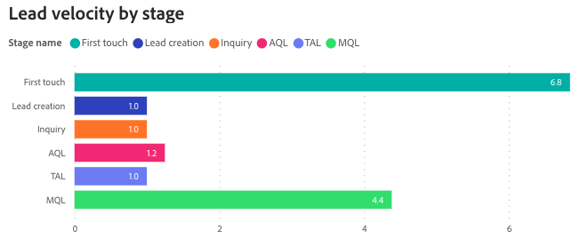

# Dashboard della velocità del lead {#lead-velocity-dashboard}

La dashboard di Velocity offre una visualizzazione dinamica del ritmo con cui i potenziali clienti si spostano attraverso il funnel di vendita, fornendo agli addetti al marketing e ai team di vendita informazioni essenziali sui tempi di conversione tra vari canali. Questo strumento è prezioso per rispondere a domande chiave sulle durate di conversione dei lead e sull’efficienza della progressione attraverso le fasi di vendita, consentendoti di ottimizzare le strategie di coinvolgimento per una crescita e conversioni accelerate.

Risposte alle domande poste da questa dashboard:

* In media, quanto tempo ci vuole per convertire un lead?
* In media, per ogni fase, quanto tempo ci vuole per passare alla fase successiva? Come cambia questo periodo nel tempo?

## Componenti del dashboard {#dashboard-components}

La visualizzazione di &quot;Lead&quot; o &quot;Contatto&quot; è determinata dalla preferenza impostata in: Impostazioni > Impostazioni attribuzione > Oggetto dashboard predefinito.

### Velocità lead/contatto per fase {#lead-contact-velocity-by-stage}

Il grafico a barre mostra la durata media in giorni della spesa di lead/contatti in ogni fase di vendita in un determinato arco temporale.

Risposte alle domande del grafico:

* Quale fase di vendita ha in genere la durata più lunga per lead/contatti?
* Come si confronta il tempo trascorso nella fase &quot;Primo contatto&quot; con la fase &quot;MQL&quot;?

### Velocità lead/contatto nel tempo {#lead-contact-velocity-over-time}

Il grafico a linee delle serie temporali mostra il tempo medio, in giorni, trascorso da lead/contatti in ogni fase di vendita nell’arco temporale specificato.

* Utilizza le funzionalità drill-down e up per classificare i dati per mese, trimestre o anno.
* Passa il cursore sopra una riga per visualizzare informazioni dettagliate.

Risposte alle domande del grafico:

* Quali sono le tendenze nel tempo trascorso in ciascuna fase per lead/contatti nei mesi osservati?
* In quale mese i lead/contatti hanno registrato la progressione più rapida attraverso le fasi di vendita?

### Velocità lead/contatto per canale {#lead-contact-velocity-by-channel}

Il grafico a barre mostra la durata media in giorni della permanenza di lead/contatti in ogni fase del funnel, segmentata per canale.

Passa il cursore sopra una riga per visualizzare informazioni dettagliate.

Risposte alle domande del grafico:

* Quale canale mostra la progressione più rapida del lead attraverso le fasi del funnel?
* In che modo la velocità di avanzamento nella fase &#39;MQL&#39; varia tra canali diversi?

## Riquadro Filtro {#filter-pane}

Questo cruscotto è dotato delle seguenti impostazioni e filtri:

* Data
   * Basato su: Transizione in data
* Fase
* Canale
* Sottocanale
* Campaign
* Segmento
