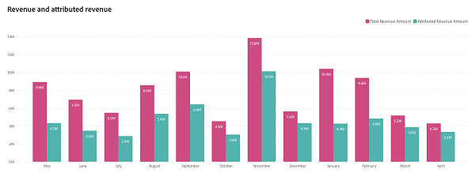
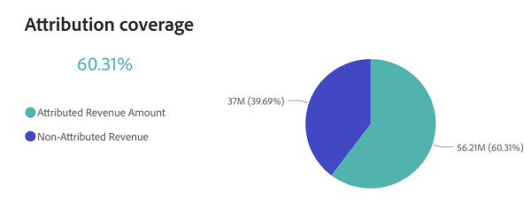

# Dashboard panoramica ricavi {#revenue-overview-dashboard}

La dashboard Panoramica ricavi fornisce informazioni sui ricavi totali derivati dal CRM, gettando luce sul ruolo delle strategie di marketing. Offre una panoramica dell’influenza del marketing sui ricavi complessivi e contribuisce alla corretta chiusura delle offerte.

**Risposte alle domande della bacheca:**

* Quale percentuale dei ricavi è attribuibile alle attività di marketing?
* Quale percentuale delle nostre offerte &quot;Closed Won&quot; è stata influenzata dai nostri sforzi di marketing?

## Componenti del dashboard {#dashboard-components}

### Riquadri KPI {#kpi-tiles}

* **Ricavi totali**: i ricavi totali delle opportunità &quot;Chiuse&quot;, incluse le opportunità senza punti di contatto.
* **Offerte totali**: numero di opportunità &quot;Chiuse&quot;, incluse quelle senza punti di contatto.
* **Entrate attribuite**: il totale delle entrate derivanti dalle opportunità &quot;Chiuse&quot; con punti di contatto.
* **Offerte attribuite**: numero di opportunità &quot;Chiuse&quot; con punti di contatto.

### Grafico Ricavi e Ricavi attribuiti {#revenue-and-attributed-revenue-chart}

Questo grafico a barre affiancato delle serie temporali contrasta il Ricavo totale con il Ricavo attribuito, visualizzando chiaramente il tuo impatto di marketing sui ricavi complessivi.

* utilizza le funzionalità drill-down e up per classificare i dati per trimestre e anno.
* Passa il puntatore del mouse su una sezione del grafico a barre per visualizzarne le informazioni dettagliate.

**Risposte al grafico:**

* Quale percentuale dei ricavi di agosto 2022 può essere attribuita alle nostre iniziative di marketing?
* In che modo i ricavi attribuiti nel terzo trimestre dello scorso anno si sovrappongono al quarto trimestre?

### Grafico di copertura dell&#39;attribuzione {#attribution-coverage-chart}

Questo grafico a torta visualizza in modo chiaro la copertura dell’attribuzione segmentando i ricavi totali in ricavi attribuiti e non attribuiti, evidenziando la percentuale precisa di ricavi influenzata dalle attività di marketing.

**Risposte al grafico:**

* Qual è stata la percentuale di copertura dei ricavi attribuita alle attività di marketing dell’anno scorso?

## Riquadro Filtro {#filter-pane}

Questo cruscotto è dotato delle seguenti impostazioni e filtri:

* Data (in base alla data di chiusura)

>[!MORELIKETHIS]
>
>* [Nozioni di base sulla dashboard](/help/marketo-measure-discover-ui/dashboards/discover-dashboard-basics.md){target="_blank"}
>* [Criteri di visibilità dei dati del dashboard](/help/marketo-measure-discover-ui/dashboards/dashboard-data-visibility-policy.md){target="_blank"}
