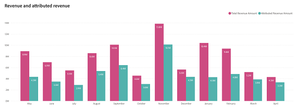

# Dashboard panoramica ricavi {#revenue-overview-dashboard}

La dashboard Panoramica ricavi fornisce informazioni sui ricavi totali derivati dal CRM, gettando luce sul ruolo delle strategie di marketing. Offre una panoramica dell’influenza del marketing sui ricavi complessivi e contribuisce alla corretta chiusura delle offerte.

Risponde alle domande della bacheca:

* Quale percentuale dei ricavi è attribuibile alle attività di marketing?
* Quale percentuale delle nostre offerte &quot;Closed Won&quot; è stata influenzata dai nostri sforzi di marketing?

<table>
<tbody> 
  <tr> 
   <th>Componente</th> 
   <th>Descrizione</th>
   <th>Campi drill-through</th>
   <th>Tipo di dati</th>
   <th>Filtri</th>
  </tr>
  <tr>
    <td>Sezione ricavi totali</td>
    <td>Totale dei ricavi originati dal sistema CRM, inclusi i ricavi attribuiti.</td>
    <td rowspan="6"><li>ID opportunità</li>
<li>Nome dell’opportunità</li>
<li>Data di creazione dell’opportunità</li>
<li>Data di chiusura dell’opportunità</li>
<li>È chiuso (S/N)</li>
<li>Vinto (S/N)</li>
<li>Fase corrente</li>
<li>Ricavi</li></td>
    <td rowspan="6">Data di chiusura</td>
    <td rowspan="6">Data</td>
  </tr>
  <tr>
    <td>Sezione Offerte totali</td>
    <td>Numero totale di offerte contrassegnate come "Closed Won" nel CRM.</td>
  </tr>
  <tr>
    <td>Sezione ricavi attribuiti</td>
    <td>Ricavi attribuibili totali da opportunità "Closed Won" con punti di contatto registrati.</td>
  </tr>
  <tr>
    <td>Sezione Offerte attribuibili</td>
    <td>Numero totale di offerte "Chiuso" da opportunità attribuibili.</td>
  </tr>
  <tr>
    <td>Grafico Ricavi e Ricavi attribuiti</td>
    <td>Questo grafico a barre affiancato delle serie temporali fornisce una vista completa della copertura dell’attribuzione tramite la giustapposizione del ricavo totale con il ricavo attribuito.
     </td>
  </tr>
  <tr>
    <td>Grafico di copertura dell'attribuzione</td>
    <td>Questo grafico a torta fornisce un chiaro confronto visivo tra Ricavi attribuiti e Ricavi non attribuiti. La torta copre il totale delle entrate.
     
    </td>
  </tr>
</tbody>
</table>
