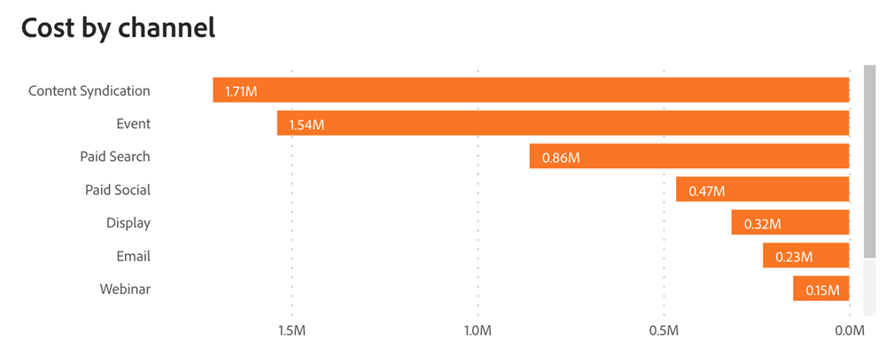

# Dashboard ROI {#roi-dashboard}

La dashboard ROI offre agli addetti al marketing una visualizzazione granulare del ritorno sull’investimento per canali, sottocanali e campagne. Suddivide meticolosamente i modelli di costi e ricavi, evidenziando al contempo metriche quali costo per lead, offerta e opportunità, garantendo una comprensione completa dell’attribuzione marketing.

**Domande alle risposte della bacheca**

* Quali erano i valori del ROI per ogni canale, sottocanale e campagna?
* In che modo i costi e i ricavi sono stati distribuiti su ciascun canale, sottocanale e campagna?
* Qual è stato il costo per lead, costo per opportunità e costo per opportunità?

## Componenti del dashboard {#dashboard-components}

### Riquadri KPI {#kpi-tiles}

* **Costo**: costi totali da origini dati connesse e costi caricati manualmente.
* **Reddito Attribuito**: il contributo totale dei ricavi, in base al modello di attribuzione scelto, da Opportunità con punti di contatto chiuse entro il periodo di data filtrato.
* **Reddito Attribuito Realizzato**: il contributo totale dei ricavi, in base al modello di attribuzione scelto, da Opportunità con punti di contatto entro il periodo di data filtrato, indipendentemente da quando sono state chiuse.
* **Totale nuovi lead**: numero totale di nuovi lead generati, inclusi quelli toccati e non toccati.
* **Costo per nuovo lead**: il costo medio per nuovo lead, derivato dal costo totale diviso per il numero totale di nuovi lead.
* **Nuove opportunità totali**: numero totale di nuove opportunità generate, incluse quelle toccate e non toccate.
* **Costo per nuova opportunità**: il costo medio per nuova opportunità, derivato dal costo totale diviso per il numero totale di nuove opportunità.
* **Offerte totali**: numero di opportunità &quot;Closed Won&quot;, comprese le opportunità senza punti di contatto.
* **ROI semplice**: ricavi attribuiti divisi per i costi nel periodo di data filtrato.
* **ROI realizzato**: ricavi attribuiti realizzati divisi per i costi nel periodo di data filtrato.

### Grafico Costi e ricavi per canale {#cost-and-revenue-by-channel-graph}

Grafico a barre che illustra costi e ricavi, progettato per offrire una prospettiva comparativa sulla loro grandezza rispetto a vari canali, sottocanali e campagne.

* utilizza le funzionalità drill-down e up per classificare i dati per sottocanale e campagna.
* Passa il puntatore del mouse su ciascuna barra per visualizzare il ROI semplice e realizzato.

**Domande sulle risposte del grafico**

* Quali erano i valori del ROI per ogni canale, sottocanale e campagna?
* Esistono canali o sottocanali meno recenti con costi insolitamente alti o bassi rispetto ai loro ricavi?

### ROI realizzato e semplice nel tempo {#realized-vs-simple-roi-over-time}

Grafico a linee delle serie temporali che mostra il confronto tra ROI realizzato e ROI semplice, tracciandone la progressione nel tempo.

* Passa il puntatore del mouse su una sezione del grafico per visualizzare il ROI semplice e realizzato.

**Domande sulle risposte del grafico**

* Come si confronta il ROI realizzato con il ROI semplice in periodi di tempo specifici?
* In che modo la tendenza del ROI realizzato si relaziona a qualsiasi evento di marketing significativo durante lo stesso periodo?

### Grafico Costo nel tempo {#cost-over-time-graph}

Grafico a barre in pila che mostra i costi totali, segmentati per canali associati per ogni mese/trimestre/anno.

* utilizzare le funzionalità di espansione e aumento per categorizzare i dati in base a mese, trimestre o anno.
* Passa il cursore del mouse su un segmento di una barra o sullo spazio tra le barre per visualizzare informazioni dettagliate.

**Domande sulle risposte del grafico**

* Come si confronta il costo combinato di tutti i canali da un trimestre/mese all&#39;altro?
* Come si sono evoluti nel tempo i costi di un canale specifico?

### Grafico Costo per canale {#cost-by-channel-graph}

Grafico a barre che mostra le spese di marketing segmentate per canale/sottocanale/campagna.

* utilizza le funzionalità drill-down e up per classificare i dati per canale/sottocanale/campagna.

**Domande sulle risposte del grafico**

* Quali sottocanali o campagne all’interno di un canale principale hanno l’allocazione più elevata?
* Quali percorsi di marketing (canale, sottocanale o campagna) sembrano sottofinanziati rispetto ad altri?

### Tabella di riepilogo del ROI {#roi-summary-table}

Tabella con ricavi attribuiti, costi e ROI segmentati per singolo canale per una suddivisione dettagliata.

* Fai clic sull’icona &quot;+&quot; accanto a ciascun canale per visualizzare il raggruppamento per sottocanale e campagna.

**Colonne**

* Canale/Sottocanale/Campagna
* Costo
* Reddito Attribuito
* Reddito Attribuito Realizzato
* ROI semplice
* ROI realizzato
* Ricavi pipeline attribuiti non realizzati: i ricavi della pipeline collegati ai punti di contatto (opportunità aperte) creati all’interno del periodo di data filtrato.

### Tabella delle spese di marketing {#marketing-spend-table}

Tabella che mostra costi, nuovi lead, opportunità e offerte chiusi segmentati per singolo canale per un raggruppamento dettagliato.

* Fai clic sull’icona &quot;+&quot; accanto a ciascun canale per visualizzare il raggruppamento per sottocanale e campagna.

**Colonne**

* Canale/Sottocanale/Campagna
* Costo
* Nuovi lead
* Costo per nuovo lead
* Nuove opportunità
* Costo per nuova opportunità
* Offerte
* Costo per transazione

## Riquadro Filtro {#filter-pane}

Questo cruscotto è dotato delle seguenti impostazioni e filtri:

* Data
   * In base a:
      * Data di creazione: nuovi lead, nuove opportunità
      * Data costo sostenuto: costo
      * Data di chiusura: ricavi attribuiti (ROI semplice), offerte
      * Data punto di contatto: punti di contatto da ricavi attribuiti realizzati (ROI realizzato)
* Modello di attribuzione
* Canale, Sottocanale
* Campaign

>[!MORELIKETHIS]
>
>* [Scopri nozioni di base sulla dashboard](/help/marketo-measure-discover-ui/dashboards/discover-dashboard-basics.md){target="_blank"}
>* [Criterio di visibilità dei dati del dashboard](/help/marketo-measure-discover-ui/dashboards/dashboard-data-visibility-policy.md){target="_blank"}

