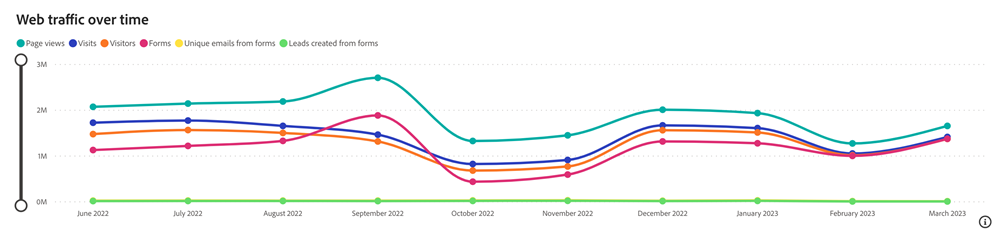

# Dashboard traffico web {#web-traffic-dashboard}

La dashboard Traffico web offre una visualizzazione completa delle interazioni dei visitatori del sito. Approfondisci metriche quali il conteggio di visitatori univoci per URL, visite complessive, visualizzazioni di pagina e invii di moduli da URL di moduli o pagine di destinazione specifici. Monitora le tendenze del traffico mensile e identifica i media a pagamento con prestazioni elevate, consentendoti di perfezionare le strategie per generare ricavi ottimali.

Risposte alle domande poste da questa dashboard:

* Quante visite/visitatori univoci abbiamo da ogni URL?
* Quante visualizzazioni di pagina e invii di moduli abbiamo da ogni URL?
* Qual è la tendenza del traffico web nell’ultimo anno?

## Componenti del dashboard {#dashboard-components}

**Riquadri KPI**

<table>
<thead>
  <tr>
    <td>Visite</td>
    <td>Il totale delle visite al sito (sessioni) avviate da pagine esterne che includono utenti noti e anonimi.</td>
  </tr>
</thead>
<tbody>
  <tr>
    <td>Visitor</td>
    <td>Il numero totale di visitatori univoci.</td>
  </tr>
  <tr>
    <td>Visualizzazioni pagina</td>
    <td>Numero totale di visualizzazioni tra le pagine del sito Web.</td>
  </tr>
  <tr>
    <td>Forms</td>
    <td>Numero totale di invii di moduli, incluso LinkedIn Lead Gen Forms.</td>
  </tr>
  <tr>
    <td>E-mail univoche da Forms</td>
    <td>Numero totale di e-mail univoche da invii di moduli.</td>
  </tr>
  <tr>
    <td>Lead creati da Forms</td>
    <td>Numero totale di nuovi lead creati dall'invio del modulo.</td>
  </tr>
</tbody>
</table>

## Traffico Web nel tempo {#web-traffic-over-time}

Grafico a linee delle serie temporali che mostra le tendenze di Visualizzazioni pagina, Visite, Visitatori, Forms, E-mail univoche da moduli e Creazione di lead da moduli. Usa questo grafico per visualizzare e confrontare le prestazioni e il coinvolgimento del sito web nel tempo.

* Passa il puntatore del mouse su una sezione del grafico per visualizzare il totale delle visite, i visitatori univoci o gli invii di moduli.
* Esegue lo zoom in intervalli di valori specifici utilizzando il cursore sinistro.

Risposte alle domande del grafico:

* Come si confrontano le tendenze nelle visite totali con i visitatori univoci e gli invii di moduli nell’arco temporale visualizzato?
* In quale periodo il sito web ha registrato il maggior numero di visitatori univoci rispetto al totale di visite e invii di moduli?

## Tabella riepilogo traffico Web {#web-traffic-summary-table}

Tabella che mostra visualizzazioni pagina, visite, visitatori, Forms, e-mail univoche dai moduli e creazione di lead dai moduli in base agli URL.

**Colonne**

* Titolo pagina
* URL pagina
* Visualizzazioni pagina
* Visite
* Visitatori univoci
* Invii modulo
* E-mail univoche da moduli
* Creazione di lead dai moduli

## Tabella referrer {#referrer-table}

Tabella in cui sono visualizzate le Visite totali e Visitatori univoci per Referrer.

**Colonne**

* Nome referrer
* Visite
* Visitatori univoci

## Visite/Visitatori per canale {#visits-visitors-by-channel}

Grafico a barre che mostra Visite o Visitatori univoci segmentati per Canale/Sottocanale/Campagna.

* utilizza le funzionalità drill-down e up per classificare i dati per sottocanale e campagna.
* Passa il puntatore del mouse su ciascuna barra per visualizzare Visite o Visitatori univoci.

Risposte alle domande del grafico:

* Quale canale/sottocanale/campagna attrae il maggior numero di visite o visitatori univoci?
* Come si confronta il numero di visitatori univoci con il totale delle visite all’interno di un canale/sottocanale/campagna specifico?

## Riquadro Filtro {#filter-pane}

Questo cruscotto è dotato delle seguenti impostazioni e filtri:

* Data (basata sulla data evento)
* Canale, Sottocanale
* Campaign
* URL
* Titolo pagina
