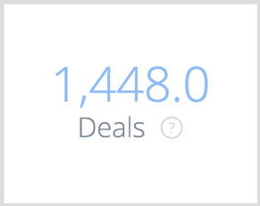
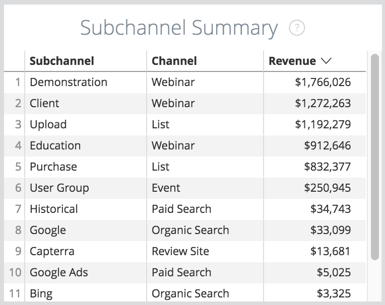

# Riquadri della bacheca Panoramica {#overview-board-tiles}

La bacheca Panoramica fornisce una panoramica più completa delle prestazioni di marketing, aiutando i team di marketing a prendere le decisioni giuste durante la crescita del team, del budget o dei ricavi.

<table> 
 <colgroup> 
  <col> 
  <col> 
  <col> 
  <col> 
  <col> 
  <col> 
  <col> 
  <col> 
  <col> 
  <col> 
  <col> 
 </colgroup> 
 <tbody> 
  <tr> 
   <td> </td> 
   <td>
<strong>Tipo di data</strong>
</td> 
   <td>
<strong>Data</strong>
</td> 
   <td>
<strong>Modello di attribuzione</strong>
</td> 
   <td>
<strong>Metrica</strong>
</td> 
   <td>
<strong>Dimensione</strong>
</td> 
   <td>
<strong>Canale</strong>
</td> 
   <td>
<strong>Sottocanale</strong>
</td> 
   <td>
<strong>Campaign</strong>
</td> 
   <td>
<strong>ID account annuncio</strong>
</td> 
   <td>
<strong>Nome account CRM</strong>
</td> 
  </tr> 
  <tr> 
   <td>
<strong>Ricavi</strong>
</td> 
   <td><strong>X</strong></td> 
   <td><strong>X</strong></td> 
   <td><strong>X</strong></td> 
   <td> </td> 
   <td> </td> 
   <td><strong>X</strong></td> 
   <td><strong>X</strong></td> 
   <td><strong>X</strong></td> 
   <td><strong>X</strong></td> 
   <td><strong>X</strong></td> 
  </tr> 
  <tr> 
   <td>
<strong>Panoramica</strong>
</td> 
   <td><strong>X</strong></td> 
   <td><strong>X</strong></td> 
   <td><strong>X</strong></td> 
   <td><strong>X</strong></td> 
   <td><strong>X</strong></td> 
   <td><strong>X</strong></td> 
   <td><strong>X</strong></td> 
   <td><strong>X</strong></td> 
   <td><strong>X</strong></td> 
   <td><strong>X</strong></td> 
  </tr> 
  <tr> 
   <td>
<strong>Spesa</strong>
</td> 
   <td> </td> 
   <td><strong>X</strong></td> 
   <td> </td> 
   <td> </td> 
   <td> </td> 
   <td><strong>X</strong></td> 
   <td><strong>X</strong></td> 
   <td><strong>X</strong></td> 
   <td><strong>X</strong></td> 
   <td> </td> 
  </tr> 
  <tr> 
   <td>
<strong>RITORNO SULL'INVESTIMENTO</strong>
</td> 
   <td><strong>X</strong></td> 
   <td><strong>X</strong></td> 
   <td><strong>X</strong></td> 
   <td> </td> 
   <td> </td> 
   <td><strong>X</strong></td> 
   <td><strong>X</strong></td> 
   <td><strong>X</strong></td> 
   <td><strong>X</strong></td> 
   <td><strong>X</strong></td> 
  </tr> 
  <tr> 
   <td>
<strong>Offerte</strong>
</td> 
   <td><strong>X</strong></td> 
   <td><strong>X</strong></td> 
   <td><strong>X</strong></td> 
   <td> </td> 
   <td> </td> 
   <td><strong>X</strong></td> 
   <td><strong>X</strong></td> 
   <td><strong>X</strong></td> 
   <td><strong>X</strong></td> 
   <td><strong>X</strong></td> 
  </tr> 
  <tr> 
   <td>
<strong>Costo per offerta</strong>
</td> 
   <td><strong>X</strong></td> 
   <td><strong>X</strong></td> 
   <td><strong>X</strong></td> 
   <td> </td> 
   <td> </td> 
   <td><strong>X</strong></td> 
   <td><strong>X</strong></td> 
   <td><strong>X</strong></td> 
   <td><strong>X</strong></td> 
   <td><strong>X</strong></td> 
  </tr> 
  <tr> 
   <td>
<strong>Ricavi pipeline</strong>
</td> 
   <td><strong>X</strong></td> 
   <td><strong>X</strong></td> 
   <td><strong>X</strong></td> 
   <td> </td> 
   <td> </td> 
   <td><strong>X</strong></td> 
   <td><strong>X</strong></td> 
   <td><strong>X</strong></td> 
   <td><strong>X</strong></td> 
   <td><strong>X</strong></td> 
  </tr> 
  <tr> 
   <td>
<strong>Dimensione offerta</strong>
</td> 
   <td><strong>X</strong></td> 
   <td><strong>X</strong></td> 
   <td><strong>X</strong></td> 
   <td> </td> 
   <td> </td> 
   <td><strong>X</strong></td> 
   <td><strong>X</strong></td> 
   <td><strong>X</strong></td> 
   <td><strong>X</strong></td> 
   <td><strong>X</strong></td> 
  </tr> 
  <tr> 
   <td>
<strong>Riepilogo canale</strong>
</td> 
   <td><strong>X</strong></td> 
   <td><strong>X</strong></td> 
   <td><strong>X</strong></td> 
   <td><strong>X</strong></td> 
   <td> </td> 
   <td><strong>X</strong></td> 
   <td><strong>X</strong></td> 
   <td><strong>X</strong></td> 
   <td><strong>X</strong></td> 
   <td><strong>X</strong></td> 
  </tr> 
  <tr> 
   <td>
<strong>Riepilogo sottocanale</strong>
</td> 
   <td><strong>X</strong></td> 
   <td><strong>X</strong></td> 
   <td><strong>X</strong></td> 
   <td><strong>X</strong></td> 
   <td> </td> 
   <td><strong>X</strong></td> 
   <td><strong>X</strong></td> 
   <td><strong>X</strong></td> 
   <td><strong>X</strong></td> 
   <td><strong>X</strong></td> 
  </tr> 
  <tr> 
   <td>
<strong>Riepilogo campagna</strong>
</td> 
   <td><strong>X</strong></td> 
   <td><strong>X</strong></td> 
   <td><strong>X</strong></td> 
   <td><strong>X</strong></td> 
   <td> </td> 
   <td><strong>X</strong></td> 
   <td><strong>X</strong></td> 
   <td><strong>X</strong></td> 
   <td><strong>X</strong></td> 
   <td><strong>X</strong></td> 
  </tr> 
  <tr> 
   <td>
<strong>RITORNO SULL'INVESTIMENTO</strong>
</td> 
   <td><strong>X</strong></td> 
   <td><strong>X</strong></td> 
   <td><strong>X</strong></td> 
   <td> </td> 
   <td><strong>X</strong></td> 
   <td><strong>X</strong></td> 
   <td><strong>X</strong></td> 
   <td><strong>X</strong></td> 
   <td><strong>X</strong></td> 
   <td><strong>X</strong></td> 
  </tr> 
  <tr> 
   <td>
<strong>Riepilogo ROI</strong>
</td> 
   <td><strong>X</strong></td> 
   <td><strong>X</strong></td> 
   <td><strong>X</strong></td> 
   <td> </td> 
   <td><strong>X</strong></td> 
   <td><strong>X</strong></td> 
   <td><strong>X</strong></td> 
   <td><strong>X</strong></td> 
   <td><strong>X</strong></td> 
   <td><strong>X</strong></td> 
  </tr> 
 </tbody> 
</table>

## Sezione ricavi {#revenue-tile}

Ricavi attribuiti totali da opportunità chiuse realizzate in base al modello di attribuzione.

-Dettagli opportunità: visualizza un raggruppamento degli ID opportunità, della data di creazione, della data di chiusura, del codice ISO e dell&#39;attribuzione dei ricavi correlati.\
-Show Details (Mostra dettagli): una suddivisione per mese.

## Sezione Panoramica (grafico) {#overview-chart-tile}

Il grafico mostra i ricavi attribuiti a ciascun canale, visualizzati nel tempo.

-Dettagli opportunità: visualizza un raggruppamento degli ID opportunità, della data di creazione, della data di chiusura, del codice ISO e dell&#39;attribuzione dei ricavi correlati.\
-Visualizza un raggruppamento degli ID Opp partecipanti:

* Per Settimana ROI
* In base ai dati sul ROI
* Per ora ROI
* Per minuto di ROI
* Per tempo ROI

## Sezione spesa {#spend-tile}

L’importo totale della spesa derivante sia dai costi API che dai costi dichiarati autonomamente per il periodo di tempo specificato.

>[!NOTE]
>
>Quando esegui il drilling in su meno di un mese, [!DNL Marketo Measure] calcolerà la media della spesa per quel mese e assegnerà tale media a ogni giorno.

-Spend Details (Dettagli spesa): visualizza un raggruppamento del relativo ID univoco della campagna di spesa, nome della campagna, canale, sottocanale, data, valuta originale, spesa.  -Show Details (Mostra dettagli): una suddivisione per mese.

## Sezione ROI {#roi-tile}

Il ROI calcolato (ritorno sull’investimento) dai ricavi totali (dal modello di attribuzione selezionato) e dalla spesa totale (sezione Ricavi ÷ sezione spesa = sezione ROI).

## Sezione Offerte {#deals-tile}

Visualizza il numero totale di offerte attribuite (le offerte sono un conteggio di opportunità di tipo Closed Won).

>[!NOTE]
>
>Se selezioni il tipo di data &quot;Data punto di contatto&quot;, sono possibili conteggi parziali perché alcuni punti di contatto potrebbero non rientrare nell’intervallo di tempo.

-Dettagli opportunità: visualizza un raggruppamento degli ID opportunità, della data di creazione, della data di chiusura e dell&#39;attribuzione correlati (conteggio).  -Show Details (Mostra dettagli): una suddivisione per mese.

## Sezione Costo per offerta {#cost-per-deal-tile}

Costo medio necessario per acquisire un’opportunità acquisita chiusa. La spesa totale divisa per il numero totale di offerte (sezione Spesa ÷ sezione Offerte = sezione Costo per offerta).

## Sezione ricavi pipeline {#pipeline-revenue-tile}

Totale dei ricavi attribuiti potenziali per le opportunità aperte

>[!NOTE]
>
>I ricavi verranno rispecchiati per il modello di attribuzione specificato.

-Dettagli opportunità: visualizza un raggruppamento degli ID opportunità, della data di creazione, della data di chiusura, del codice ISO e dell&#39;attribuzione dei ricavi correlati.  -Show Details (Mostra dettagli): una suddivisione per mese.

## Sezione dimensioni offerta {#deal-size-tile}

Il ricavo medio delle opportunità di acquisto chiuse (sezione Ricavi ÷ sezione Offerte = sezione Dimensione offerta).

## Sezione riepilogo canale {#channel-summary-tile}

Visualizza un elenco di canali in base alla metrica selezionata (ricavi, ricavi pipeline, spesa, offerte, lead, contatti).

## Sezione riepilogo sottocanale {#subchannel-summary-tile}

Visualizza un elenco di canali secondari in base alla metrica selezionata (ricavi, ricavi pipeline, spesa, offerte, lead, contatti).

## Sezione riepilogo campagna {#campaign-summary-tile}

Visualizza un elenco di campagne in base alla metrica selezionata (ricavi, ricavi pipeline, spesa, offerte, opportunità, lead, contatti).

## Sezione ROI (grafico) {#roi-chart-tile}

Visualizza il ROI attribuito alla metrica selezionata (canale, sottocanale, campagna, account, adgroup, annuncio, inserzionista, creativo, parola chiave, posizionamento, sito) in base al modello di attribuzione selezionato.

## Sezione Riepilogo ROI {#roi-summary-tile}

Visualizza il ROI attribuito alla metrica selezionata (canale, sottocanale, campagna, account, adgroup, annuncio, inserzionista, creativo, parola chiave, posizionamento, sito) in base al modello di attribuzione selezionato.

-Dettagli opportunità: visualizza un raggruppamento degli ID opportunità, della data di creazione, della data di chiusura e dell&#39;attribuzione correlati (conteggio).

-Show Details (Mostra dettagli): una suddivisione per mese.
