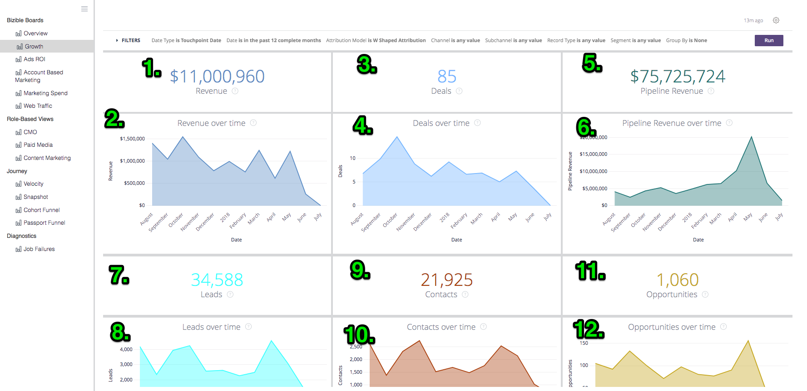
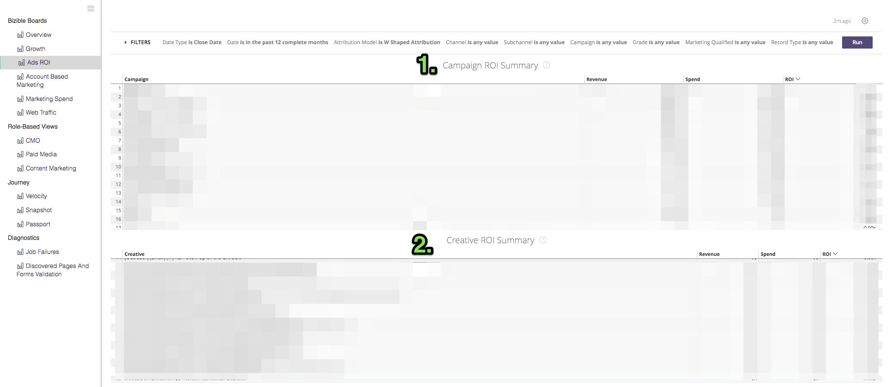

# Definizioni ed enciclopedia {#definitions-and-encyclopedia}

Di seguito è riportata una panoramica delle diverse bacheche e riquadri presenti nella piattaforma Discover, nonché dei filtri all’interno di tali bacheche. All&#39;interno della schermata di ogni bacheca ci sono diverse piastrelle numeriche, le cui definizioni si trovano nella sezione seguente di quella bacheca.

**[!DNL Marketo Measure]Schede**

Panoramica

Crescita

ROI degli annunci

Marketing basato su account

Spese di marketing

Traffico web

**Visualizzazioni basate su ruoli**

OCM

Supporti a pagamento

Marketing dei contenuti

Ops di marketing

**Percorso**

Velocity

Istantanea

Funnel Passport

Percorso di coinvolgimento

## [!DNL Marketo Measure] Schede {#marketo-measure-boards}

### Panoramica {#overview}

La panoramica fornisce all’utente un’immagine di alto livello delle prestazioni del team di marketing in merito al loro impatto su ricavi, spese e ROI.

**Filtri**

Tipo di data: Data di chiusura

La data è negli ultimi 12 mesi completi

Il modello di attribuzione è a forma di W

La metrica è Ricavo

Il Dimension è Canale

Il canale è uguale a __

Il canale secondario è uguale a __

Campaign è uguale a __

Categorie

**Entrate**

`1.` Importo totale dei ricavi da opportunità di risultato chiuso, in base al modello di attribuzione.

Fai clic su Mostra dettagli per analizzare i dati visualizzandoli come una visualizzazione e una tabella.

**Panoramica**

`2.` Utilizzando l’elenco a discesa Metrica dal menu Filtri , questo grafico mostra le entrate/entrate della pipeline/spesa/offerte/opportunità/lead/contatti attribuiti a ciascun canale, mostrati nel tempo.

**Spesa**

`3.` La quantità totale di spesa registrata sia dai costi API che dai costi auto-segnalati si è aggregata al livello più alto del canale.

Fai clic su Mostra dettagli per analizzare i dati visualizzandoli come una visualizzazione e una tabella.

**ROI**

`4.` Utilizzando l’elenco a discesa Dimension dal menu Filtri, viene mostrato quanto ROI è stato attribuito a ciascun canale/canale secondario/campagna/account/gruppo di annunci/inserzionista/creativo/parola chiave/posizionamento/sito in base al modello di attribuzione durante l’intero intervallo di date selezionato.

**Riepilogo del ROI**

Utilizzando l’elenco a discesa Dimension dal menu Filtri, viene mostrato quanto Ricavo, Spesa e ROI è stato attribuito a ciascun Canale / Canale secondario / Campagna / Account / AdGroup / Inserzionista / Creativo / Parola chiave / Posizionamento / Sito in base al modello di attribuzione durante l’intero intervallo di date selezionato.

**Offerte**

`5.` Il numero totale di opportunità chiuse, in base al conteggio del modello di attribuzione. Se è selezionato il tipo di data &quot;Data punto di contatto&quot;, è possibile effettuare conteggi parziali perché è possibile escludere alcuni punti di contatto all’interno di un’opportunità utilizzando questo tipo di data.

Fai clic su Mostra dettagli per analizzare i dati visualizzandoli come una visualizzazione e una tabella.

**Costo per transazione**

`6.` La spesa totale divisa per il numero totale di offerte, fornendo un costo medio che ci vuole per acquisire un&#39;opportunità di vittoria chiusa.

**Ricavi dalla pipeline**

`7.` Totale dei ricavi potenziali da qualsiasi opportunità aperta, il che significa che non è chiusa o chiusa. I ricavi si basano sul modello di attribuzione selezionato.

Fai clic su Mostra dettagli per analizzare i dati visualizzandoli come una visualizzazione e una tabella.

**Dimensione dell&#39;offerta**

`8.` La quantità media di un&#39;opportunità di un won chiuso.

**Riepilogo del canale**

`9`. Utilizzando l’elenco a discesa Metrica dal menu Filtri , si tratta di un elenco di canali in base alla quantità di ricavi/ricavi/spesa/offerte/opportunità/lead/contatti attribuiti a ciascun canale, ordinati in base al più alto in base al modello di attribuzione selezionato.

**Riepilogo dei sottocanali**

`10.` Utilizzando il menu a discesa Metrica del menu Filtri , si tratta di un elenco di sottocanali in base alla quantità di ricavi/ricavi della pipeline/spesa/offerte/opportunità/lead/contatti è stato attribuito a ciascun canale secondario, ordinato in base al più alto in base al modello di attribuzione selezionato.

**Riepilogo campagna**

`11.` Utilizzando l’elenco a discesa Metrica dal menu Filtri , si tratta di un elenco di campagne basate su quante entrate/entrate pipeline/spesa/offerte/opportunità/lead/contatti sono state attribuite a ogni campagna, ordinate in base al più alto in base al modello di attribuzione selezionato.

### Crescita {#growth}

La crescita consente all&#39;addetto al marketing di vedere cosa ha generato in tutto il settore, dai contatti alle opportunità ai ricavi. È una rapida vista di tutte le pipeline e delle loro prestazioni nel tempo.

**Filtri**

Il tipo di data è la data del punto di contatto

La data è negli ultimi 12 mesi completi

Il modello di attribuzione è a forma di W

Raggruppa per nessuno

Il canale è uguale a __

Il canale secondario è uguale a __

Campaign è uguale a __

Categorie

**Entrate**

`1.` Importo totale dei ricavi da opportunità di risultato chiuso, in base al modello di attribuzione.

Fai clic su Mostra dettagli per analizzare i dati visualizzandoli come una visualizzazione e una tabella.

**Ricavi nel tempo**

`2.` Importo totale dei ricavi da opportunità di risultato chiuso, in base al modello di attribuzione che mostra la tendenza in un intervallo di tempo specifico. Usa il filtro Raggruppa per per per modificare lo stack per canale, canale secondario, campagna, account, gruppo di annunci, annuncio, inserzionista, creativo, parola chiave, posizionamento, sito.

Esegui un drill-in per visualizzare i dati da una dimensione data più piccola.

**Offerte**

`3.` Il numero totale di opportunità chiuse, in base al conteggio del modello di attribuzione.

Fai clic su Mostra dettagli per analizzare i dati visualizzandoli come una visualizzazione e una tabella.

**Offerte nel tempo**

`4.` Il numero totale di opportunità chiuse, in base al modello di attribuzione che mostra la tendenza in un intervallo di tempo specifico. Usa il filtro Raggruppa per per per modificare lo stack per canale, canale secondario, campagna, account, gruppo di annunci, annuncio, inserzionista, creativo, parola chiave, posizionamento, sito.

Esegui un drill-in per visualizzare i dati da una dimensione data più piccola.

**Ricavi dalla pipeline**

`5.` Totale dei ricavi potenziali da qualsiasi opportunità aperta, il che significa che non è chiusa o chiusa. I ricavi si basano sul modello di attribuzione selezionato.

Fai clic su Mostra dettagli per analizzare i dati visualizzandoli come una visualizzazione e una tabella.

**Ricavi dalla pipeline nel tempo**

`6.` Il totale dei ricavi potenziali da qualsiasi opportunità aperta, in base al modello di attribuzione che mostra la tendenza in un intervallo di tempo specifico. Usa il filtro Raggruppa per per per modificare lo stack per canale, canale secondario, campagna, account, gruppo di annunci, annuncio, inserzionista, creativo, parola chiave, posizionamento, sito.

Esegui un drill-in per visualizzare i dati da una dimensione data più piccola.

**Lead**

`7.` Il numero totale di lead, in base al modello di attribuzione. Se è selezionato il tipo di data &quot;Data punto di contatto&quot;, è possibile effettuare conteggi parziali perché è possibile escludere alcuni punti di contatto all’interno di un record Lead utilizzando questo tipo di data. Se viene applicato un modello di attribuzione diverso da A forma di U, il conteggio a forma di U viene utilizzato per i modelli a forma di W, a forma di W e personalizzati.

Fai clic su Mostra dettagli per analizzare i dati visualizzandoli come una visualizzazione e una tabella.

**Lead nel tempo**

`8.` Il numero totale di lead, in base al modello di attribuzione che mostra la tendenza in un periodo di tempo specifico. Usa il filtro Raggruppa per per per modificare lo stack per canale, canale secondario, campagna, account, gruppo di annunci, annuncio, inserzionista, creativo, parola chiave, posizionamento, sito.

Esegui un drill-in per visualizzare i dati da una dimensione data più piccola.

**Contatti**

`9.` Numero totale di contatti, in base al modello di attribuzione. Se è selezionato il tipo di data &quot;Data punto di contatto&quot;, è possibile effettuare conteggi parziali perché è possibile escludere alcuni punti di contatto all’interno di un record Contatto utilizzando questo tipo di data. Se viene applicato un modello di attribuzione diverso da A forma di U, il conteggio a forma di U viene utilizzato per i modelli a forma di W, a forma di W e personalizzati.

Fai clic su Mostra dettagli per analizzare i dati visualizzandoli come una visualizzazione e una tabella.

**Contatti nel tempo**

`10.` Numero totale di contatti, in base al modello di attribuzione che mostra la tendenza in un determinato periodo di tempo. Usa il filtro Raggruppa per per per modificare lo stack per canale, canale secondario, campagna, account, gruppo di annunci, annuncio, inserzionista, creativo, parola chiave, posizionamento, sito.

Esegui un drill-in per visualizzare i dati da una dimensione data più piccola.

**Opportunità**

`11.` Numero totale di opportunità, in base al modello di attribuzione. Se è selezionato il tipo di data &quot;Data punto di contatto&quot;, è possibile effettuare conteggi parziali perché è possibile escludere alcuni punti di contatto all’interno di un record Opportunità utilizzando questo tipo di data.

Fai clic su Mostra dettagli per analizzare i dati visualizzandoli come una visualizzazione e una tabella.

**Opportunità nel tempo**

`12.` Numero totale di opportunità, in base al modello di attribuzione che mostra la tendenza in un periodo di tempo specifico. Usa il filtro Raggruppa per per per modificare lo stack per canale, canale secondario, campagna, account, gruppo di annunci, annuncio, inserzionista, creativo, parola chiave, posizionamento, sito.

Esegui un drill-in per visualizzare i dati da una dimensione data più piccola.

**Visite**

`13.` Il numero totale di visite al sito monitorate da tutti i visitatori noti e anonimi.

Fai clic su Mostra dettagli per analizzare i dati visualizzandoli come una visualizzazione e una tabella.

Se questa funzione è disabilitata, verrà visualizzato come 0.

**Visite nel tempo**

`14.` Numero totale di visite al sito monitorate che mostrano la tendenza in un periodo di tempo specifico. Usa il filtro Raggruppa per per per modificare lo stack per canale, canale secondario, campagna, account, gruppo di annunci, annuncio, inserzionista, creativo, parola chiave, posizionamento, sito.

Esegui un drill-in per visualizzare i dati da una dimensione data più piccola.

Se questa funzione è disabilitata, verrà visualizzato vuoto.

**Visite univoche**

`15.` Il numero totale di visite univoche del sito monitorate da tutti i visitatori noti e anonimi.

Fai clic su Mostra dettagli per analizzare i dati visualizzandoli come una visualizzazione e una tabella.

Se questa funzione è disabilitata, verrà visualizzato come 0.

**Visite univoche nel tempo**

`16.` Numero totale di visite di sito univoche tracciate che mostrano la tendenza in un periodo di tempo specifico. Usa il filtro Raggruppa per per per modificare lo stack per canale, canale secondario, campagna, account, gruppo di annunci, annuncio, inserzionista, creativo, parola chiave, posizionamento, sito.

Esegui un drill-in per visualizzare i dati da una dimensione data più piccola.

Se questa funzione è disabilitata, verrà visualizzato vuoto.

**Forms**

`17.` Numero totale di moduli inviati da tutti i visitatori noti e anonimi.

Fai clic su Mostra dettagli per analizzare i dati visualizzandoli come una visualizzazione e una tabella.

Se questa funzione è disabilitata, verrà visualizzato come 0.

**Forms nel tempo**

`18.` Numero totale di moduli inviati che mostrano la tendenza in un determinato periodo di tempo. Usa il filtro Raggruppa per per per modificare lo stack per canale, canale secondario, campagna, account, gruppo di annunci, annuncio, inserzionista, creativo, parola chiave, posizionamento, sito.

Esegui un drill-in per visualizzare i dati da una dimensione data più piccola.

Se questa funzione è disabilitata, verrà visualizzato vuoto.

### ROI degli annunci {#ads-roi}

Il ROI degli annunci offre ai media manager a pagamento una visione delle loro attività di marketing, fornendo loro informazioni sulle prestazioni della loro campagna alle prestazioni delle parole chiave.

**Filtri**

Tipo di data: Data di chiusura

La data è negli ultimi 12 mesi completi

Il modello di attribuzione è a forma di W

Il canale è uguale a __

Il canale secondario è uguale a __

Campaign è uguale a __

Categorie

**Riepilogo del ROI della campagna**

`1.` Elenco di campagne basate su quantità di ricavi, spesa e ROI attribuiti a ciascuna campagna, ordinate in base ai ricavi più elevati basati sul modello di attribuzione selezionato.

**Riepilogo del ROI creativo**

`2.` Un elenco di creativi in base alla quantità di ricavi, spesa e ROI attribuiti a ciascun creativo, ordinati in base ai ricavi più elevati basati sul modello di attribuzione selezionato.

**Riepilogo del ROI delle parole chiave**

`3.` Elenco di parole chiave in base alla quantità di ricavi, spesa e ROI attribuiti a ciascuna parola chiave, ordinate in base ai ricavi più elevati basati sul modello di attribuzione selezionato.

### Marketing basato su account {#account-based-marketing}

Il marketing basato su account fornisce alle aziende che utilizzano ABM la possibilità di monitorare i loro sforzi verso i loro account target e quanto coinvolgimento hanno visto dal loro marketing.

**Filtri**

Il tipo di data è la data del punto di contatto

La data è negli ultimi 12 mesi completi

Attribuzione modello attribuzione a forma di W

Raggruppa per canale

Account uguale a __

**Entrate**

Importo totale dei ricavi da opportunità di risultato chiuso, in base al modello di attribuzione.

Fai clic su Mostra dettagli per analizzare i dati visualizzandoli come una visualizzazione e una tabella.

**Ricavi dalla pipeline**

Totale dei ricavi potenziali da qualsiasi opportunità aperta, il che significa che non è chiusa o chiusa. I ricavi si basano sul modello di attribuzione selezionato.

**Numero medio di contatti per account**

Il numero medio di punti di contatto generati da ciascun account CRM, in base all&#39;ID account.

**Lead con corrispondenza**

Il numero totale di lead che sono stati confrontati con successo con un account utilizzando [!DNL Marketo Measure] Funzione lead-to-account, che utilizza algoritmi di corrispondenza del sito web, del nome dell’azienda e del dominio e-mail.

**Account coinvolti**

Numero totale di account che hanno ricevuto qualsiasi punto di contatto. Se viene utilizzato un elenco di conti target, si tratta del sottoinsieme di conti di tale elenco di conti target.

**Opportunità interessate**

Il numero totale di opportunità che hanno ricevuto qualsiasi punto di contatto. Se viene utilizzato un elenco di conti target, si tratta del sottoinsieme di opportunità di tale elenco di conti target.

**Singoli coinvolti**

Il numero totale di persone (lead e contatti per indirizzi e-mail) che hanno ricevuto qualsiasi punto di contatto. Se si utilizza un elenco di conti target, si tratta del sottoinsieme di singoli utenti dell&#39;elenco di conti target.

**Punti di contatto nel tempo**

Il numero totale di punti di contatto registrati durante il periodo di tempo specificato. Se viene utilizzato un elenco di conti target, si tratta del sottoinsieme di conti di tale elenco di conti target.

**Account toccati nel tempo (grafico)**

Il numero totale di account che hanno ricevuto qualsiasi punto di contatto al mese durante il periodo di tempo specificato con l’opzione di raggruppare i risultati per canale, canale secondario, campagna, account, gruppo di annunci, annuncio, inserzionista, creativo, parola chiave, posizionamento o sito. Se viene utilizzato un elenco di conti target, si tratta del sottoinsieme di conti di tale elenco di conti target.

**Account per conteggio punti di contatto**

Per ID account e Nome account, il numero totale di punti di contatto di ciascun account.

**Conteggio punti di contatto**

Il numero di punti di contatto attribuiti a ciascuna dimensione, in cui la dimensione può essere modificata dal filtro Raggruppa per , ad esempio: Nessuno / Canale / Canale secondario / Campagna / Account / Inserzionista / Annuncio / Creativo / Gruppo di annunci / Parola chiave / Posizionamento / Sito.

### Spese di marketing {#marketing-spend}

Marketing Spend (Spesa di marketing) mostra agli addetti al marketing quanto hanno speso in un periodo di tempo in modo da poter monitorare la spesa per mese e per canale.

**Filtri**

Il tipo di data è la data del punto di contatto

La data è negli ultimi 12 mesi completi

Modello di attribuzione

Raggruppa per è uguale a Canale

Il canale è uguale a __

Il canale secondario è uguale a __

Campaign è uguale a __

**Entrate**

Importo totale dei ricavi da opportunità di risultato chiuso, in base al modello di attribuzione.

Fai clic su Mostra dettagli per analizzare i dati visualizzandoli come una visualizzazione e una tabella.

**Spesa**

La quantità totale di spesa registrata sia dai costi API che dai costi auto-segnalati si è aggregata al livello più alto del canale.

Fai clic su Mostra dettagli per analizzare i dati visualizzandoli come una visualizzazione e una tabella.

**ROI**

Il ROI calcolato (ritorno sull’investimento) derivante dai ricavi totali (dal modello di attribuzione selezionato) e dalla spesa totale.

**Spesa (grafico)**

L’importo totale della spesa registrata che mostra la tendenza in un determinato periodo di tempo. Usa il filtro Raggruppa per per per modificare lo stack di Nessuno, Canale, Canale secondario, Campagna, Account, Gruppo di annunci, Annuncio, Inserzionista, Creativo, Parola chiave, Posizionamento, Sito.

Poiché la spesa non viene registrata a tutti i livelli, è possibile che i totali non siano uguali a ogni selezione &quot;Raggruppa per&quot;. Ad esempio, il totale di tutte le campagne non sarà uguale al totale di tutti i sottocanali.

**Spesa + ROI**

Visualizza la quantità di spesa di marketing mensile insieme al ROI sull’asse y destro.

**Spesa per canale**

Un elenco di canali in base alla quantità segnalata per ciascun canale, ordinata in base alla spesa più elevata.

**Spesa per canale secondario**

Un elenco di sottocanali in base alla quantità segnalata per ciascun sottocanale, ordinata in base alla spesa più elevata.

**Spesa per campagna**

Un elenco di campagne in base a quanto è stato riportato per ciascuna campagna, ordinate in base alla spesa più elevata. Le campagne sono costituite da un elenco completo di campagne che includono valori utm_campaign da Visualizzazioni pagina.

### Traffico web {#web-traffic}

La visualizzazione Traffico web consente agli esperti di marketing di tenere traccia dell’attività sul sito web, misurando il traffico sia da visitatori noti che anonimi del sito.

**Filtri**

Il tipo di data è la data del punto di contatto

La data è negli ultimi 12 mesi completi

Attribuzione modello attribuzione a forma di W

L’URL è uguale a __

Raggruppa per è nessuno

La metrica è visite

Il canale è uguale a __

Il canale secondario è uguale a __

Campaign è uguale a __

**Visite univoche**

Il numero totale di visite univoche del sito monitorate da tutti i visitatori noti e anonimi.

Fai clic su Mostra dettagli per analizzare i dati visualizzandoli come una visualizzazione e una tabella.

**Visite**

Il numero totale di visite al sito monitorate da tutti i visitatori noti e anonimi.

Fai clic su Mostra dettagli per analizzare i dati visualizzandoli come una visualizzazione e una tabella.

**Costo per visita univoca**

La spesa totale divisa per il numero totale di visite univoche, fornendo il costo per tasso di visita univoco.

**Costo per visita**

La spesa totale divisa per il numero totale di visite, indicando il costo per visita.

**Ricavo per visita univoca**

Media calcolata dei ricavi chiusi per visita di sito univoca da visitatori noti e anonimi.

**Ricavo per visita**

Media calcolata dei ricavi chiusi per visita del sito da visitatori noti e anonimi.

**Visualizzazioni pagina**

Il numero totale di visualizzazioni di pagina monitorate tra tutti i visitatori noti e anonimi.

Fai clic su Mostra dettagli per analizzare i dati visualizzandoli come una visualizzazione e una tabella.

**Forms**

Numero totale di moduli inviati da tutti i visitatori noti e anonimi.

Fai clic su Mostra dettagli per analizzare i dati visualizzandoli come una visualizzazione e una tabella.

**Panoramica**

Utilizzando l’elenco a discesa Metrica dal menu Filtri , questo grafico mostra le entrate/entrate della pipeline/spesa/offerte/opportunità/lead/contatti/clic/impression/visite/visite/visualizzazioni di pagina/moduli attribuiti a ciascuna dimensione, mostrati nel tempo. I Dimension possono essere modificati da Nessuno a Canale / Canale secondario / Campagna / Account / Inserzionista / Annuncio / Creativo / Gruppo di annunci / Parola chiave / Posizionamento / Sito.

**Riepilogo del traffico web**

Per URL, visualizzare il numero di visualizzazioni di pagina, visite, visite univoche e di invii di moduli accreditati a ciascuno di essi.

**Riepilogo referente**

Il numero di visite di pagina e di visite univoche provenienti da ciascun URL di riferimento.

**Visite univoche per origine**

Utilizzando il menu a discesa Raggruppa per del menu Filtri , puoi visualizzare l’origine dei Visitatori unici sul tuo sito. Cambia il gruppo in: Canale, Canale secondario, Campagna, Account, Gruppo di annunci, Annuncio, Inserzionista, Creativo, Parola chiave, Posizionamento, Sito.

**Visite per fonte**

Utilizzando il menu a discesa Raggruppa per del menu Filtri , puoi visualizzare l’origine dei visitatori sul sito. Cambia il gruppo in: Canale, Canale secondario, Campagna, Account, Gruppo di annunci, Annuncio, Inserzionista, Creativo, Parola chiave, Posizionamento, Sito.

**Lead per pagina di destinazione**

Elenco di pagine di destinazione in base al numero di lead generati da ogni pagina di destinazione, ordinati in base al numero più elevato di lead.

**Lead per URL modulo**

Un elenco di URL del modulo in base al numero di lead generati da ciascun URL, ordinati in base al maggior numero di lead.

## Visualizzazioni basate su ruoli {#role-based-views}

### OCM {#cmo}

Le visualizzazioni dell’OCM danno all’OCM uno sguardo di alto livello sulle prestazioni del team marketing in relazione al loro impatto su ricavi, spese e ROI.

**Filtri**

Tipo di data: Data di chiusura

La data è negli ultimi 12 mesi completi

Il modello di attribuzione è a forma di W

Il canale è uguale a __

Il canale secondario è uguale a __

Campaign è uguale a __

La metrica è Ricavo

Categorie

**Entrate**

`1.` Importo totale dei ricavi da opportunità di risultato chiuso, in base al modello di attribuzione.

Fai clic su Mostra dettagli per analizzare i dati visualizzandoli come una visualizzazione e una tabella.

**Panoramica**

`2.` Utilizzando l’elenco a discesa Metrica dal menu Filtri , questo grafico mostra le entrate/entrate della pipeline/spesa/offerte/opportunità/lead/contatti attribuiti a ciascun canale, mostrati nel tempo.

**Spesa**

`3.` La quantità totale di spesa registrata sia dai costi API che dai costi auto-segnalati si è aggregata al livello più alto del canale.

Fai clic su Mostra dettagli per analizzare i dati visualizzandoli come una visualizzazione e una tabella.

**ROI**

`4.` Il ROI calcolato (ritorno sull’investimento) derivante dai ricavi totali (dal modello di attribuzione selezionato) e dalla spesa totale.

**Offerte**

`5.` Il numero totale di opportunità chiuse, in base al conteggio del modello di attribuzione. Se è selezionato il tipo di data &quot;Data punto di contatto&quot;, è possibile effettuare conteggi parziali perché è possibile escludere alcuni punti di contatto all’interno di un’opportunità utilizzando questo tipo di data.

Fai clic su Mostra dettagli per analizzare i dati visualizzandoli come una visualizzazione e una tabella.

**Costo per offerta**

`6.` La spesa totale divisa per il numero totale di offerte, fornendo un costo medio che ci vuole per acquisire un&#39;opportunità di vittoria chiusa.

**Ricavi dalla pipeline**

`7.` Totale dei ricavi potenziali da qualsiasi opportunità aperta, il che significa che non è chiusa o chiusa. I ricavi si basano sul modello di attribuzione selezionato.

Fai clic su Mostra dettagli per analizzare i dati visualizzandoli come una visualizzazione e una tabella.

**Dimensione dell&#39;offerta**

`8.` La quantità media di un&#39;opportunità di un won chiuso.

**Riepilogo del canale**

`9.` Utilizzando l’elenco a discesa Metrica dal menu Filtri , si tratta di un elenco di canali in base alla quantità di ricavi/ricavi/spesa/offerte/opportunità/lead/contatti attribuiti a ciascun canale, ordinati in base al più alto in base al modello di attribuzione selezionato.

**Riepilogo dei sottocanali**

`10.` Utilizzando il menu a discesa Metrica del menu Filtri , si tratta di un elenco di sottocanali in base alla quantità di ricavi/ricavi della pipeline/spesa/offerte/opportunità/lead/contatti è stato attribuito a ciascun canale secondario, ordinato in base al più alto in base al modello di attribuzione selezionato.

**Riepilogo campagna**

`11.` Utilizzando l’elenco a discesa Metrica dal menu Filtri , si tratta di un elenco di campagne basate su quante entrate/entrate pipeline/spesa/offerte/opportunità/lead/contatti sono state attribuite a ogni campagna, ordinate in base al più alto in base al modello di attribuzione selezionato.

### Supporti a pagamento {#paid-media}

Le dashboard di Paid Media forniscono ai media manager a pagamento (o simili) un&#39;occhiata alle loro prestazioni a pagamento. Sii in grado di vedere quanto è stato servito nei canali pertinenti e quanta domanda è stata generata dai tuoi sforzi. Tutte le metriche vengono estratte dalle integrazioni multimediali a pagamento.

**Filtri**

Il tipo di data è la data del punto di contatto

La data è negli ultimi 12 mesi completi

Il modello di attribuzione è a forma di W

La metrica è Ricavo

Il Dimension è Canale

Il canale è uguale a __

Il canale secondario è uguale a __

Campaign è uguale a __

Categorie

**Entrate**

`1.` Importo totale dei ricavi da opportunità di risultato chiuso, in base al modello di attribuzione.

Fai clic su Mostra dettagli per analizzare i dati visualizzandoli come una visualizzazione e una tabella.

**Spesa**

`2.` La quantità totale di spesa registrata sia dai costi API che dai costi auto-segnalati si è aggregata al livello più alto del canale.

Fai clic su Mostra dettagli per analizzare i dati visualizzandoli come una visualizzazione e una tabella.

**ROI**

`3.` Il ROI calcolato (ritorno sull’investimento) derivante dai ricavi totali (dal modello di attribuzione selezionato) e dalla spesa totale.

**Ricavi dalla pipeline**

`4.` Totale dei ricavi potenziali da qualsiasi opportunità aperta, il che significa che non è chiusa o chiusa. I ricavi si basano sul modello di attribuzione selezionato.

Fai clic su Mostra dettagli per analizzare i dati visualizzandoli come una visualizzazione e una tabella.

**Panoramica**

`5.` Utilizzando l’elenco a discesa Metrica dal menu Filtri , questo grafico mostra le entrate/entrate della pipeline/spesa/offerte/opportunità/lead/contatti/visite/visite/impression/clic/moduli nel tempo.

**Impressioni**

`6.` Il numero totale di impression servite da tutti gli account degli annunci connessi.

Fai clic su Mostra dettagli per analizzare i dati visualizzandoli come una visualizzazione e una tabella.

**CPM**

`7.` La spesa totale dalle impression servite divisa per le impression totali (divise per 1000), fornendo il tasso CPM.

**Clic**

`8.` Numero totale di clic tracciati da tutti gli account degli annunci connessi.

Fai clic su Mostra dettagli per analizzare i dati visualizzandoli come una visualizzazione e una tabella.

**CPC**

`9.` La spesa totale dai clic tracciati divisa per i clic totali, fornendo la tariffa CPC.

**Lead**

`10.` Numero totale di lead creati nel CRM.

**Costo per lead**

`11.` La spesa totale dai lead creati divisa per i clic totali, fornendo il tasso di CPL.

**Visite**

`12.` Il numero totale di visite al sito monitorate da tutti i visitatori noti e anonimi.

Fai clic su Mostra dettagli per analizzare i dati visualizzandoli come una visualizzazione e una tabella.

**Visite univoche**

`13.` Il numero totale di visite univoche del sito monitorate da tutti i visitatori noti e anonimi.

Fai clic su Mostra dettagli per analizzare i dati visualizzandoli come una visualizzazione e una tabella.

**Riepilogo del traffico web**

Utilizzando il selettore delle dimensioni nel menu Filtri, passa da Canale, Canale secondario, Campagna, Account, Gruppo di annunci, Annuncio, Inserzionista, Creativo, Parola chiave, Posizionamento, Sito e visualizza il numero di visualizzazioni di pagina, visite, visite univoche e di invii di moduli accreditati a ciascuno di essi.

**Riepilogo della pipeline lead**

Utilizzando il selettore delle dimensioni nel menu Filtri, passa da Canale, Canale secondario, Campagna, Account, Gruppo di annunci, Annuncio, Inserzionista, Creativo, Parola chiave, Posizionamento, Sito e visualizza il numero di Lead o Contatti attribuiti a ciascuno, in base al modello di attribuzione selezionato.

**Riepilogo pipeline opportunità**

Utilizzando il selettore delle dimensioni nel menu Filtri, passa da Canale, Canale secondario, Campagna, Account, Gruppo di annunci, Annuncio, Inserzionista, Creativo, Parola chiave, Posizionamento, Sito e visualizza il numero di opportunità, Offerte, Ricavo pipeline, Spesa, ROI e Entrate attribuiti a ciascuno, in base al modello di attribuzione selezionato.

### Marketing dei contenuti {#content-marketing}

La dashboard Content Marketing permette agli esperti di marketing dei contenuti di vedere le prestazioni del contenuto marketing, da quante visite hanno generato fino a quanto fatturato è stato chiuso. Visualizza tutto il contenuto o restringilo a specifici contenuti o pagine.

Filtri

Il tipo di data è la data del punto di contatto

La data è negli ultimi 12 mesi completi

Il modello di attribuzione è a forma di W

Pagina di destinazione: __

Il canale è uguale a __

Il canale secondario è uguale a __

Campaign è uguale a __

Categorie

**Entrate totali**

`1.` Importo totale delle entrate provenienti solo da opportunità chiuse ottenute da fonti digitali, in base al modello di attribuzione.

Fai clic su Mostra dettagli per analizzare i dati visualizzandoli come una visualizzazione e una tabella.

**Pagine di destinazione per ricavi**

`2.` Elenco di pagine di destinazione in base al volume di ricavi attribuiti a ciascuna pagina di destinazione, ordinati in base ai ricavi più elevati in base al modello di attribuzione selezionato.

**Ricavi totali dalla pipeline**

`3.` Il totale dei ricavi potenziali da qualsiasi opportunità aperta proveniente solo da fonti digitali, il che significa che non è chiusa o chiusa. I ricavi si basano sul modello di attribuzione selezionato.

Fai clic su Mostra dettagli per analizzare i dati visualizzandoli come una visualizzazione e una tabella.

**Ricavi dalle pagine di destinazione per pipeline**

`4.` Elenco di pagine di destinazione in base al volume di ricavi della pipeline attribuiti a ciascuna pagina di destinazione, ordinati in base ai ricavi della pipeline più elevati in base al modello di attribuzione selezionato.

**Opportunità totali**

`5.` Numero totale di opportunità solo da origini digitali, in base al modello di attribuzione.

Fai clic su Mostra dettagli per analizzare i dati visualizzandoli come una visualizzazione e una tabella.

**Numero di pagine di destinazione per opportunità**

`6.` Elenco di pagine di destinazione in base al numero di opportunità attribuite a ciascuna pagina di destinazione, ordinate in base al numero più elevato di opportunità in base al modello di attribuzione selezionato.

**Forms**

`7.` Numero totale di moduli inviati in tutte le pagine monitorate.

**URL del modulo principali per invio del modulo**

`8.` Un elenco di URL del modulo in base al numero di moduli inviati su ciascun URL, ordinati in base al numero massimo di moduli inviati su una pagina.

**URL del modulo per canale**

`9.` I primi 10 URL del modulo raggruppati per il canale che sta guidando la visita.

Fai clic su Mostra dettagli per analizzare i dati visualizzandoli come una visualizzazione e una tabella.

**Visite univoche**

`10.` Il numero totale di visite univoche del sito monitorate da tutti i visitatori noti e anonimi.

Esegui il drill-in per visualizzare le visite univoche del sito tracciate per mese.

**Pagine di destinazione principali per visite univoche**

`11.` Elenco di pagine di destinazione in base al numero di visite univoche per ogni pagina di destinazione, ordinate in base alle pagine con il maggior numero di visite univoche.

Effettua un drill-in per visualizzare le visite univoche per mese all’URL selezionato.

**Visite**

`12.` Il numero totale di visite al sito monitorate da tutti i visitatori noti e anonimi.

**Pagine di destinazione principali per visite**

`13.` Elenco di pagine di destinazione in base al numero di visite iniziali a ogni pagina di destinazione, ordinate in base alle pagine con il maggior numero di visite.

**Lead**

`14.` Il numero totale di lead, in base al modello di attribuzione. Se è selezionato il tipo di data &quot;Data punto di contatto&quot;, è possibile effettuare conteggi parziali perché è possibile escludere alcuni punti di contatto all’interno di un record Lead utilizzando questo tipo di data. Se viene applicato un modello di attribuzione diverso da A forma di U, il conteggio a forma di U viene utilizzato per i modelli a forma di W, a forma di W e personalizzati.

Fai clic su Mostra dettagli per analizzare i dati visualizzandoli come una visualizzazione e una tabella.

**Pagine di destinazione per conteggio lead**

`15.` Un elenco di URL di pagina in base al numero di lead creati da ciascun URL, ordinati in base alle pagine con il maggior numero di lead.

### Ops di marketing {#marketing-ops}

Convalida e diagnosi [!DNL Marketo Measure] dati con visibilità completa nei singoli punti di contatto.

**Filtri**

ID account

Nome account

ID opportunità

ID lead o contatto

Indirizzo e-mail lead o contatto

ID campagna

Opportunità conquistata (S/N)

Data creazione opportunità

Data chiusura opportunità

Data punto di contatto

Modello di attribuzione

**Drill-down**

Dettagli opportunità

Contatti

Dettagli lead

Dettagli punto di contatto attribuzione

Dettagli dei punti di contatto

**Account**

`1.` Elenco di tutti gli account con punti di contatto. Le informazioni per ciascun account includono il punteggio di coinvolgimento, il numero di opportunità, il numero di contatti, il numero di lead, il numero di punti di contatto di attribuzione e il numero di punti di contatto.

Fare clic sui numeri aggregati per espandere i dettagli dei dati di base.

**Opportunità**

`2.` Elenco di tutte le opportunità con i punti di contatto di attribuzione. Le informazioni per ogni opportunità includono la quantità di opportunità, il numero di contatti e il numero di punti di contatto di attribuzione.

Fare clic sui numeri aggregati per espandere i dettagli dei dati di base.

**Contatti**

`3.` Elenco di tutti i contatti con i punti di contatto. Le informazioni per ciascun contatto includono il numero di punti di contatto attributi e il numero di punti di contatto

Fare clic sui numeri aggregati per espandere i dettagli dei dati di base.

**Lead**

`4.` Elenco di tutti i lead con punti di contatto. Le informazioni per ogni lead includono il numero di punti di contatto.

Fare clic sui numeri aggregati per espandere i dettagli dei dati di base.

**Campagne**

`5.` Elenco di tutte le campagne con punti di contatto. Le informazioni per ogni campagna includono la spesa della campagna, la quantità di attributi, il numero di punti di contatto di attribuzione e il numero di punti di contatto.

Fare clic sui numeri aggregati per espandere i dettagli dei dati di base.

**Domande frequenti su Marketing Ops**

**D: Perché sono presenti sia un filtro &quot;ID account&quot; che un filtro &quot;Nome account&quot;?**

R: Anche se gli ID account sono univoci, i nomi account non devono necessariamente essere. Ad esempio, potresti aver creato più account diversi per ogni business unit all&#39;interno di un&#39;azienda aziendale. L’utilizzo del nome account può essere più intuitivo, ma per garantire che filtriate un account specifico, potete usare l’ID account.

**D: Se filtro per ID account, tutte le tabelle verranno filtrate?**

R: Sì, applicherà il filtro a ogni tessera della bacheca. Ad esempio, se applichi un filtro account per &quot;Microsoft&quot;, nella sezione &quot;Opportunità&quot; vedrai solo le opportunità relative a Microsoft.

**D: Qual è la colonna &quot;Valutazione di coinvolgimento&quot;?**

R: La classificazione di coinvolgimento richiama la [!DNL Marketo Measure] Punteggio predittivo di coinvolgimento dell’account, disponibile in [!DNL Marketo Measure] Livello 2 In caso contrario, questo campo verrà visualizzato come null.

**D: È possibile modificare l’ordine della tabella?**

R: Sì, se fai clic su una delle intestazioni di colonna, la tabella verrà ordinata. Se fai nuovamente clic sulla stessa intestazione, la tabella verrà invertita.

**D: Posso esportare i dati?**

R: Sì, quando passi il cursore sul titolo del riquadro (ad esempio, &quot;Account&quot;), fai clic sui tre punti verticali nell&#39;angolo in alto a destra. In questo modo potrai scaricare i dati per quel riquadro nei seguenti formati: TXT, CSV, XLS, JSON, HTML e Markdown.

**D: Posso vedere oltre 500 righe di dati?**

R: Il riquadro è limitato alla visualizzazione di 500 righe alla volta, ma puoi esportare i dati e scegliere &quot;Tutti i risultati&quot; per visualizzare più delle 500 righe visualizzate.

## Percorso {#journey}

### Velocità di vendita {#sales-velocity}

Velocity di vendita consente agli addetti al marketing e alle vendite di vedere quanto rapidamente le loro prospettive si stanno muovendo nel funnel e di capire quali canali hanno un tempo di conversione più veloce (o più lento).

**Filtri**

La data è negli ultimi 12 mesi completi

Won è Sì

Stage è uguale a __

Il canale è uguale a __

Il canale secondario è uguale a __

**Velocity (giorni)**

`1.` Il numero medio di giorni in cui le opportunità sono nel loro ciclo di vendita, dal primo tocco anonimo fino alla chiusura dell&#39;opportunità.

**Opportunità attive**

`2.` Il numero totale di opportunità da qualsiasi opportunità aperta, il che significa che non è chiusa o chiusa.

**Dimensione media dell&#39;offerta**

`3.` La quantità media di un&#39;opportunità di un won chiuso.

**Frequenza Win**

`4.` Il numero totale di opportunità di vincita chiusa divisa per il numero totale di opportunità di acquisto e di acquisto chiusi chiuse, che mostra la percentuale del tasso di vincita.

**Velocity opportunità per canale**

`5.` Il numero medio di giorni in cui le opportunità si trovano nel ciclo per fase, raggruppati per canale di marketing e che mostra il tempo necessario per l&#39;avanzamento alla fase successiva. Le fasi che compaiono qui sono fasi cardine (FT, LC, OC) e fasi personalizzate.

**Velocity lead per canale**

`6.` Il numero medio di giorni in cui i lead si trovano nel ciclo per fase prima che vengano convertiti in un contatto/opportunità/account, raggruppati per canale di marketing e che mostra il tempo necessario per l’avanzamento alla fase successiva. Le tappe che compaiono qui sono fasi cardine (FT, LC) e fasi personalizzate.

**Velocity opportunità media**

`7.` Il numero medio di giorni in cui le opportunità si trovano nel ciclo per fase, mostrando il tempo necessario per passare alla fase successiva. Le fasi che compaiono qui sono fasi cardine (FT, LC, OC) e fasi personalizzate. I numeri qui riflettono il tempo per fase nel grafico Velocity opportunità per canale riportato sopra.

**Velocity lead medio**

`8.` Il numero medio di giorni in cui i lead si trovano nel ciclo per fase prima che vengano convertiti in un contatto/opportunità/account, mostrando il tempo necessario per passare alla fase successiva. Le tappe che compaiono qui sono fasi cardine (FT, LC) e fasi personalizzate. I numeri qui riflettono il tempo per fase nel grafico Velocity lead per canale riportato sopra.

**Velocity opportunità nel tempo**

`9.` Il numero medio di giorni in cui le opportunità sono nel loro ciclo per fase con una tendenza nel tempo.

**Velocity lead nel tempo**

`10.` Il numero medio di giorni in cui i lead si trovano nel ciclo per fase con una tendenza nel tempo.

### Istantanea {#snapshot}

Snapshot fornisce agli addetti al marketing una visione dell’intera pipeline in qualsiasi momento. Al filtro viene aggiunta una sola data per mostrare l’aspetto dello stato della pipeline in tale data.

Filtri

Data: 2018-01-01

Lead o contatti

**Istantanea lead/contatto**

`1.` Numero di record Lead o Contatto presenti in ogni fase della data selezionata.

**Istantanea lead/contatto (tabella)**

`2.` Numero di record Lead o Contatto presenti in ogni fase della data selezionata.

**Snapshot opportunità**

`3.` Numero di record Opportunità presenti in ogni fase della data selezionata.

**Snapshot opportunità (tabella)**

`4.` Numero di record Opportunità presenti in ogni fase della data selezionata.

### Passaporto {#passport}

Il Passaporto è la nuova vista a cascata della domanda dal [!DNL Marketo Measure] Dashboard sul ROI, in cui ogni fase mostra il numero di record in ogni fase e il totale di record che hanno attraversato ogni fase.

**Filtri**

Il tipo di data è la data del punto di contatto

La data è negli ultimi 12 mesi completi

Il modello di attribuzione è a forma di W

Il canale è uguale a __

Il canale secondario è uguale a __

Campaign è uguale a __

Categorie

**Passaporto lead/contatti**

`1.` &amp; `2.` Ogni fase mostra il numero di record in ogni fase di stato lead o di contatto e il totale di record che hanno superato ogni fase.

**Passaporto opportunità**

`3.` Ogni fase mostra il numero di record in ogni fase Opportunità e il totale di record che hanno superato ogni fase.

### Percorso di coinvolgimento {#engagement-path}

Comprendi in che modo i lead, i contatti, le opportunità e gli account si interagiscono dal primo contatto alla chiusura.

**Filtri**

Nome account/ID

ID lead/E-mail

ID contatto/E-mail

Modello di attribuzione

Tipo evento

Posizione punto di contatto dell&#39;acquirente

Posizione punto di contatto dell’attribuzione dell’acquirente

Data punto di contatto

E-mail punto di contatto utente

Tipo di contatto marketing

Canale

Medium

Origine Web

Prima interazione con la persona (S/N)

Entrate attribuite

**Percorso di eventi**

Elenco di tutti gli eventi con i dettagli dei punti di contatto associati e i ricavi attribuiti.

Fai clic su Tipo evento per espandere e visualizzare i dettagli dell’evento.

**Domande frequenti sul percorso di coinvolgimento**

**D: Come posso visualizzare il percorso di una singola persona?**

R: Utilizzando il filtro &quot;ID lead/e-mail&quot; o &quot;ID contatto/e-mail&quot;, imposta il filtro su &quot;contiene&quot; [indirizzo e-mail]&quot; e quindi fare clic su &#39;Esegui&#39;.

**D: Che cosa influisce il filtro &quot;Modello di attribuzione&quot;?**

R: Il filtro del modello di attribuzione influirà sulla colonna &quot;Entrate attribuite&quot;

**D: Qual è il filtro &quot;Marketing Touch Type&quot; (Tipo di contatto marketing)?**

R: Il &quot;Tipo di contatto marketing&quot; è il tipo di coinvolgimento, che può includere Visita web, Modulo web, Chat web, E-mail, Chiamata, Messaggio sinistro o CRM (ad esempio, iscrizione alla campagna per i canali offline)

**D: Come posso filtrare tutte le sessioni web dal percorso?**

R: Utilizzando il filtro &quot;Marketing Touch Type&quot; (Tipo di contatto marketing), imposta il filtro su &quot;non contiene visite web&quot; O &quot;contiene&quot; [tutti i tipi di touch eccetto Visita web], quindi fai clic su &quot;Esegui&quot;

**D: Posso esportare i dati?**

R: Sì, quando passi il mouse sulla tabella &quot;Percorso di eventi&quot;, fai clic sui tre punti verticali nell’angolo in alto a destra. In questo modo sarà possibile scaricare i dati nei seguenti formati: TXT, CSV, XLS, JSON, HTML e Markdown.

**D: È possibile modificare l’ordine della tabella?**

R: Sì, se fai clic su una delle intestazioni di colonna, la tabella verrà ordinata. Se fai nuovamente clic sulla stessa intestazione, la tabella verrà invertita. Per impostazione predefinita, le tabelle sono ordinate per Data punto di contatto a partire dalla meno recente.

**D: Posso vedere oltre 500 righe di dati?**

R: Il riquadro è limitato alla visualizzazione di 500 righe alla volta, ma puoi esportare i dati e scegliere &quot;Tutti i risultati&quot; per visualizzare più delle 500 righe visualizzate.
