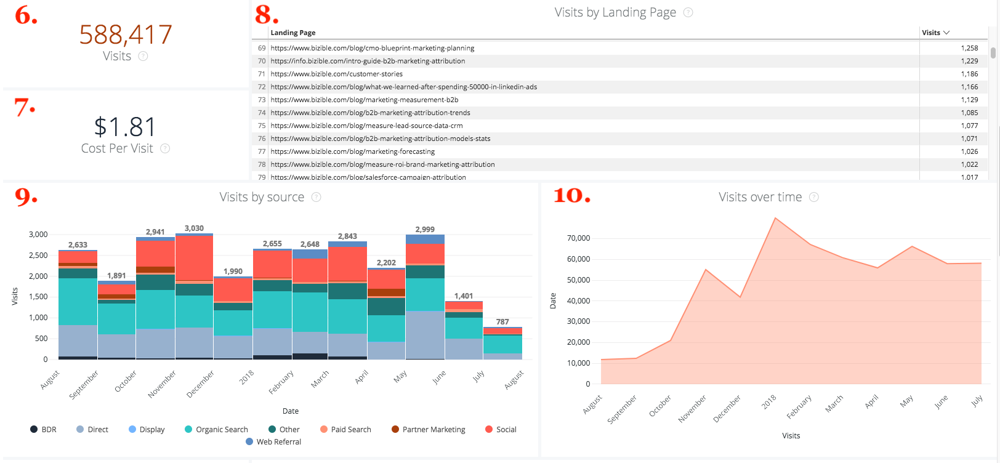

# Drill Throughs {#drill-throughs}

La [!DNL Marketo Measure Discover] experience consente ai clienti di analizzare in profondità il set di dati che più si interessano di loro. Su alcune misure [!DNL Marketo Measure Discover], i clienti possono fare clic su una tessera ed esplorare di più su tale metrica.

Di seguito è riportato un elenco delle dashboard e delle porzioni contenenti drill-through e l’esperienza che un utente deve aspettarsi durante il drill-through. Tieni presente che i filtri globali dal dashboard persistono durante il drill-through.

## Panoramica {#overview}

**Entrate**

Definizione: Entrate totali per mese tramite grafico a barre e tabella. Da lì, è possibile eseguire il drill-through in un mese singolo o rompere un mese per settimana, giorno o ora.

**Ricavi (grafico)**

Definizione: Entrate totali per mese tramite grafico a barre e tabella. Poiché il riquadro principale è già un grafico a barre, l’analisi in Mostra dettagli mostra solo un mese.

_Drill In: Totale ricavi per mese suddivisi per settimana o data._

**Spesa**

Definizione: Spesa totale per mese tramite grafico a barre e tabella. Da lì, è possibile eseguire il drill-through in un mese singolo o rompere un mese per settimana, giorno o ora.

**Offerte**

Definizione: Numero totale di offerte per mese tramite grafico a barre e tabella. Da lì, è possibile eseguire il drill-through in un mese singolo o rompere un mese per settimana, giorno o ora.

**Ricavi dalla pipeline**

Definizione: Ricavi totali della pipeline per mese tramite grafico a barre e tabella. Da lì, è possibile eseguire il drill-through in un mese singolo o rompere un mese per settimana, giorno o ora.

**Riepilogo del ROI**

Definizione: Entrate o spese totali per ogni canale per mese tramite grafico a barre e tabella. Da lì, è possibile approfondire quella riga per un mese o rompere un mese per settimana, giorno o ora.

**Costo per transazione**

Definizione: La spesa totale divisa per il numero totale di offerte, fornendo il costo medio necessario per acquisire un&#39;opportunità di vittoria chiusa. Da lì, è possibile approfondire quella riga per un mese o rompere un mese per settimana, giorno o ora.

**Canali per ricavi**

Definizione: Entrate totali di ogni canale per mese tramite grafico a barre e tabella. Da lì, è possibile approfondire quella riga per un mese o rompere un mese per settimana, giorno o ora.

**Sottocanali per ricavi**

Definizione: Entrate totali di ciascun canale secondario per mese tramite grafico a barre e tabella. Da lì, è possibile approfondire quella riga per un mese o rompere un mese per settimana, giorno o ora.

**Campagne per ricavi**

Definizione: Entrate totali di ogni campagna per mese tramite grafico a barre e tabella. Da lì, è possibile approfondire quella riga per un mese o rompere un mese per settimana, giorno o ora.

**Riepilogo dell&#39;offerta**

Definizione: Conteggio totale delle spese o delle offerte per ogni canale per mese tramite grafico a barre e tabella. Da lì, è possibile approfondire quella riga per un mese o rompere un mese per settimana, giorno o ora.

## Crescita {#growth}

**Entrate totali**

Definizione: Entrate totali per mese tramite grafico a barre e tabella. Da lì, è possibile eseguire il drill-through in un mese singolo o rompere un mese per settimana, giorno o ora.

**Ricavi nel tempo**

Definizione: Entrate totali per mese tramite grafico a barre e tabella. Poiché il riquadro principale è già un grafico, l&#39;analisi in Mostra dettagli mostrerà solo un mese.

_Totale ricavi per mese suddivisi per settimana o data._

**Offerte totali**

Definizione: Numero totale di offerte per mese tramite grafico a barre e tabella. Da lì, è possibile eseguire il drill-through in un mese singolo o rompere un mese per settimana, giorno o ora.

**Offerte nel tempo**

Definizione: Numero totale di offerte per mese tramite grafico a barre e tabella. Poiché il riquadro principale è già un grafico, l&#39;analisi in Mostra dettagli mostrerà solo un mese.

_Numero totale di offerte per mese disaggregate per settimana o data._

**Ricavi totali dalla pipeline**

Definizione: Ricavi totali della pipeline per mese tramite grafico a barre e tabella. Da lì, è possibile eseguire il drill-through in un mese singolo o rompere un mese per settimana, giorno o ora.

**Ricavi dalla pipeline nel tempo**

Definizione: Ricavi totali della pipeline per mese tramite grafico a barre e tabella. Poiché il riquadro principale è già un grafico, l&#39;analisi in Mostra dettagli mostrerà solo un mese.

_Totale ricavi della pipeline per mese suddivisi per settimana o data._

**Lead totali**

Definizione: Numero totale di lead per mese tramite grafico a barre e tabella. Da lì, è possibile eseguire il drill-through in un mese singolo o rompere un mese per settimana, giorno o ora.

**Lead nel tempo**

Definizione: Numero totale di lead per mese tramite grafico a barre e tabella. Poiché il riquadro principale è già un grafico, l&#39;analisi in Mostra dettagli mostrerà solo un mese.

_Numero totale di lead per mese suddivisi per settimana o data._

**Contatti totali**

Definizione: Totale contatti per mese tramite grafico a barre e tabella. Da lì, è possibile eseguire il drill-through in un mese singolo o rompere un mese per settimana, giorno o ora.

**Contatti nel tempo**

Definizione: Totale contatti per mese tramite grafico a barre e tabella. Poiché il riquadro principale è già un grafico, l&#39;analisi in Mostra dettagli mostrerà solo un mese.

_Totale contatti per mese suddivisi per settimana o data._

**Opportunità totali**

Definizione: Opportunità totali per mese tramite grafico a barre e tabella. Da lì, è possibile eseguire il drill-through in un mese singolo o rompere un mese per settimana, giorno o ora.

**Opportunità nel tempo**

Definizione: Opportunità totali per mese tramite grafico a barre e tabella. Poiché il riquadro principale è già un grafico, l&#39;analisi in Mostra dettagli mostrerà solo un mese.

_Opportunità totali per mese suddivise per settimana o data._

**Visite univoche**

Definizione: Numero totale di visualizzazioni di pagina per mese tramite grafico a barre e tabella. Da lì, è possibile eseguire il drill-through in un mese singolo o rompere un mese per settimana, giorno o ora.

**Visite univoche nel tempo**

Definizione: Il numero totale di visite univoche che mostrano la tendenza in un periodo di tempo specifico. Utilizza il filtro Raggruppa per per modificare lo stack per canale, canale secondario, campagna, account, gruppo di annunci, annuncio, inserzionista, creativo, parola chiave, posizionamento e sito. Se questa funzione è disabilitata, verrà visualizzato vuoto.

**Visite**

Definizione: Numero totale di visite al sito per mese tramite grafico a barre e tabella. Da lì, è possibile eseguire il drill-through in un mese singolo o rompere un mese per settimana, giorno o ora.

**Visite nel tempo**

Definizione: Numero totale di visite al sito monitorate che mostrano la tendenza in un periodo di tempo specifico. Utilizza il filtro Raggruppa per per modificare lo stack per canale, canale secondario, campagna, account, gruppo di annunci, annuncio, inserzionista, creativo, parola chiave, posizionamento e sito. Se questa funzione è disabilitata, verrà visualizzato vuoto.

**Forms**

Definizione: Numero totale di invii di moduli per mese tramite grafico a barre e tabella. Da lì, è possibile eseguire il drill-through in un mese singolo o rompere un mese per settimana, giorno o ora.

**Forms nel tempo**

Definizione: Numero totale di moduli inviati che mostrano la tendenza in un determinato periodo di tempo. Utilizza il filtro Raggruppa per per modificare lo stack per canale, canale secondario, campagna, account, gruppo di annunci, annuncio, inserzionista, creativo, parola chiave, posizionamento e sito. Se questa funzione è disabilitata, verrà visualizzato vuoto.

## Spesa {#spend}

**Spesa**

Definizione: Spesa totale per mese tramite grafico a barre e tabella. Da lì, è possibile eseguire il drill-through in un mese singolo o rompere un mese per settimana, giorno o ora.

**Spesa (grafico)**

Definizione: Spesa totale per mese tramite grafico a barre e tabella. Dato che il riquadro principale è già un grafico, l&#39;analisi in Mostra dettagli mostrerà solo un mese.

_Spesa totale per mese suddivisa per settimana, data o ora. Il tempo è possibile perché trascorre [!DNL Marketo Measure] scarica la spesa effettiva al minuto dalle nostre connessioni degli annunci._

**Spesa per canale**

Definizione: Spesa totale da ciascun canale per mese tramite grafico a barre e tabella. Da lì, è possibile approfondire quella riga per un mese o rompere un mese per settimana, giorno o ora.

**Spesa per canale secondario**

Definizione: Spesa totale da ciascun canale secondario per mese tramite grafico a barre e tabella. Da lì, è possibile approfondire quella riga per un mese o rompere un mese per settimana, giorno o ora.

**Spesa per campagna**

Definizione: Spesa totale per ogni campagna per mese tramite grafico a barre e tabella. Da lì, è possibile approfondire quella riga per un mese o rompere un mese per settimana, giorno o ora.

## Velocità di vendita {#sales-velocity}

**Velocity (giorni)**

Definizione: Il numero medio di giorni in cui le opportunità sono nel loro ciclo di vendita, dal primo tocco anonimo fino all&#39;opportunità vicina.

**Opportunità attive**

Definizione: Il numero totale di opportunità da qualsiasi opportunità aperta, il che significa che non è chiusa o chiusa.

**Dimensione dell&#39;offerta**

Definizione: La quantità media di un&#39;opportunità di un won chiuso.

**Frequenza Win**

Definizione: Il numero totale di opportunità chiuse e vinte divise per il numero totale di opportunità chiuse perdute e chiuse.

**Velocity opportunità per canale**

Definizione: Il numero medio di giorni in cui le opportunità si trovano nel ciclo per fase, raggruppati per canale di marketing e che mostra il tempo necessario per l&#39;avanzamento alla fase successiva. Le fasi che compaiono qui sono fasi cardine (FT, LC, OC) e fasi personalizzate.

**Velocity lead per canale**

Definizione: Il numero medio di giorni in cui i lead si trovano nel ciclo per fase prima che vengano convertiti in un contatto/opportunità/importo, raggruppati per canale di marketing e che mostra il periodo di tempo necessario per l’avanzamento alla fase successiva. Le tappe che compaiono qui sono fasi cardine (FT, LC) e fasi personalizzate.

**Velocity opportunità media**

Definizione: Il numero medio di giorni in cui le opportunità si trovano nel ciclo per fase, mostrando il tempo necessario per passare alla fase successiva. Le fasi che compaiono qui sono fasi cardine (FT, LC, OC) e fasi personalizzate. i numeri qui riflettono il tempo per fase nella Velocity opportunità dal grafico a canali.

**Velocity lead medio**

Definizione: Il numero medio di giorni in cui i lead si trovano nel ciclo per fase prima che vengano convertiti in un contatto/opportunità/importo, mostrando il tempo necessario per l&#39;avanzamento alla fase successiva. Le tappe che compaiono qui sono fasi cardine (FT, LC) e fasi personalizzate. i numeri qui riflettono il tempo per fase nella Velocity lead dal grafico a canali.

**Velocity opportunità nel tempo**

Definizione: Il numero medio di giorni in cui le opportunità sono nel loro ciclo per fase con una tendenza nel tempo.

**Velocity lead nel tempo**

Definizione: Il numero medio di giorni in cui i lead si trovano nel ciclo per fase con una tendenza nel tempo.

## Marketing basato su account {#account-based-marketing}

**Entrate totali**

Definizione: Entrate totali per mese tramite grafico a barre e tabella. Da lì, è possibile eseguire il drill-through in un mese singolo o rompere un mese per settimana, giorno o ora.

**Ricavi totali dalla pipeline**

Definizione: Ricavi totali della pipeline per mese tramite grafico a barre e tabella. Da lì, è possibile eseguire il drill-through in un mese singolo o rompere un mese per settimana, giorno o ora.

**Lead con corrispondenza**

Definizione: Numero totale di lead associati a un account.

**Account contattati**

Definizione: Numero totale di account che hanno ricevuto qualsiasi punto di contatto.

**Opportunità toccate**

Definizione: Elenco degli ID opportunità con l&#39;ID account corrispondente

**Contatti contattati**

Definizione: Elenco degli ID contatto con l&#39;ID account corrispondente

**Punti di contatto nel tempo (grafico)**

Definizione: Elenco dei punti di contatto del mese selezionato.

_Il numero di punti di contatto interessati suddivisi per settimana, data o ora._

**Account toccati nel tempo (grafico)**

Definizione: Elenco degli ID account dal mese selezionato.

_Il numero di account interessati suddivisi per settimana, data o ora._

## Analisi web {#web-analytics}

**Visite univoche**

Definizione: Numero totale di visite del sito univoche per mese tramite grafico a barre e tabella. Da lì, è possibile eseguire il drill-through in un mese singolo o rompere un mese per settimana, giorno o ora.

**Costo per visita univoca**

Definizione: Spesa totale divisa per il numero totale di visite univoche. Da lì, è possibile eseguire il drill-through in un mese singolo o rompere un mese per settimana, giorno o ora.

**Visite univoche per pagina di destinazione**

Definizione: Un elenco di pagine di destinazione basato sul numero di visitatori univoci da ciascun URL.

**Visite univoche per origine**

Definizione: Visualizza le origini dei visitatori unici del sito.

**Visite univoche nel tempo**

Definizione: Numero totale di visite univoche tracciate, che mostrano una tendenza in un intervallo di tempo specifico.

**Visite**

Definizione: Numero totale di visite al sito per mese tramite grafico a barre e tabella. Da lì, è possibile eseguire il drill-through in un mese singolo o rompere un mese per settimana, giorno o ora.

**Costo per visita**

Definizione: La spesa totale divisa per il numero totale di visite.

**Visite per pagina di destinazione**

Definizione: Elenco di pagine di destinazione in base al numero di visite a ciascun URL.

**Visite per origine**

Definizione: Origine dei visitatori del sito. Può essere modificato per canale, canale secondario, campagna, account, gruppo di annunci, annuncio, inserzionista, creativo, parola chiave, posizionamento e sito.

**Visite nel tempo**

Definizione: Numero totale di visite monitorate, che mostrano la tendenza in un intervallo di tempo specifico. Da lì, è possibile eseguire il drill-through in un mese singolo o rompere un mese per settimana, giorno o ora.

**Visualizzazioni pagina**

Definizione: Numero totale di visualizzazioni di pagina per mese tramite grafico a barre e tabella. Da lì, è possibile eseguire il drill-through in un mese singolo o rompere un mese per settimana, giorno o ora.

**Visualizzazione Costo per pagina**

Definizione: La spesa totale divisa per il numero totale di visualizzazioni di pagina monitorate.

**Visualizzazioni di pagina per URL**

Definizione: Un elenco di URL di pagina in base al numero di visualizzazioni di pagina da ciascun URL.

**Visualizzazioni pagina nel tempo**

Definizione: Totale visualizzazioni pagina per mese tramite grafico a barre e tabella. Dato che il riquadro principale è già un grafico, l&#39;analisi in Mostra dettagli mostrerà solo un mese.

_Visualizzazioni di pagina totali per mese suddivise per settimana, data o ora._

**Forms nel tempo**

Definizione: Numero totale di moduli tracciati, che mostrano la tendenza in un intervallo di tempo specifico.

**Forms**

Definizione: Numero totale di invii di moduli per mese tramite grafico a barre e tabella. Da lì, è possibile eseguire il drill-through in un mese singolo o rompere un mese per settimana, giorno o ora.

**Costo per modulo**

Definizione: Spesa totale divisa per il totale dei moduli inviati.

**Invio del modulo per URL del modulo**

Definizione: Un elenco di URL del modulo in base al numero inviato su ciascun URL.

**Lead per pagina di destinazione**

Definizione: Elenco di pagine di destinazione in base al numero di lead generati da ogni pagina di destinazione.

**Lead per URL modulo**

Definizione: Un elenco di URL del modulo in base al numero di lead generati da ciascun URL.

## OCM {#cmo}

**Entrate**

Definizione: Entrate totali per mese tramite grafico a barre e tabella. Da lì, è possibile eseguire il drill-through in un mese singolo o rompere un mese per settimana, giorno o ora.

**Ricavi (grafico)**

Definizione: Entrate totali per mese tramite grafico a barre e tabella. Poiché il riquadro principale è già un grafico a barre, l’analisi in Mostra dettagli mostra solo un mese.

_Totale ricavi per mese suddivisi per settimana o data._

**Spesa**

Definizione: Spesa totale per mese tramite grafico a barre e tabella. Da lì, è possibile eseguire il drill-through in un mese singolo o rompere un mese per settimana, giorno o ora.

**ROI**

Definizione: L’utile sull’investimento calcolato a partire dai ricavi totali e dalla spesa totale (in base al modello di attribuzione).

**Offerte**

Definizione: Numero totale di offerte per mese tramite grafico a barre e tabella. Da lì, è possibile eseguire il drill-through in un mese singolo o rompere un mese per settimana, giorno o ora.

**Costo per transazione**

Definizione: Spesa totale divisa per il numero totale di offerte, fornendo il costo medio che ci vuole per acquisire un&#39;opportunità di vittoria chiusa.

**Ricavi dalla pipeline**

Definizione: Ricavi totali della pipeline per mese tramite grafico a barre e tabella. Da lì, è possibile eseguire il drill-through in un mese singolo o rompere un mese per settimana, giorno o ora.

**Dimensione dell&#39;offerta**

Definizione: L&#39;importo medio di un&#39;opportunità di vincita chiusa.

**Canali per ricavi**

Definizione: Entrate totali di ogni canale per mese tramite grafico a barre e tabella. Da lì, è possibile approfondire quella riga per un mese o rompere un mese per settimana, giorno o ora.

**Sottocanali per ricavi**

Definizione: Entrate totali di ciascun canale secondario per mese tramite grafico a barre e tabella. Da lì, è possibile approfondire quella riga per un mese o rompere un mese per settimana, giorno o ora.

**Campagne per ricavi**

Definizione: Entrate totali di ogni campagna per mese tramite grafico a barre e tabella. Da lì, è possibile approfondire quella riga per un mese o rompere un mese per settimana, giorno o ora.

**Riepilogo del ROI**

Definizione: Entrate o spese totali per ogni canale per mese tramite grafico a barre e tabella. Da lì, è possibile approfondire quella riga per un mese o rompere un mese per settimana, giorno o ora.

**Riepilogo dell&#39;offerta**

Definizione: Conteggio totale delle spese o delle offerte per ogni canale per mese tramite grafico a barre e tabella. Da lì, è possibile approfondire quella riga per un mese o rompere un mese per settimana, giorno o ora.

## Marketing dei contenuti {#content-marketing}

**Entrate totali**

Definizione: Entrate totali per mese tramite grafico a barre e tabella. Da lì, è possibile eseguire il drill-through in un mese singolo o rompere un mese per settimana, giorno o ora.

**Pagine di destinazione per ricavi**

Definizione: Entrate totali da ogni pagina di destinazione tramite grafico a barre e tabella. Da lì, è possibile approfondire quella riga per un mese o rompere un mese per settimana, giorno o ora.

**Ricavi totali dalla pipeline**

Definizione: Ricavi totali della pipeline per mese tramite grafico a barre e tabella. Da lì, è possibile eseguire il drill-through in un mese singolo o rompere un mese per settimana, giorno o ora.

**Ricavi dalle pagine di destinazione per pipeline**

Definizione: Entrate totali della pipeline da ogni pagina di destinazione tramite grafico a barre e tabella. Da lì, è possibile approfondire quella riga per un mese o rompere un mese per settimana, giorno o ora.

**Opportunità totali**

Definizione: Numero totale di opportunità per mese tramite grafico a barre e tabella. Da lì, è possibile eseguire il drill-through in un mese singolo o rompere un mese per settimana, giorno o ora.

**Numero di pagine di destinazione per opportunità**

Definizione: Numero totale di opportunità da ogni pagina di destinazione tramite grafico a barre e tabella. Da lì, è possibile approfondire quella riga per un mese o rompere un mese per settimana, giorno o ora.

**Totale Forms**

Definizione: Numero totale di moduli per mese tramite grafico a barre e tabella. Da lì, è possibile eseguire il drill-through in un mese singolo o rompere un mese per settimana, giorno o ora.

**URL del modulo principale per sottomoduli**

Definizione: Numero totale di moduli da ciascun URL del modulo tramite grafico a barre e tabella. Da lì, è possibile approfondire quella riga per un mese o rompere un mese per settimana, giorno o ora.

**URL del modulo per canale**

Definizione: Numero totale di moduli inviati dall’URL del modulo per mese tramite grafico a barre e tabella. Da lì, è possibile approfondire quella riga per un mese o rompere un mese per settimana, giorno o ora.

**Visite univoche**

Definizione: Il numero totale di visite univoche del sito monitorate da tutti i visitatori noti e anonimi. Esegui il drill-in per visualizzare le visite univoche del sito tracciate per mese.

**Pagine di destinazione principali per visite univoche**

Definizione: Elenco di pagine di destinazione in base al numero di visite univoche per ogni pagina di destinazione. Effettua un drill-in per visualizzare le visite univoche per mese all’URL selezionato.

**Visite**

Definizione: Il numero totale di visite al sito monitorate da tutti i visitatori noti e anonimi. Effettua un drill-in per visualizzare le visite al sito tracciate per mese.

**Pagine di destinazione principali per visite**

Definizione: Elenco di pagine di destinazione in base al numero di visite iniziali a ogni pagina di destinazione. Effettua un drill-in per visualizzare le visite per mese all’URL selezionato.

**Lead totali**

Definizione: Numero totale di lead per mese tramite grafico a barre e tabella. Da lì, è possibile eseguire il drill-through in un mese singolo o rompere un mese per settimana, giorno o ora.

**Pagine di destinazione per conteggio lead**

Definizione: Numero totale di lead da ogni pagina di destinazione tramite grafico a barre e tabella. Da lì, è possibile approfondire quella riga per un mese o rompere un mese per settimana, giorno o ora.

## Supporti a pagamento {#paid-media}

**Impressioni**

Definizione: Numero totale di impression per mese tramite grafico a barre e tabella. Da lì, è possibile eseguire il drill-through in un mese singolo o rompere un mese per settimana, giorno o ora.

**CPM**

Definizione: La spesa totale dalle impression servite divisa per le impression totali.

**Clic**

Definizione: Numero totale di clic per mese tramite grafico a barre e tabella. Da lì, è possibile eseguire il drill-through in un mese singolo o rompere un mese per settimana, giorno o ora.

**CPC**

Definizione: La spesa totale dei clic tracciati divisa per i clic totali.

**Lead**

Definizione: Numero totale di lead in base al modello di attribuzione.

**CPL**

Definizione: La spesa totale dai lead creati divisa per i clic totali, fornendo il tasso di CPL.

**Visite**

Definizione: Numero totale di visite al sito per mese tramite grafico a barre e tabella. Da lì, è possibile eseguire il drill-through in un mese singolo o rompere un mese per settimana, giorno o ora.

**Visualizzazioni pagina**

Definizione: Numero totale di visualizzazioni di pagina per mese tramite grafico a barre e tabella. Da lì, è possibile eseguire il drill-through in un mese singolo o rompere un mese per settimana, giorno o ora.

**Riepilogo campagne**

Definizione: Elenco di campagne in base alla quantità di entrate/spese/offerte/opportunità attribuite a ciascuna campagna, ordinate in base al più alto in base al modello di attribuzione selezionato.

**Riepilogo annuncio**

Definizione: Un elenco di annunci in base alla quantità di ricavi/ricavi/spesa/offerte/opportunità della pipeline attribuiti a ciascun annuncio, in base al modello di attribuzione selezionato.

**Riepilogo parole chiave**

Definizione: Un elenco di parole chiave basate sulla quantità di ricavi/ricavi/spesa/opportunità della pipeline/offerte/opportunità attribuite a ciascuna parola chiave, in base al modello di attribuzione selezionato.

**Campagne per ROI**

Definizione: Un elenco di campagne basate sul ROI calcolato per ogni campagna, ordinate in base al ROI più alto. Esegui il drill-in per visualizzare le entrate o le spese per mese per la campagna selezionata.

**Annunci per ROI**

Definizione: Un elenco di annunci basati sul ROI calcolato per ciascun annuncio, ordinati in base al ROI più alto. Effettua un drill-in per visualizzare le entrate o la spesa per mese per l’annuncio selezionato.

**Parole chiave per ROI**

Definizione: Elenco di parole chiave basate sul ROI calcolato per ogni parola chiave, ordinate in base al ROI più alto. Esegui il drill-down per visualizzare i ricavi o la spesa per mese per la parola chiave selezionata.
