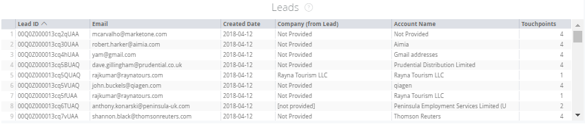

# Riquadri Marketing Ops {#marketing-ops-tiles}

Operazioni di marketing consente di convalidare e diagnosticare [!DNL Marketo Measure] dati con visibilità completa su singoli punti di contatto per lead, contatti, account, campagne e opportunità.

<table> 
 <colgroup> 
  <col> 
  <col> 
  <col> 
  <col> 
  <col> 
  <col> 
  <col> 
  <col> 
  <col> 
  <col> 
  <col> 
  <col> 
  <col> 
 </colgroup> 
 <tbody> 
  <tr> 
   <td> </td> 
   <td>
<strong>ID account</strong>
</td> 
   <td>
<strong>Nome account</strong>
</td> 
   <td>
<strong>ID Opp</strong>
</td> 
   <td>
<strong>Nome Opp</strong>
</td> 
   <td>
<strong>ID lead o contatto</strong>
</td> 
   <td>
<strong>E-mail lead o contatto</strong>
</td> 
   <td>
<strong>ID campagna</strong>
</td> 
   <td>
<strong>Opp Won</strong>
</td> 
   <td>
<strong>Data creazione Opp</strong>
</td> 
   <td>
<strong>Data chiusura Opp</strong>
</td> 
   <td>
<strong>Data punto di contatto</strong>
</td> 
   <td>
<strong>Modello di attribuzione</strong>
</td> 
  </tr> 
  <tr> 
   <td>
<strong>Account</strong>
</td> 
   <td><strong>X</strong></td> 
   <td><strong>X</strong></td> 
   <td><strong>X</strong></td> 
   <td><strong>X</strong></td> 
   <td><strong>X</strong></td> 
   <td> </td> 
   <td><strong>X</strong></td> 
   <td><strong>X</strong></td> 
   <td><strong>X</strong></td> 
   <td><strong>X</strong></td> 
   <td><strong>X</strong></td> 
   <td><strong>X</strong></td> 
  </tr> 
  <tr> 
   <td>
<strong>Opportunità</strong>
</td> 
   <td><strong>X</strong></td> 
   <td><strong>X</strong></td> 
   <td><strong>X</strong></td> 
   <td><strong>X</strong></td> 
   <td><strong>X</strong></td> 
   <td> </td> 
   <td><strong>X</strong></td> 
   <td><strong>X</strong></td> 
   <td><strong>X</strong></td> 
   <td><strong>X</strong></td> 
   <td><strong>X</strong></td> 
   <td><strong>X</strong></td> 
  </tr> 
  <tr> 
   <td>
<strong>Contatti</strong>
</td> 
   <td><strong>X</strong></td> 
   <td><strong>X</strong></td> 
   <td><strong>X</strong></td> 
   <td><strong>X</strong></td> 
   <td><strong>X</strong></td> 
   <td><strong>X</strong></td> 
   <td><strong>X</strong></td> 
   <td><strong>X</strong></td> 
   <td><strong>X</strong></td> 
   <td><strong>X</strong></td> 
   <td><strong>X</strong></td> 
   <td><strong>X</strong></td> 
  </tr> 
  <tr> 
   <td>
<strong>Lead</strong>
</td> 
   <td><strong>X</strong></td> 
   <td><strong>X</strong></td> 
   <td><strong>X*</strong></td> 
   <td><strong>X*</strong></td> 
   <td><strong>X</strong></td> 
   <td><strong>X</strong></td> 
   <td><strong>X</strong></td> 
   <td><strong>X*</strong></td> 
   <td><strong>X*</strong></td> 
   <td><strong>X*</strong></td> 
   <td><strong>X</strong></td> 
   <td><strong>X</strong></td> 
  </tr> 
  <tr> 
   <td>
<strong>Campagne</strong>
</td> 
   <td><strong>X</strong></td> 
   <td><strong>X</strong></td> 
   <td><strong>X</strong></td> 
   <td><strong>X</strong></td> 
   <td><strong>X</strong></td> 
   <td> </td> 
   <td><strong>X</strong></td> 
   <td><strong>X</strong></td> 
   <td><strong>X</strong></td> 
   <td><strong>X</strong></td> 
   <td><strong>X</strong></td> 
   <td><strong>X</strong></td> 
  </tr> 
 </tbody> 
</table>

## Sezione account {#account-tile}

Visualizza i dati seguenti relativi agli account specificati.

**Gli account devono disporre di dati punto di contatto (applicabile solo se è abilitato ABM)**

-ID account: ID account in CRM

-Nome account: nome account in CRM

-Data di creazione: data di creazione dell’account nel sistema di gestione delle relazioni con i clienti

* Drill-down: vedi Data di creazione per ora, minuto e ora

-Sito Web: valore trovato nel campo Sito Web dell&#39;account

-Valutazione del coinvolgimento: punteggio di coinvolgimento predittivo (PES) popolato da [!DNL Marketo Measure]^1

-Opportunità: numero di opportunità collegate all&#39;account

* Drill-down: consulta i dettagli per le opportunità associate

-Contatti: numero di contatti elencati in questo account

* Drill-down: consulta i dettagli dei contatti associati

-Lead: numero di lead mappati a questo conto tramite il mapping lead-account^1

* Drill-down: consulta i dettagli per i lead mappati sul conto

-Punti di contatto di attribuzione: numero di punti di contatto di attribuzione acquirente per l&#39;account

* Drill-down: consulta i dettagli del punto di contatto di attribuzione dell’acquirente (ID, e-mail, data punto di contatto, nome account, campagna, canale, sottocanale, tipo di contatto marketing, modello di attribuzione)

-Punti di contatto: numero di punti di contatto che i contatti di questo account hanno^2

* Drill-down: vedi i punti di contatto nei dettagli dell’account punto di contatto (ID, e-mail, data punto di contatto, nome account, campagna, canale, sottocanale, tipo di contatto marketing)

>[!NOTE]
>
>Se disponi di ABM, verranno visualizzati i punti di contatto relativi ai lead mappati tramite la mappatura lead-account.

## Sezione opportunità {#opportunity-tile}

Visualizza i seguenti dati relativi alle opportunità specificate.

-ID opportunità: ID opportunità in CRM

-Nome opportunità: nome dell&#39;opportunità in CRM

-Nome account: nome account associato all&#39;opportunità

-Data di creazione: data di creazione dell’opportunità nel CRM

Drill-down: vedi Data di creazione per ora, minuto e ora

-Data di chiusura: data di chiusura dell&#39;opportunità nel CRM

Drill-down: vedi Data di chiusura per ora, minuto, ora

-Importo: importo totale dell&#39;opportunità

-Contatti: numero di contatti associati all&#39;opportunità

Drill-down: consulta i dettagli dei contatti associati

-Punti di contatto di attribuzione: numero di punti di contatto di attribuzione buyer correlati

Drill-down: consulta i dettagli del punto di contatto di attribuzione dell’acquirente (ID, e-mail, data punto di contatto, nome account, campagna, canale, sottocanale, tipo di contatto marketing, modello di attribuzione)

## Sezione Contatti {#contacts-tile}

Visualizza i dati seguenti relativi ai contatti specificati.

-ID contatto: ID contatto in CRM

-Email: Indirizzo email del record di contatto

-Data di creazione: data di creazione del contatto nel CRM

* Drill-down: vedi Data di creazione per ora, minuto e ora

-Nome account: nome account associato al contatto

-Punti di contatto di attribuzione: numero di punti di contatto di attribuzione acquirente per il contatto

* Drill-down: consulta i dettagli del punto di contatto di attribuzione dell’acquirente (ID, e-mail, data punto di contatto, nome account, campagna, canale, sottocanale, tipo di contatto marketing, modello di attribuzione)

-Punti di contatto: numero di punti di contatto dell&#39;acquirente per il contatto

* Drill-down: consulta Contatti nei dettagli del punto di contatto dell’account (ID, e-mail, data punto di contatto, nome account, campagna, canale, sottocanale, tipo di contatto marketing)

## Sezione lead {#leads-tile}

Visualizza i seguenti dati relativi ai lead specificati.

-ID lead: ID lead in CRM

-E-mail: indirizzo e-mail record lead

-Data di creazione: quando il lead è stato creato nel CRM

* Drill-down: vedi Data di creazione per ora, minuto e ora

-Società (da lead): la società indicata nel record nel CRM compilato dal cliente

-Nome account: il nome dell&#39;account [!DNL Marketo Measure] compila in base alla mappatura lead per account

-Punti di contatto: il numero di punti di contatto associati ai lead

* Drill-down: consulta Contatti nei dettagli del punto di contatto dell’account (ID, e-mail, data punto di contatto, nome account, campagna, canale, sottocanale, tipo di contatto marketing)

## Sezione campagne {#campaigns-tile}

Visualizza i seguenti dati relativi alle campagne specificate.

-ID campagna: ID campagna nel CRM

-Nome campagna: nome campagna in CRM

-Spesa campagna: la spesa [!DNL Marketo Measure] ha registrato associato alla campagna

-Modello di attribuzione: mostra l’attribuzione appropriata in base al modello selezionato

-Punti di contatto di attribuzione: il numero di punti di contatto di attribuzione buyer associati alle campagne

* Drill-down: consulta i dettagli del punto di contatto di attribuzione dell’acquirente (ID, e-mail, data punto di contatto, nome account, campagna, canale, sottocanale, tipo di contatto marketing, modello di attribuzione)

-Punti di contatto: numero di punti di contatto associati alle campagne

* Drill-down: consulta Contatti nei dettagli del punto di contatto dell’account (ID, e-mail, data punto di contatto, nome account, campagna, canale, sottocanale, tipo di contatto marketing)
