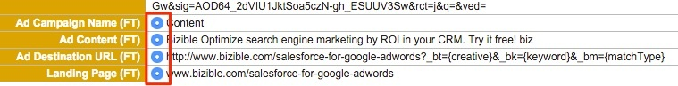

# Best practice per l’unione di lead {#best-practices-for-merging-leads}

Quando si tratta di unire lead in [!DNL Salesforce]Quindi è sempre meglio essere cauti per assicurarsi che non vadano persi dati.

Per riferimento, ecco la suddivisione di [come unire i lead](https://help.salesforce.com/HTViewHelpDoc?id=leads_merge.htm&amp;language=en_US) da [!DNL Salesforce] Supporto.

Dove [!DNL Marketo Measure] arriva è il momento di selezionare i campi che verranno inseriti nel record unito. Dopo aver selezionato il record principale, verificare che [!DNL Marketo Measure] vengono selezionati per il riporto al nuovo record.

Se sono presenti più record con [!DNL Marketo Measure] , accertati che il record principale contenga i campi selezionati per il lead creato per primo. Aggiuntivo [!DNL Marketo Measure] I dati saranno presenti nella sezione Approfondimenti. Inoltre, assicurati che l’indirizzo e-mail del lead tracciato sia l’indirizzo e-mail che viene mantenuto, in quanto ci consentirà di continuare ad aggiornare tale lead con eventuali nuovi dati di attribuzione.

Da qui, dovresti essere libero di unire i lead e [!DNL Marketo Measure] I dati verranno trasferiti al nuovo record.

In caso di domande, non esitare a contattare l&#39;Adobe Account Team (il tuo Account Manager) o [Supporto Marketo](https://nation.marketo.com/t5/support/ct-p/Support){target="_blank"}.

