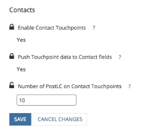

# Punti di contatto PostLC e coinvolgimento lead {#postlc-touchpoints-and-lead-engagement}

[!DNL Marketo Measure] I punti di contatto Post-Lead Creation (PostLC) sono disponibili per i clienti che utilizzano modelli di attribuzione multi-touch (W-Shape e versioni successive). Quando un lead o un contatto ritorna sul tuo sito web e continua a compilare moduli, questi invii di moduli si registreranno come punti di contatto PostLC. Questi punti di contatto consentono di vedere quali contenuti stanno guidando i lead a continuare a interagire con il sito, molto tempo dopo la loro prima conversione. I punti di contatto PostLC condividono il credito di attribuzione con tutti i punti di contatto intermediari all’interno di un’opportunità; il 10% di credito di attribuzione viene assegnato ai punti di contatto intermediari e viene distribuito equamente tra tutti i contatti.

È possibile regolare il numero di punti di contatto PostLC visualizzati in [!DNL SFDC]. In genere si consiglia di spingere fino a cinque punti di contatto PostLC; ogni punto di contatto occupa 1 KB in [!DNL SFDC].

>[!NOTE]
>
>Le istruzioni su come regolare le impostazioni dei punti di contatto PostLC sono disponibili alla fine di questo articolo.

I punti di contatto PostLC sono dinamici. Poiché un lead o un contatto continua a inviare moduli PostLC, [!DNL Marketo Measure] aggiornerà i punti di contatto PostLC nel CRM per mostrarti i moduli inviati più di recente. In particolare, se hai impostato un limite di 5 punti di contatto PostLC, [!DNL Marketo Measure] spingi sempre il 5 _più recente_ punti di contatto per il tuo CRM.  In questo esempio, questo account ha impostato il limite PostLC su quattro punti di contatto. Questo lead ha già raggiunto il numero massimo di punti di contatto PostLC che può avere nel CRM. L’ultimo contatto PostLC è avvenuto il 2/6/2018. Se questa persona dovesse compilare un altro modulo il giorno successivo, [!DNL Marketo Measure] rimuoverà il primo punto di contatto PostLC da 11/9/2017 per aggiungere l’ultimo punto di contatto da 2/7/2018.

>[!NOTE]
>
>[!DNL Marketo Measure] aggiorna solo i punti di contatto PostLC sul lead o sul contatto e non aggiorna i punti di contatto di attribuzione PostLC su un’opportunità. Tutti i punti di contatto PostLC pertinenti su un contatto verranno inclusi nell’opportunità.

## Come modificare le impostazioni dei punti di contatto PostLC {#how-to-change-postlc-touchpoint-settings}

Per regolare le impostazioni dei punti di contatto PostLC per i lead o i contatti, attenersi alle istruzioni riportate di seguito.

**Lead**

1. Accedi al tuo [!DNL Marketo Measure] account in [experience.adobe.com/marketo-measure](https://experience.adobe.com/marketo-measure){target="_blank"} e vai a [!UICONTROL Settings].

1. In CRM, seleziona **[!UICONTROL Leads]**.

1. Inserisci il numero di punti di contatto postLC che desideri inviare ai lead e fai clic su **[!UICONTROL Save]**.

   

**Contatti**

1. Accedi al tuo [!DNL Marketo Measure] account in [experience.adobe.com/marketo-measure](https://experience.adobe.com/marketo-measure){target="_blank"} e vai a [!UICONTROL Settings].

1. In CRM, seleziona **[!UICONTROL Contacts]**.

1. Inserisci il numero di punti di contatto postLC che desideri inviare ai tuoi Contatti e fai clic su **[!UICONTROL Save]**.

   
