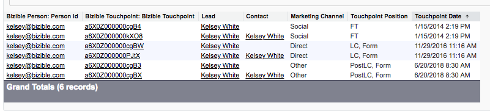
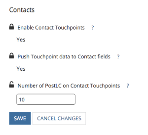

# Abilitazione dell’autorizzazione per la modifica di lead convertiti {#enabling-the-permission-to-edit-converted-leads}

Scopri come abilitare l&#39;autorizzazione per modificare i record lead convertiti in [!DNL Salesforce]. [!DNL Marketo Measure] ha la capacità di inviare dati ai vari oggetti in Salesforce. Quando si invia il messaggio ai lead, in alcuni scenari potrebbe essere necessario inviarlo nuovamente a un record di lead già convertito. Per inviare i dati a tali record, l’utente con cui siamo connessi deve disporre dell’autorizzazione per visualizzare e modificare i lead convertiti a livello di profilo.

1. Vai a [!UICONTROL Setup] ed espandi il raggruppamento [!UICONTROL Manage Users] per selezionare Profili.

   

1. Seleziona il profilo dell’utente tramite il quale siamo connessi.

1. Cercare l&#39;autorizzazione per visualizzare e modificare lead convertiti.

   

1. Seleziona la casella per abilitare l&#39;autorizzazione per visualizzare e modificare i lead convertiti.

   

E hai finito!
