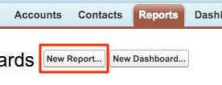
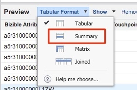

# Opportunità perdute chiuse per canale di marketing {#closed-lost-opportunities-by-marketing-channel}

Anche se questo rapporto può dipendere dalle fasi opportunità, verrà mostrato quali canali di marketing hanno contribuito a creare opportunità che non vengono chiuse.

1. Fai clic su **[!UICONTROL Reports]** scheda in Salesforce e seleziona **[!UICONTROL New Report]**.

   

1. Nel tipo di ricerca rapida in &quot;Attribuzione Bizible&quot; e seleziona il **[!UICONTROL Bizible Attribution Touchpoint with Opportunity]** tipo di rapporto, quindi seleziona **[!UICONTROL Create]**.

   

1. A partire dalla parte superiore del report, mostra &quot;[!UICONTROL All Bizible Attribution Touchpoints]&quot; e regola il campo data in base all’intervallo temporale su cui desideri effettuare il rapporto. Nel nostro esempio, stiamo guardando All Time. Inoltre, modifica il formato del rapporto da Tabulare a Riepilogo.

   

   

1. Ora aggiungeremo dei campi al rapporto. Nella ricerca rapida a sinistra, digita &quot;Marketing Channel&quot; e aggiungilo al raggruppamento di riepilogo nel rapporto.

   

1. Successivamente, aggiungeremo un filtro per esaminare solo le Opp perdute chiuse. Nella ricerca rapida a sinistra, cerca il campo &quot;Stage&quot; e trascinalo nell’area del filtro.

   

1. Da lì si selezionerà la lente di ingrandimento per scegliere qualsiasi fase/i si utilizza per &quot;Closed Lost&quot; Opportunità. Nel nostro caso, utilizzeremo la denominazione standard &quot;Closed Lost&quot;.

   

1. Ora, vai avanti ed esegui il rapporto!

   Questo è un rapporto Opportunità riepilogato dal canale Marketing che misura le opportunità perdute chiuse tra i tuoi canali. Questo rapporto ti consente di comprendere i Canali che potrebbero presentare prestazioni inferiori. Puoi aggiungere altri filtri o campi su cui desideri creare rapporti.

>[!MORELIKETHIS]
>
>[[!DNL Marketo Measure] Università: Rapporti aggiuntivi SFDC](https://universityonline.marketo.com/courses/bizible-fundamentals-bizible-102/#/page/5c5cb68dfb384d0c9fb96cd0)
