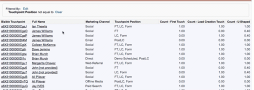

# Record duplicati nel mio report {#duplicate-records-in-my-report}

>[!NOTE]
>
>Potresti vedere le istruzioni che specificano &quot;[!DNL Marketo Measure]&quot; nella documentazione, ma vedere comunque &quot;[!DNL Bizible]&quot; nel CRM. Stiamo lavorando per aggiornarlo e il rebranding verrà riportato nel tuo CRM a breve.

Mentre si immergono nei report [!DNL Marketo Measure] in [!DNL Salesforce], è possibile che si trovino record &quot;duplicati&quot; nei report. È probabile che provi questa sensazione quando esamini [!DNL Marketo Measure] rapporti predefiniti.

Quando esegui un rapporto con l’oggetto Punti di contatto buyer o con l’oggetto Buyer Attribution Touchpoint, è importante comprendere che non stai più eseguendo un rapporto sul numero di lead, contatti o opportunità, ma piuttosto sul numero di Punti di contatto buyer o di Punti di contatto di attribuzione buyer associati a tali oggetti standard (lead, contatti, opportunità).

Prendiamo il seguente rapporto come esempio:

Questo è un report **Contatti con punti di contatto acquirenti**. Anche in questo caso, ciò significa che stiamo esaminando il numero di punti di contatto associati a un singolo contatto.

Come potete vedere, sembra che ci siano tre contatti di James Williams nel rapporto, e quindi potreste pensare, &quot;duplicati!&quot;

Tuttavia, questo rapporto mostra il numero di punti di contatto relativi a James. All’interno del rapporto, puoi vedere che James ha un FT individuale (First Touch), un LC individuale, un Form (Lead Creation Touch) e un punto di contatto PostLC (un invio di moduli che avviene dopo il punto di contatto LC).

Se desideri comprendere il &quot;conteggio dei contatti&quot;, puoi quindi utilizzare i campi &quot;Conteggio - Primo contatto&quot;, &quot;Conteggio-contatto di creazione lead&quot; o &quot;Conteggio-a forma di U&quot; per capire quanti contatti hanno avuto interazioni di marketing.

>[!MORELIKETHIS]
>
>[[!DNL Marketo Measure] Esercitazioni: Stock SFDC Reports](https://experienceleague.adobe.com/en/docs/marketo-measure-learn/tutorials/onboarding/marketo-measure-102/stock-salesforce-reports){target="_blank"}
