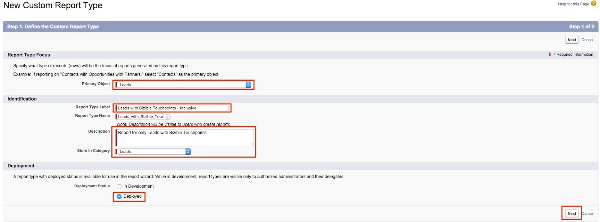

# Rapporto Lead con punti di contatto buyer {#leads-with-buyer-touchpoints-report}

>[!NOTE]
>
>Potresti vedere le istruzioni che specificano &quot;[!DNL Marketo Measure]&quot; nella nostra documentazione, ma vedi comunque &quot;[!DNL Bizible]&quot; nel tuo CRM. Stiamo lavorando per aggiornarlo e il rebranding verrà riportato nel tuo CRM a breve.

Sono già disponibili numerose funzionalità di reporting per [!DNL Marketo Measure], ma è consigliabile creare alcuni tipi di rapporto aggiuntivi. Scopri come creare un tipo di rapporto Lead inclusivi con punti di contatto buyer di seguito.

1. Passa all’opzione Configurazione in [!DNL Salesforce]. Da qui, espandi il raggruppamento &quot;Crea&quot; e seleziona **[!UICONTROL Report Types]**.

   

1. Seleziona **[!UICONTROL New Custom Report Type]**.

   

1. Impostare l&#39;oggetto principale come &quot;Lead&quot; e all&#39;interno dell&#39;input &quot;Etichetta tipo di report&quot; &quot;Lead con punti di contatto buyer - Inclusivi&quot;. Memorizza il rapporto nella categoria &quot;Lead&quot; e modifica lo stato di distribuzione in **[!UICONTROL Deployed]**. Quindi seleziona **[!UICONTROL Next]**.

   

1. Per le relazioni tra gli oggetti, selezionare **[!DNL Marketo Measure]Persone** come oggetto secondario. Selezionare la relazione da A a B come, &quot;Ogni record &#39;A&#39; deve avere almeno un record &#39;B&#39; correlato.&quot; A questo punto, verrà correlato l&#39;oggetto &quot;Punto di contatto acquirente&quot; e verrà selezionata la stessa relazione tra gli oggetti B e C.

   

1. Salva e inizia a creare alcuni rapporti.
