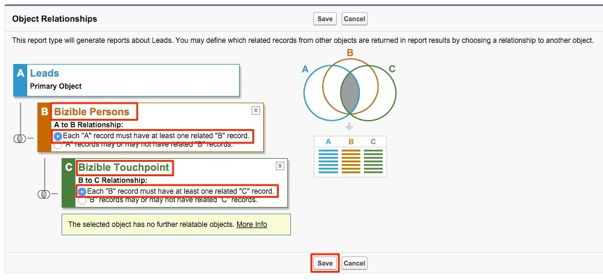

# Rapporto Lead con punti di contatto dell’acquirente {#leads-with-buyer-touchpoints-report}

>[!NOTE]
>
>È possibile visualizzare istruzioni che specificano &quot;[!DNL Marketo Measure]&quot; nella nostra documentazione, ma ancora vedi &quot;[!DNL Bizible]&quot; nel CRM. Stiamo lavorando per aggiornarlo e il rebranding verrà riflesso nel tuo CRM presto.

Con le funzionalità di reporting disponibili puoi contare su numerose funzionalità predefinite per [!DNL Marketo Measure], ma sono disponibili alcuni tipi di report aggiuntivi che consigliamo di creare. Scopri come creare un lead inclusivo con il tipo di rapporto Punti di contatto per l’acquirente qui sotto.

1. Passa all’opzione Configurazione in [!DNL Salesforce]. Da lì, espandi il raggruppamento &quot;Crea&quot; e seleziona **[!UICONTROL Report Types]**.

   

1. Seleziona **[!UICONTROL New Custom Report Type]**.

   

1. Imposta l’oggetto principale come &quot;Lead&quot; e all’interno dell’input &quot;Etichetta del tipo di rapporto&quot; &quot;Lead con punti di contatto dell’acquirente - Inclusivo&quot;. Memorizza il rapporto nella categoria &quot;Lead&quot; e modifica lo stato di distribuzione in **[!UICONTROL Deployed]**. Quindi seleziona **[!UICONTROL Next]**.

   

1. Per le relazioni con gli oggetti, selezionare la **[!DNL Marketo Measure]Persone** come oggetto secondario. Selezionare la relazione da A a B come, &quot;Ogni record &#39;A&#39; deve avere almeno un record &#39;B&#39; correlato.&quot; Da lì, si relazionerà l&#39;oggetto &quot;Buyer Touchpoint&quot; e si selezionerà la stessa relazione tra gli oggetti B e C.

   

1. Salva e inizia a creare alcuni report!
