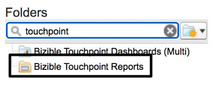

# [!DNL Marketo Measure] Panoramica dei report 101 {#marketo-measure-101-reports-overview}

>[!NOTE]
>
>È possibile visualizzare istruzioni che specificano &quot;[!DNL Marketo Measure]&quot; nella nostra documentazione, ma vedi ancora &quot;Bizible&quot; nel tuo CRM. Stiamo lavorando per aggiornarlo e il rebranding verrà riflesso nel tuo CRM presto.

Tutto [!DNL Marketo Measure] clienti che utilizzano [!DNL Marketo Measure] e [!DNL Salesforce] accedere alla cartella &quot;Buyer Touchpoints Reports&quot; all&#39;interno della loro istanza SFDC. Questa cartella contiene una serie di rapporti predefiniti che possono aiutarti a iniziare a creare rapporti con i dati dei punti di contatto dell’acquirente.

Sebbene molti di questi rapporti abbiano già stabilito obiettivi specifici di reporting, ce ne sono sei &quot;_[!DNL Marketo Measure]101_&quot; rappresentato da tre tipi di report chiave che coprono la maggior parte delle esigenze di reporting.

* Lead con punti di contatto dell’acquirente
* [!DNL Marketo Measure] Persone con punti di contatto dell&#39;acquirente
* Punti di contatto per l’attribuzione dell’acquirente con opportunità

Questi rapporti forniscono i campi e l&#39;infrastruttura di base necessari per qualsiasi [!DNL Marketo Measure] rapporto correlato che desideri creare. Incoraggiamo tutti i clienti, vecchi e nuovi, a iniziare con questi rapporti quando esplori domande sull’attribuzione di marketing. Di seguito troverete una spiegazione di ciascuno dei sei &quot;_[!DNL Marketo Measure]101_&quot; rapporti.

_Se non riesci a trovare la cartella Buyer Touchpoints Report o i sei &quot;_[!DNL Marketo Measure] 101 _&quot; rapporti all&#39;interno di tale cartella, contatta il supporto per l&#39;assistenza._

**Lead con punti di contatto dell’acquirente** | Le due varianti seguenti, riferiscono sui lead e i relativi punti di contatto per gli acquirenti. Sebbene utilizzino lo stesso tipo di rapporto di base, sono raggruppati per diverse metriche, ID lead rispetto al canale di marketing, per fornire due visualizzazioni chiave dei dati. Questo tipo di rapporto è progettato per la generazione di rapporti funnel ed è ideale quando si cerca di scoprire in che modo i lead interagiscono con le attività di marketing. Prima di qualsiasi personalizzazione, i due rapporti seguenti mostrano quanto segue:

**[!DNL Marketo Measure]101 Lead per canale** | Una visione di alto livello di come i canali di marketing influenzano la creazione di lead e i relativi impegni aggiuntivi.
**[!DNL Marketo Measure]101 Lead per ID** | Mostra la storia Lead ed è un rapporto molto più dettagliato, che mostra ogni singolo lead e i relativi punti di contatto per l’acquirente.

**Lead/contatti con punti di contatto dell&#39;acquirente** | Queste relazioni sono comunemente denominate [!DNL Marketo Measure] Rapporti sulle persone. Utilizzano [!DNL Marketo Measure] oggetto personalizzato _[!DNL Marketo Measure]Persona_ invece dell’oggetto Lead nei rapporti sopra menzionati.

La [!DNL Marketo Measure] Oggetto Persona mette in relazione gli oggetti Lead e Contatto. Fuori dalla scatola, [!DNL Salesforce] non fornisce l’opzione per creare rapporti utilizzando l’oggetto Lead e Contatto nello stesso rapporto. Per quanto riguarda l’oggetto Lead e Contact utilizzando l’identificatore univoco di una persona, l’e-mail, il [!DNL Marketo Measure] La persona può creare rapporti sui punti di contatto dell’acquirente correlati al lead e al contatto all’interno dello stesso rapporto. Questo tipo di rapporto è ideale quando si desidera convalidare uno qualsiasi dei [!DNL Marketo Measure] Impostazioni account , che rappresenta il livello di reporting dei punti di contatto più inclusivo.

Le due varianti di rapporto seguenti utilizzano lo stesso tipo di rapporto, ma sono raggruppate per metriche diverse, ID persona (e-mail) rispetto al canale di marketing. Questi sono top di funnel/middle dei rapporti funnel che sono ottimi quando cerchi di scoprire in che modo i tuoi Lead e Contatti si stanno impegnando con le tue attività di marketing. Prima di qualsiasi personalizzazione, i due rapporti seguenti mostrano quanto segue:

**[!DNL Marketo Measure]101 Lead/contatti per canale** | Una visione di alto livello di come i canali di marketing influenzano la creazione di lead o contatti e i relativi impegni aggiuntivi. Questo rapporto è ideale per comprendere il coinvolgimento totale nei canali di marketing e quali canali di marketing generano nuovi nomi netti all’interno dell’istanza Salesforce.
**[!DNL Marketo Measure]101 Lead/contatti per ID** | Viene visualizzata ogni [!DNL Marketo Measure] La storia della persona ed è un rapporto molto più dettagliato, che mostra ogni individuo e i suoi punti di contatto per l’acquirente, indipendentemente dal fatto che il punto di contatto si sia verificato quando si è trattato di un lead o di un contatto.

**Opportunità con punti di contatto per l’attribuzione dell’acquirente** | Gli ultimi due &quot;_[!DNL Marketo Measure]101_&quot; i rapporti sono nella parte inferiore dei rapporti funnel che mostrano i dati del punto di contatto dell’attribuzione dell’acquirente relativi alle opportunità. Il fattore di differenziazione fondamentale per questi rapporti è che sono stati costruiti _Punti di contatto dell’attribuzione dell’acquirente_ che si riferiscono ai dati a livello di opportunità e opportunità, ad esempio i ricavi. Ogni volta che desideri creare rapporti sulle opportunità o sui ricavi attribuiti, utilizza questo tipo di rapporto. I due rapporti seguenti utilizzano lo stesso tipo di rapporto, tuttavia sono raggruppati per diverse metriche, ID opportunità rispetto al canale di marketing. Prima di qualsiasi personalizzazione, i due rapporti seguenti mostrano quanto segue:

**[!DNL Marketo Measure]101 Opportunità per canale** | Una visione di alto livello di come i canali di marketing influenzano e generano ricavi attribuiti nelle opportunità.
**[!DNL Marketo Measure]101 Opportunità per ID** | Questa versione granulare del rapporto mostra il percorso completo delle opportunità. In questo rapporto puoi vedere ogni punto di contatto di attribuzione dell’acquirente associato a un’opportunità e i relativi ricavi attribuiti tramite i vari modelli di attribuzione.

È considerata una best practice trattare il &quot;_[!DNL Marketo Measure]101_&quot; rapporti come modelli per le tue esigenze di reporting. Se si inizia con uno dei report di cui sopra, potrai risparmiare tempo e lavorare con i campi corretti relativi a [!DNL Marketo Measure] dati. Assicurati sempre di &quot;salvare con nome&quot; ogni volta che effettui personalizzazioni al &quot;_[!DNL Marketo Measure]101_&quot; modelli per conservare la variante originale del rapporto.

La cartella &quot;Buyer Touchpoint Reports&quot; è stata progettata per aiutarti a iniziare [!DNL Marketo Measure] rapporti, per i rapporti utilizzabili dovrai personalizzare tali rapporti in modo che siano personalizzati in base alle tue esigenze di reporting. Devi aggiungere i filtri necessari per garantire che i record all’interno del rapporto (e i relativi punti di contatto) siano allineati con l’obiettivo di reporting.

Una volta che hai familiarità con il &quot;_[!DNL Marketo Measure]101_&quot; rapporti, puoi ricrearli da tipi di rapporti personalizzati per esigenze di reporting più personalizzate. Creazione della [[!DNL Marketo Measure] Tipi di rapporti personalizzati](/help/marketo-measure-salesforce-reporting/new-report-types/creating-custom-marketo-measure-report-types.md) ti consentirà di inserire campi personalizzati che potresti comunemente utilizzare in altri rapporti di gestione delle relazioni con i clienti. Questo ti aiuterà a portarti [!DNL Marketo Measure] rapporti al livello successivo!
