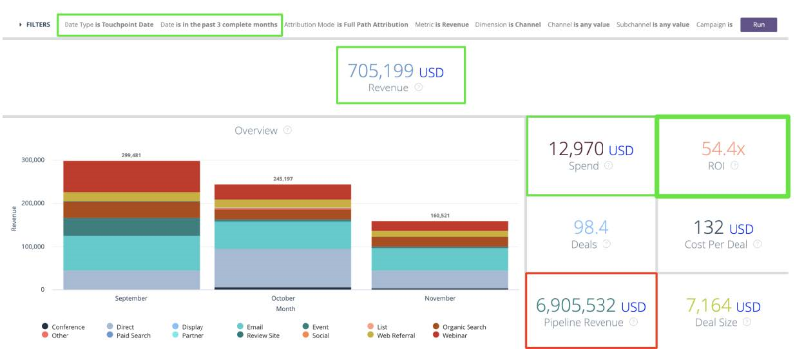
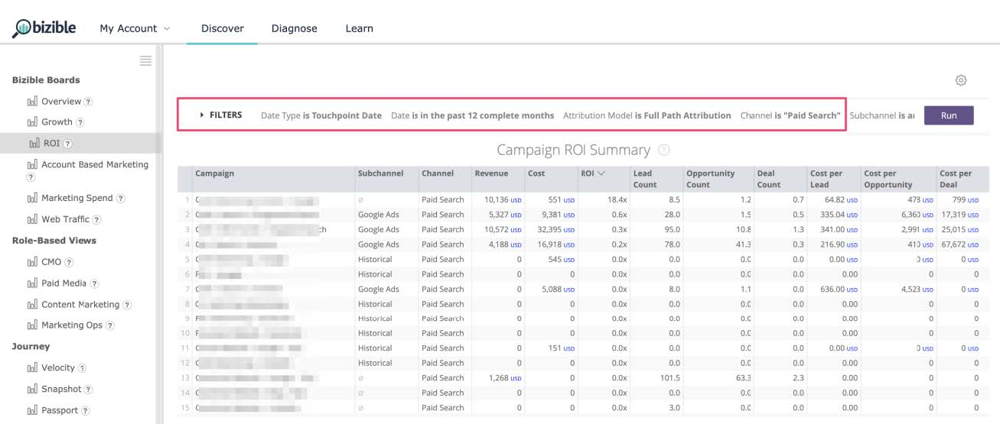

# [!DNL Marketo Measure] Guida al reporting {#marketo-measure-reporting-guide}

>[!NOTE]
>
>È possibile visualizzare istruzioni che specificano &quot;[!DNL Marketo Measure]&quot; nella nostra documentazione, ma vedi ancora &quot;Bizible&quot; nel tuo CRM. Stiamo lavorando per aggiornarlo e il rebranding verrà riflesso nel tuo CRM presto.

Prima di costruire un [!DNL Marketo Measure] rapporto, è fondamentale confermare [!DNL Marketo Measure] Le Impostazioni account sono state riviste e configurate per garantire che i dati all’interno dei rapporti siano accurati e riflettano le specificità della tua azienda. Inoltre, i progetti di reporting funzionano al meglio quando seguono un processo strutturato. Justin Norris [!DNL Marketo Measure] power user, advocate e partner di [Perkuto](https://perkuto.com/) accuratamente riassunto [come approcciare il reporting in [!DNL Marketo Measure]](https://perkuto.com/blog/turning-attribution-data-into-actionable-insights/):

**Stabilire obiettivi**: &quot;La prima domanda da fare è &#39;perché misuriamo?&#39; Lori Wizdo di [Ricerca Forrester](https://go.forrester.com/) riassunto bene in un [Webinar Marketo](https://www.marketo.com/webinars/beyond-revenue-performance-real-kpis-of-b2b-marketing/). Secondo lei, &#39;misuriamo per dimostrare o convalidare una decisione o il valore del marketing o per ottenere meglio (miglioramento del processo).&#39; Aggiungiamo che le informazioni provenienti da misurazioni corrette forniscono anche informazioni e indicazioni sul processo di pianificazione del marketing.

Quindi prima di iniziare, è essenziale essere chiari sui vostri obiettivi, sulle domande a cui state cercando di rispondere, o sui problemi che state cercando di risolvere. Che storia vuole raccontare? Quali decisioni saranno prese? Troppo spesso questi fondamentali sono mal pensati, portando alla frustrazione per tutti coinvolti&quot;.

**Progettazione report**: &quot;Successivamente, devi progettare il rapporto e determinare le dimensioni, le metriche e il set di dati specifici che conterrà. Un&#39;esperienza comune è quella di fornire a un utente aziendale esattamente ciò che chiede, solo perché senta ancora che le loro esigenze non sono soddisfatte. Questo perché le informazioni che un utente aziendale cerca non sono sempre contenute nel rapporto che richiede. Un buon analista (o una persona del MOPS con un cappello da analista) farà domande chiarificanti, stabilirà definizioni comuni (&quot;quindi, cosa intendete veramente con lead?&quot;), e persino schizzerà una visione del rapporto finale per assicurarti che ci sia allineamento. Solo in questo caso il rapporto viene generato, sapendo di disporre di un solido insieme di requisiti&quot;.

**Generazione di rapporti**: &quot;Una volta costruite, non è raro correre in posti di blocco o in vicoli ciechi. Ad esempio, potresti riscontrare la mancanza di un punto dati essenziale o il mancato collegamento degli oggetti nel modo desiderato. Per risolvere questi problemi, penso anche che sia fondamentale capire cosa sta accadendo &quot;sotto il cofano&quot; nella vostra &quot;macchina&quot; di reporting. Questa fluidità ti permetterà di ridimensionare rapidamente una richiesta di reporting e valutare se è raggiungibile (e più facilmente concepire soluzioni creative quando non lo è).&quot;

Diamo un&#39;occhiata &quot;sotto il cofano&quot; per capire meglio cosa rende il [!DNL Marketo Measure] sistema di reporting di attribuzione eseguito.

## Oggetti punto di contatto dell&#39;acquirente (CRM) {#buyer-touchpoint-objects-crm}

Al livello più alto, esistono due categorie di reporting basate sui due diversi oggetti punto di contatto dell’acquirente: Queste categorie determinano il tipo di [!DNL Marketo Measure] dati su cui si desidera creare rapporti: dati relativi a un _individuale_ o dati relativi a un _opportunità_.

1. **Punti di contatto dell&#39;acquirente** (BT) / Singoli/Coinvolgimento totale

   * Utilizzato comunemente per le metriche &quot;top of the funnel&quot; (TOFU) e i rapporti relativi a _individui_ (Lead, contatti, [!DNL Marketo Measure] Persone)
   * I BT vengono utilizzati per comprendere tutte le interazioni di marketing relative a **persone**, poiché contengono la cronologia completa dei punti di contatto per ogni persona. Come promemoria, questi punti di contatto vengono creati in CRM per il primo contatto anonimo, il contatto per la creazione di lead e per qualsiasi successivo invio o punto di contatto del modulo che si sceglie di sincronizzare da una campagna o attività offline.

1. **Punti di contatto dell’attribuzione dell’acquirente** (BAT) / Opportunità / Livello di account / Ricavi

   * Utilizzata comunemente per le metriche &quot;centrale e/o inferiore dell&#39;imbuto&quot; (MOFU e BOFU) e i rapporti relativi a _Opportunità_.
   * Le BAT rappresentano i punti di contatto pertinenti di tutte le persone collegate alla **opportunità** (tramite Ruoli contatto opportunità o tramite un ID account condiviso, a seconda delle impostazioni). A differenza dei BT che si riferiscono solo alle persone, le BAT possono anche essere associate con **entrate**. In quanto tale, utilizzerai le BAT per rispondere a domande relative alle opportunità, tra cui quante opportunità sono state aperte o chiuse, o il valore della pipeline e i ricavi ottenuti.

>[!NOTE]
>
>Le BAT sono create da BT. In sostanza, il tracciamento inizia a livello individuale attraverso gli BT. Una volta creata un&#39;opportunità su un account, tutti i BT provenienti da Contatti nell&#39;ambito dello stesso account sono referenziati e idonei per creare BAT che si riferiscono all&#39;opportunità, quindi si desidera utilizzare uno o l&#39;altro a seconda delle domande a cui si sta tentando di rispondere: domande relative alle metriche &quot;Persone&quot; (rapporti BT) o domande relative alle metriche &quot;Opportunità&quot; (rapporti BAT)

Articolo di supporto: [Differenza tra punti di contatto dell’acquirente e punti di contatto dell’attribuzione dell’acquirente](/help/configuration-and-setup/getting-started-with-marketo-measure/difference-between-buyer-touchpoints-and-buyer-attribution-touchpoints.md#configuration-and-setup)

## Punto di contatto dell&#39;acquirente (BT) {#buyer-touchpoint-bt}

Il punto di contatto dell’acquirente (BT) è l’oggetto utilizzato per monitorare ogni interazione di marketing che un utente ha con i materiali di marketing. di ogni individuo (Lead/Contact/[!DNL Marketo Measure] Persona) il percorso sarebbe rappresentato dai relativi BT. In [!DNL Marketo Measure], il percorso di una persona è costituito da:

1. Come ha interagito questa persona per la prima volta con il nostro marchio? (Primo contatto o _FT_)
1. Come ha convertito / diventato conosciuto / diventato un lead? (Creazione di lead o _LC_)
1. In che altro modo questa persona ha interagito con il nostro marchio e il nostro materiale di marketing da quando è diventata un lead? (_PostLC_)

I punti di contatto dell’acquirente vengono utilizzati per rispondere a domande correlate a _persone_ (&quot;persone&quot; sono rappresentate da Lead o Contatti all&#39;interno di un CRM), ad esempio la generazione di lead/contatti o le metriche di acquisizione, anziché dalle metriche relative alle opportunità. Ad esempio:

* Quali canali forniscono il maggior numero di lead?
* Quali canali sono più o meno costosi per creare un nuovo lead?
* Con quali contenuti interagiscono i miei contatti/lead?
* Qual è la storia di marketing di particolari titoli, ruoli, personaggi?
* Quali canali determinano gli MQL o altri stati Lead/Contatto?

In primo luogo, le aziende devono sapere &quot;da dove vengono i miei lead/contatti?&quot;. Storicamente, questa risposta è stata fornita con un singolo valore dimensionale (ad esempio, Origine lead). Tuttavia, come indicato ai punti 1 e 2, sappiamo che i Lead possono avere più punti di contatto durante il loro percorso di diventare Lead. Il punto di contatto dell’acquirente consente di ottenere informazioni sulle due interazioni più importanti che rappresentano il modo in cui è stato generato un lead: il loro primo contatto e il loro contatto per la creazione del lead. I punti di contatto per gli acquirenti sono anche _multidimensionale_ significa che contengono un sacco di dati di marketing, principalmente da dove proviene la persona (canale di marketing) e con cosa la persona è impegnata (contenuto).

La [modelli di attribuzione](/help/introduction-to-marketo-measure/overview-resources/marketo-measure-attribution-models.md) fornire informazioni migliori sulle metriche basate su persone:

* **Primo contatto** - Attribution credit al 100% al primo contatto del lead (FT)
* **Creazione di lead** - 100% di merito di attribuzione al Lead&#39;s Lead Creation Touch (LC)
* **A forma di U** - approccio multi-touch, con 40% di credito al FT, 40% di credito alla LC

<table> 
 <tbody>
  <tr>
   <td></td> 
   <td>Il modello a forma di U è progettato per dare credito a tutti i punti di contatto dell'acquirente che riassumono come un lead sia diventato un lead. Anche se i punti di contatto successivi di questi Lead possono essere segnalati per comprendere il coinvolgimento aggiuntivo (Post LC), non fanno parte del <strong>Percorso di creazione di lead</strong> quindi non ricevono alcun credito di attribuzione nei modelli a forma di FT, LC o U.

&#42;Nella maggior parte dei casi, l’attribuzione a forma di U riflette una divisione pari a 50/50 tra FT e LC. Se il lead si converte nella stessa sessione del primo contatto, un singolo punto di contatto rappresenta sia le posizioni dei punti di contatto FT che LC. Pertanto, il 100% dell’attribuzione verrebbe assegnato a un singolo punto di contatto.</td>
</tr>
 </tbody>
</table>

Questi modelli pongono molta enfasi sulle interazioni in fase iniziale e sul coinvolgimento superiore del funnel. L’attribuzione a forma di U è il modello consigliato in quanto è un fattore nei punti di contatto FT e LC che garantisce il credito a qualsiasi tocco che ha influenzato il lead nella creazione. Tuttavia, è possibile ottenere ulteriori informazioni dai modelli First Touch e Lead Creation Touch se si desidera comprendere più dettagliatamente le parti specifiche del percorso Lead.

## Rapporti consigliati utilizzando il punto di contatto dell’acquirente (BT) {#recommended-reports-using-the-buyer-touchpoint-bt}

1. **LEAD CON PUNTI DI CONTATTO ACQUIRENTE**

**1.1. | Nuovi lead per canale di marketing**

Riepilogare i dati del punto di contatto dell’acquirente del lead in base al campo &quot;Canale di marketing&quot; è la visualizzazione di livello più alto che rappresenta i canali/le tattiche che influenzano i nuovi lead nella creazione. La struttura di questo rapporto intorno a un &quot;Tipo di data&quot; = &quot;Data creazione&quot; assicura una coorte di &quot;Nuovi lead netti&quot; (quando il lead è stato creato nel CRM) nel rapporto.

<table> 
 <tbody>
  <tr>
   <td>Domanda</td> 
   <td>Quali canali di marketing influenzano i Lead nella creazione?</td> 
  </tr>
  <tr>
   <td>Tipo di rapporto</td> 
   <td>Lead e punti di contatto per gli acquirenti (CRM) 
   Metrica: Lead ([!DNL Marketo Measure] Scopri)</td> 
  </tr>
  <tr>
   <td>Campo data / Tipo data</td> 
   <td>Data creazione lead (CRM) / Data creazione (Discover)</td> 
  </tr>
  <tr>
   <td>Intervallo date</td> 
   <td><i>seleziona l’intervallo di date desiderato</i></td> 
  </tr>
  <tr>
   <td>Gruppo/Dimension</td> 
   <td>Canale di marketing</td> 
  </tr>
  <tr>
   <td>Modelli ottimali</td> 
   <td>Primo contatto, creazione di lead, <strong>A forma di U</strong> 
   *SOMMA i campi "Conteggio" nei rapporti CRM (Conteggio - Primo contatto, Conteggio - Creazione lead, Conteggio - A forma di U)</td> 
  </tr>
 </tbody>
</table>

>[!TIP]
>
>Per qualsiasi tipo di rapporto &quot;Lead con punti di contatto dell’acquirente&quot;, inizia personalizzando il rapporto predefinito denominato &quot;[!DNL Marketo Measure] 101 | Lead per canale&quot;. Questo rapporto è disponibile pronto all’uso ed è un ottimo sandbox precostruito come descritto nella tabella precedente e può essere rapidamente personalizzato per esigenze di reporting più specifiche.

**1.2. | Nuovi lead per campagna (o approfondimenti più granulari)**

Per informazioni più dettagliate sui dati riepilogati nel rapporto &quot;Nuovi lead per canale di marketing&quot; (1.1), aggiungi un riepilogo aggiuntivo a livello di campagna. Questo ti consentirà non solo di comprendere cosa stanno guidando i nuovi lead nella creazione, ma più specificamente quali campagne all’interno di tali canali stanno ottenendo le migliori prestazioni:

<table> 
 <tbody>
  <tr>
   <td>Domanda</td> 
   <td>Cosa <i>campagne</i> sta influenzando i Lead nella creazione?</td> 
  </tr>
  <tr>
   <td>Tipo di rapporto</td> 
   <td>Lead e punti di contatto per gli acquirenti (CRM) 
   Metrica: Lead ([!DNL Marketo Measure] Scopri)</td> 
  </tr>
  <tr>
   <td>Campo data / Tipo data</td> 
   <td>Data creazione lead (CRM) / Data creazione (Discover)</td> 
  </tr>
  <tr>
   <td>Intervallo date</td> 
   <td><i>seleziona l’intervallo di date desiderato</i></td> 
  </tr>
  <tr>
   <td>Gruppo/Dimension</td> 
   <td>Nome campagna pubblicitaria (CRM)</td> 
  </tr>
  <tr>
   <td>Modelli ottimali</td> 
   <td>Primo contatto, creazione di lead, <strong>A forma di U</strong> 
   *SOMMA i campi "Conteggio" nei rapporti CRM (Conteggio - Primo contatto, Conteggio - Creazione lead, Conteggio - A forma di U)</td> 
  </tr>
 </tbody>
</table>

>[!TIP]
>
>Ottieni informazioni ancora più granulari riepilogando il rapporto con altri campi disponibili dall’oggetto punto di contatto per l’acquirente. A tale scopo, imposta gruppi aggiuntivi (CRM) o dimensioni (Discover). A seconda del canale (che può essere rappresentativo del tuo ruolo), ci possono essere ulteriori dettagli oltre il livello della campagna in cui stai cercando di ottenere informazioni. Analizziamo &#39;Ricerca a pagamento&#39;, per esempio nella tabella seguente...

<table> 
 <tbody>
  <tr>
   <td>Domanda</td> 
   <td>Cosa <i>parole chiave</i> sta influenzando i Lead nella creazione?</td> 
  </tr>
  <tr>
   <td>Tipo di rapporto</td> 
   <td>Lead e punti di contatto per gli acquirenti (CRM) 
   Metrica: Lead ([!DNL Marketo Measure] Scopri)</td> 
  </tr>
  <tr>
   <td>Filtri</td> 
   <td>Canale di marketing = Ricerca a pagamento</td> 
  </tr>
  <tr>
   <td>Campo data / Tipo data</td> 
   <td>Data creazione lead (CRM) / Data creazione (Discover)</td> 
  </tr>
  <tr>
   <td>Intervallo date</td> 
   <td><i>seleziona l’intervallo di date desiderato</i></td> 
  </tr>
  <tr>
   <td>Gruppo/Dimension</td> 
   <td>Testo della parola chiave (CRM) / Parola chiave (Discover)</td> 
  </tr>
  <tr>
   <td>Modelli ottimali</td> 
   <td>Primo contatto, creazione di lead, <strong>A forma di U</strong> 
   *SOMMA i campi "Conteggio" nei rapporti CRM (Conteggio - Primo contatto, Conteggio - Creazione lead, Conteggio - A forma di U)</td> 
  </tr>
 </tbody>
</table>

Il livello di granularità può variare a seconda del canale. L&#39;approccio consigliato sarebbe quello di domandarsi, &quot;che dire del &#39;canale X&#39; sto cercando di capire più dettagliatamente?&quot;. I manager di ricerca a pagamento possono essere interessati anche a dimensioni aggiuntive, come:

* Nome della campagna pubblicitaria
* Contenuto annuncio
* Gruppo di annunci

I manager degli eventi possono tuttavia essere più interessati a quali eventi specifici o a quali tipi di eventi hanno influenzato maggiormente i lead nella creazione:

* Nome campagna annunci / Campagna Salesforce = evento specifico
* Media = Campagna &#39;Type&#39;

**PROMEMORIA**: Possono essere necessari filtri aggiuntivi per aggiungere una qualsiasi delle varianti di rapporto sopra o sotto descritte. Questi filtri sono specifici per la tua organizzazione e possono essere consigliati dai team di Marketing Ops o di Sales Ops . Non è raro che un&#39;organizzazione esegua gli stessi filtri in tutti i rapporti per garantire che il rapporto sia il più pulito e accurato possibile. Esempi comuni potrebbero essere:

* Filtrare i record interni dai test, solitamente per indirizzo e-mail
* Filtraggio in base a determinati &#39;tipi di record&#39; che possono essere specifici per la tua unità aziendale

**1.3. | Nuovi lead per contenuto (solo rapporti CRM)**

<table> 
 <tbody>
  <tr>
   <td>Domanda</td> 
   <td>Cosa <i>content</i> sta influenzando i Lead nella creazione?</td> 
  </tr>
  <tr>
   <td>Tipo di rapporto</td> 
   <td>Lead e punti di contatto per gli acquirenti (CRM)</td> 
  </tr>
  <tr>
   <td>Campo data</td> 
   <td>Data creazione lead</td> 
  </tr>
  <tr>
   <td>Intervallo date</td> 
   <td><i>seleziona l’intervallo di date desiderato</i></td> 
  </tr>
  <tr>
   <td>Gruppo/Dimension</td> 
   <td>Pagina di destinazione  
   URL modulo</td> 
  </tr>
  <tr>
   <td>Modelli ottimali</td> 
   <td>Primo contatto, creazione di lead, <strong>A forma di U</strong> </td> 
  </tr>
 </tbody>
</table>

**PROMEMORIA**: I due campi principali per il reporting sui contenuti/risorse digitali sono &quot;Pagina di destinazione&quot; e &quot;URL modulo&quot;. Questi due valori possono essere gli stessi se il lead converte (invia un modulo) sulla stessa pagina in cui è &quot;atterrato&quot; (pagina di destinazione), _tuttavia_, a volte questi valori sono diversi. Ad esempio, il lead può fare clic su un collegamento Facebook che consente di passare a una pagina del sito web (valore &quot;Pagina di destinazione&quot;). Il lead può quindi spostarsi da tale pagina, proseguire la sessione sul sito e finire per inviare un modulo a un’altra pagina (URL modulo). Questo viene riepilogato in un singolo punto di contatto che rappresenta da dove proviene il lead (canale di marketing), quali contenuti li hanno portati sul sito (pagina di destinazione) e quali contenuti sono stati scaricati (URL del modulo). &quot;URL modulo&quot; è anche il campo di riferimento per la generazione di rapporti su altri moduli non associati a contenuti scaricabili, come i moduli &quot;Contattaci&quot; o &quot;Richiesta demo&quot;.

>[!TIP]
>
>Approfondisci specifici contenuti con filtri aggiuntivi
>
>* Filtra per: &#39;Pagina di destinazione&#39; CONTIENE (ad esempio):
   >   * /blog
   >   * /ebook
   >   * /webinar
>
>* OPPURE: &quot;URL modulo&quot; CONTIENE (ad esempio)
   >   * /contact
   >   * /demo

I rapporti basati su &quot;Contenuto&quot; forniscono un grande valore durante la generazione di rapporti su qualsiasi parte dell’imbuto, ma sono generalmente utilizzati nella parte superiore dell’imbuto per fornire ulteriori informazioni su un coinvolgimento iniziale di Lead. Considerando che &quot;Ricerca biologica&quot; tende ad essere il canale più forte alla guida del coinvolgimento iniziale (FT), non ci sono tanti dati a livello di &quot;Campagna&quot;.

I rapporti basati sui contenuti sono ideali per acquisire informazioni su ciò che sta guidando i Lead nello specifico all’interno del canale di marketing di livello superiore, in questo caso &quot;Ricerca organica&quot;.

**1.4. | Coinvolgimento totale del lead in un determinato intervallo di date**

<table> 
 <tbody>
  <tr>
   <td>Domanda</td> 
   <td>Quali canali di marketing hanno avuto di più <i>coinvolgimento totale lead</i> in passato (settimana/mese/trimestre)?</td> 
  </tr>
  <tr>
   <td>Tipo di rapporto</td> 
   <td>Lead e punti di contatto per gli acquirenti (CRM)  
   Metrica: Lead ([!DNL Marketo Measure] Scopri)</td> 
  </tr>
  <tr>
   <td>Campo data / Tipo data</td> 
   <td>Data punto di contatto</td> 
  </tr>
  <tr>
   <td>Intervallo date</td> 
   <td><i>seleziona l’intervallo di date desiderato</i></td> 
  </tr>
  <tr>
   <td>Gruppo/Dimension</td> 
   <td>Canale di marketing (o più granulare)</td> 
  </tr>
  <tr>
   <td>Modelli ottimali*</td> 
   <td>*Questo rapporto riguarda meno la misurazione della provenienza dei lead con un modello di attribuzione, ma più informazioni <i>numero totale di punti di contatto (quantità di coinvolgimento)</i>, compresi quelli dopo il contatto per la creazione del lead. Il conteggio totale dei record dei punti di contatto riflette quali canali hanno visto il coinvolgimento più elevato di Lead.</td> 
  </tr>
 </tbody>
</table>

**PROMEMORIA**: Basare i rapporti su &quot;Data punto di contatto&quot; è il modo più efficace per comprendere le prestazioni di marketing durante un determinato intervallo di date. &quot;Data punto di contatto&quot; struttura il rapporto in modo tale che l’attribuzione non sia solo correlata al canale, alla campagna o al contenuto, ma mostri anche quando si è verificato il punto di contatto. Questo è il modo più efficace per comprendere cosa stava accadendo il coinvolgimento di marketing in un certo momento e anche il modo consigliato per misurare l&#39;impatto del marketing, in quanto si confronta con la spesa di marketing investita nello stesso momento. Si consiglia quando si esegue un’analisi della spesa di marketing o del ROI (vedi 5.1).

**2. LEAD QUALIFICATI DI MARKETING CON PUNTI DI CONTATTO ACQUIRENTE**

Uno dei report più comuni non si concentra solo sui nuovi lead o sull&#39;impegno a livello di lead, ma più specificamente sui &quot;lead qualificati per il marketing&quot; (MQL). Ci sono un paio di approcci diversi quando si tratta di reporting sugli MQL a seconda di cosa [!DNL Marketo Measure] funzioni e funzionalità a cui hai accesso.

**2.1 | Marketing Qualified Leads by Channel (multi-touch)**

Questo approccio per misurare l’impatto del marketing sull’influenza degli MQL è essenzialmente una continuazione del rapporto &quot;Nuovi lead per canale di marketing&quot; (1.1), ma con i criteri aggiuntivi che i lead vengono misurati sono più specificamente MQL. Il modello di attribuzione a forma di U è ancora consigliato qui per identificare quali canali di marketing e contenuti generano lead che sono in seguito _probabile_ per diventare un MQL:

<table> 
 <tbody>
  <tr>
   <td>Domanda</td> 
   <td>Quali canali di marketing sono i migliori per generare nuovi lead che diventano <i>MQL</i>?</td> 
  </tr>
  <tr>
   <td>Tipo di rapporto</td> 
   <td>Lead e punti di contatto per gli acquirenti (CRM)  
   Metrica: Lead ([!DNL Marketo Measure] Scopri)</td> 
  </tr>
  <tr>
   <td>Filtri</td> 
   <td>MQL = true* 
   *<i>Gli MQL possono essere definiti in modo diverso per organizzazione. Assicurati che [!DNL Marketo Measure] i rapporti vengono filtrati per gli MQL utilizzando gli stessi campi degli altri rapporti basati su MQL. Un filtro per segmenti dovrebbe essere creato nello stesso modo per i rapporti sugli MQL in [!DNL Marketo Measure] Scoprite.</i></td> 
  </tr>
  <tr>
   <td>Campo data / Tipo data</td> 
   <td>Data MQL (o equivalente) / Data di creazione ([!DNL Marketo Measure] Scopri)  <i>La data di creazione del lead può essere utilizzata anche nel reporting CRM se "Data MQL" non è un'opzione nel CRM. È importante tenere presente quale campo data si utilizza per definire il set di dati coorti.</i></td> 
  </tr>
  <tr>
   <td>Intervallo date</td> 
   <td><i>seleziona l’intervallo di date desiderato</i></td> 
  </tr>
  <tr>
   <td>Gruppo/Dimension</td> 
   <td>Canale di marketing</td> 
  </tr>
  <tr>
   <td>Modelli ottimali</td> 
   <td>Primo contatto, creazione di lead, <strong>A forma di U</strong>  
   SOMMA i campi "Count" nei rapporti CRM (Conteggio - Primo contatto, Conteggio - Creazione lead, Conteggio - A forma di U)</td> 
  </tr>
 </tbody>
</table>

**2.2. | Marketing Qualified Leads by Channel (single touch, solo CRM)**

Questo approccio per misurare l&#39;impatto del marketing sull&#39;influenza degli MQL si concentra maggiormente sull&#39;identificazione di quali _punto di contatto singolo_ è stato l’ultimo contatto prima che il lead raggiungesse MQL.

>[!NOTE]
>
>Per eseguire questo rapporto, è necessario un valore &quot;Stato lead&quot; di &quot;MQL&quot; per definire lo stadio MQL a scopo di tracciamento (Funnel Stage). Se le MQL non sono tracciate tramite il campo &quot;Stato lead&quot;, la funzione Modello di attribuzione personalizzato con stadi personalizzati è necessaria per creare una fase &#39;MQL&#39; personalizzata nel [!DNL Marketo Measure] Impostazioni account.

<table> 
 <tbody>
  <tr>
   <td>Domanda</td> 
   <td>Quali canali di marketing sono i più forti a spingere i lead per raggiungere lo stato MQL?</td> 
  </tr>
  <tr>
   <td>Tipo di rapporto</td> 
   <td>Lead e punti di contatto per gli acquirenti (CRM) 
   <i>questo rapporto è possibile solo all'interno del reporting CRM. Non è possibile filtrare su determinati valori di "Posizione punto di contatto" in [!DNL Marketo Measure] Scopri</i></td> 
  </tr>
  <tr>
   <td>Filtri</td> 
   <td><strong>La posizione punto di contatto contiene "MQL"</strong></td> 
  </tr>
  <tr>
   <td>Campo data / Tipo data</td> 
   <td>Data MQL (o equivalente)</td> 
  </tr>
  <tr>
   <td>Intervallo date</td> 
   <td><i>seleziona l’intervallo di date desiderato</i></td> 
  </tr>
  <tr>
   <td>Gruppo/Dimension</td> 
   <td>Canale di marketing</td> 
  </tr>
  <tr>
   <td>Modelli ottimali</td> 
   <td><i>Poiché questo rapporto viene filtrato su un singolo punto di contatto, i modelli di attribuzione a livello di lead non sono rilevanti. Come il "Lead Engagement Report" (1.4), il numero di record dei punti di contatto viene qui sfruttato per capire quali sono i canali più forti (ogni lead avrebbe un solo punto di contatto MQL).</i></td> 
  </tr>
 </tbody>
</table>

>[!TIP]
>
>Esplora altri raggruppamenti o dimensioni per ottenere ulteriori informazioni sugli MQL. Come menzionato negli altri rapporti &quot;Lead con punti di contatto per l’acquirente&quot;, il punto di contatto per l’acquirente offre una granularità molto maggiore rispetto al solo canale di marketing. Un rapporto basato su &quot;Contenuto&quot; può anche essere combinato con uno dei rapporti MQL di cui sopra per comprendere meglio quale contenuto influenza meglio gli MQL.

**3. [!DNL MARKETO MEASURE] PERSONE CON PUNTI DI CONTATTO ACQUIRENTE**

C&#39;è una terza personalizzazione [!DNL Marketo Measure] oggetto in Salesforce che può essere molto utile quando si generano rapporti sulle metriche relative alle persone: **la [!DNL Marketo Measure] Persona (BP)**. La BP risolve il vecchio problema di come rappresentare nello stesso rapporto sia le informazioni relative a Lead che a Contatti . Unisce tutti i BT relativi a una &quot;persona&quot; (a [!DNL Marketo Measure] L’ID della persona è il suo indirizzo e-mail). Sia che si tratti di un lead o di un contatto, la BP funge da oggetto ponte, per aiutare i report a estendersi su lead e contatti ed è molto utile per produrre report più sofisticati sulle persone.

La [!DNL Marketo Measure] La persona si riferisce solo a uno degli oggetti punto di contatto, il punto di contatto dell’acquirente (BT). Ciò significa che non può essere sfruttato per una metrica Opportunità o relativa ai ricavi. Un &#39;[!DNL Marketo Measure] Il tipo di rapporto Punti di contatto persona e acquirente è ottimo per comprendere _coinvolgimento totale_ poiché sorge su tutti i BT se il BT si riferisce a un lead o a un contatto in modo più specifico. Ad esempio, se utilizzi una campagna Salesforce per tenere traccia di un evento, all’interno della campagna di gestione delle relazioni con i clienti potresti avere membri della campagna che esistono come Lead o Contatti. [!DNL Marketo Measure] creerà punti di contatto per i membri della campagna, indipendentemente, ma senza [!DNL Marketo Measure] Persona, il reporting standard di Salesforce richiederebbe due rapporti separati per comprendere quanti _totale_ i punti di contatto disponibili nell’evento: uno che è &quot;Lead con punti di contatto dell&#39;acquirente&quot; e uno che è &quot;Contatti con punti di contatto dell&#39;acquirente&quot;. Qualche altro [!DNL Marketo Measure] Di seguito sono elencati i casi d’uso di rapporti basati su persone:

**3.1 [!DNL Marketo Measure] Persone che hanno scaricato &quot;libri&quot; o &quot;white paper&quot; (download totali)**

Questo rapporto è lo stesso di un rapporto basato su &quot;Contenuto&quot; a livello di lead. Tuttavia, anziché cercare di misurare il numero di lead attribuibili a ciascun contenuto, utilizzando un [!DNL Marketo Measure] La relazione sulle persone sarà utile per comprendere il totale _numero di download_ se la risorsa è gata (il numero totale di punti di contatto rappresenta il numero totale di download/invii di moduli).

<table> 
 <tbody>
  <tr>
   <td>Domanda</td> 
   <td>Quante persone hanno scaricato una particolare risorsa?</td> 
  </tr>
  <tr>
   <td>Tipo di rapporto</td> 
   <td>[!DNL Marketo Measure] Persone e punti di contatto dell'acquirente (CRM)</td> 
  </tr>
  <tr>
   <td>Filtri</td> 
   <td>"URL modulo" CONTIENE (ad esempio) 
   <li>/ebook</li>
   <li>/whitepaper</li>
   <i>I valori del filtro sopra riportati sono solo esempi. Il valore effettivo sarà basato sulla struttura URL di ciascuna organizzazione.</i></td> 
  </tr>
  <tr>
   <td>Campo data / Tipo data</td> 
   <td>Data punto di contatto <i>(quando è stata scaricata la risorsa)</i></td> 
  </tr>
  <tr>
   <td>Intervallo date</td> 
   <td><i>seleziona l’intervallo di date desiderato</i></td> 
  </tr>
  <tr>
   <td>Gruppo/Dimension</td> 
   <td>URL modulo</td> 
  </tr>
  <tr>
   <td>Modelli ottimali</td> 
   <td>Questo rapporto si occupa non solo di misurare da dove provengono i lead o i contatti con un modello di attribuzione, ma anche di più <i>numero totale di punti di contatto (quantità di coinvolgimento)</i>, compresi quelli dopo il contatto per la creazione del lead. Con questo rapporto cerchiamo di capire il <i>importo del coinvolgimento totale</i>. Il conteggio totale dei record dei punti di contatto rispecchierebbe quali risorse sono state scaricate di più.</td> 
  </tr>
 </tbody>
</table>

>[!TIP]
>
>Per qualsiasi &#39;Lead con [!DNL Marketo Measure] Tipo di rapporto Persone, inizia personalizzando il rapporto predefinito denominato &quot;**[!DNL Marketo Measure]101 | Lead/contatti per canale**&quot;. Questo rapporto è disponibile preconfigurato ed è un ottimo [!DNL Marketo Measure] Sandbox basato su persone. È pregenerato e può essere rapidamente personalizzato per esigenze di reporting più specifiche.

>[!TIP]
>
>Puoi utilizzare questo rapporto per ottenere informazioni sul coinvolgimento totale di qualsiasi dimensione di marketing dall’oggetto punto di contatto per l’acquirente, e non solo sui download del contenuto come illustrato nell’esempio. Il rapporto può essere invece raggruppato o filtrato su dimensioni come &quot;Canale di marketing&quot; o &quot;Nome campagna di annunci&quot; per comprendere al meglio il coinvolgimento totale dei lead e dei contatti presenti nel database. È sufficiente cambiare i filtri o i raggruppamenti all’interno del rapporto in zero in su altre dimensioni rappresentate da altri campi dell’oggetto punto di contatto.

**3.2. [!DNL Marketo Measure] Persone registrate per un evento (solo CRM)**

_Questo rapporto è applicabile solo se i moduli di registrazione sono ospitati sul tuo sito web che [!DNL Marketo Measure] è in grado di tracciare digitalmente._

<table> 
 <tbody>
  <tr>
   <td>Domanda</td> 
   <td>Quali canali di marketing guidano le registrazioni degli eventi?</td> 
  </tr>
  <tr>
   <td>Tipo di rapporto</td> 
   <td>[!DNL Marketo Measure] Persone e punti di contatto dell'acquirente (CRM)</td> 
  </tr>
  <tr>
   <td>Filtri</td> 
   <td>"URL modulo" CONTIENE (ad esempio) 
   <li>/evento</li>
   <i>Il valore del filtro sopra riportato è solo esemplificativo. Il valore effettivo sarà basato sulla struttura URL di ciascuna organizzazione.</i></td> 
  </tr>
  <tr>
   <td>Campo data / Tipo data</td> 
   <td>Data punto di contatto <i>(al momento della presentazione del modulo di registrazione)</i></td> 
  </tr>
  <tr>
   <td>Intervallo date</td> 
   <td><i>seleziona l’intervallo di date desiderato</i></td> 
  </tr>
  <tr>
   <td>Gruppo/Dimension</td> 
   <td>URL modulo 
   Canale di marketing</td> 
  </tr>
  <tr>
   <td>Modelli ottimali</td> 
   <td>Questo rapporto si occupa non solo di misurare da dove provengono i lead o i contatti con un modello di attribuzione, ma anche di più <i>numero totale di punti di contatto (numero di registrazioni)</i>, compresi quelli dopo il contatto per la creazione del lead. Con questo rapporto cerchiamo di ottenere informazioni su cosa sta guidando le registrazioni degli eventi. Il conteggio totale dei record dei punti di contatto per "canale di marketing" riflette quali canali hanno generato il maggior numero di registrazioni.</td> 
  </tr>
 </tbody>
</table>

L’elemento chiave di questo rapporto è che i dati del punto di contatto dell’acquirente forniranno anche i dati del canale di marketing. Anche se puoi già avere informazioni sul numero di persone che si sono registrate per i tuoi eventi, questo rapporto fornisce anche informazioni su quali canali di marketing digitali, sorgenti e/o campagne stanno portando le persone sul tuo sito web per poi registrarsi all’evento.

>[!TIP]
>
>Questo stesso approccio può essere adottato quando si cerca di ottenere informazioni sulle registrazioni di webinar o, forse, sui download di webinar on-demand (se si tratta di una risorsa collegata). L’unica differenza è rappresentata dal valore del filtro nell’URL del modulo se tali moduli sono ospitati su pagine univoche del sito web. Ma l&#39;obiettivo è lo stesso. Risponde alle domande, &quot;Quale dei miei canali di marketing sta guidando il maggior numero di registrazioni/download di webinar on-demand.

**3.3. [!DNL Marketo Measure] Persone con punti di contatto dell’acquirente (convalida punto di contatto)**

Considerando il [!DNL Marketo Measure] Persona ci consente di creare rapporti su tutti i punti di contatto in un singolo rapporto, è il tipo di rapporto ideale da utilizzare per convalidare i dati. Vogliamo assicurarci di non trascurare alcun punto di contatto che possa rivelare, ad esempio, dove si verifica un problema nella configurazione dei &quot;Canali di marketing&quot; (consulta gli articoli di supporto collegati di seguito per ulteriori informazioni sulla configurazione dei &quot;Canali di marketing&quot;).

* [Configurazione del canale personalizzato online](/help/channel-tracking-and-setup/online-channels/online-custom-channel-setup.md)
* [Configurazione del canale personalizzato offline](/help/channel-tracking-and-setup/offline-channels/offline-custom-channel-setup.md)

In sostanza, i dati dei punti di contatto riflettono ciò che è stato monitorato da [!DNL Marketo Measure] e può essere controllato per garantire che la configurazione corrisponda a input in base a elementi come: Valori dei parametri UTM, pagine di riferimento o tipi di campagna. Se i dati dei punti di contatto non corrispondono alla configurazione, è molto probabile che qualcosa debba essere regolato. Oltre alla configurazione del &quot;canale di marketing&quot;, puoi esaminare i dati dei punti di contatto per determinare quali punti di contatto potrebbero essere necessari [soppresso](/help/advanced-marketo-measure-features/touchpoint-settings/touchpoint-removal-and-touchpoint-suppression.md) o [segmentato](/help/advanced-marketo-measure-features/segmentation/custom-segmentation.md). Si consiglia di controllare i dati dei punti di contatto all’interno di un’[!DNL Marketo Measure] Rapporto Persone e punti di contatto dell&#39;acquirente alla fine di ogni mese o trimestre, se possibile. In questo modo l’attribuzione sarà il più accurata possibile. Il[!DNL Marketo Measure] 101 | Rapporto Lead/Contatti per canale disponibile pronto all&#39;uso è un ottimo punto di partenza. Includi i campi seguenti se non sono già inclusi per esaminare alcuni dei componenti di configurazione più importanti:

* **Canale di marketing** - Percorso = Marketing Channel.Subchannel (valori impostati in [!DNL Marketo Measure])
* **Origine punto di contatto** = utm_source
* **Media** = utm_medium (punti di contatto online) O Tipo di campagna CRM (punti di contatto offline)
* **Pagina di riferimento** (utilizzata la configurazione &quot;Canali online&quot;)
* **Pagina di destinazione - Raw** (utilizzata la configurazione &quot;Canali online&quot;) è anche un input comune per la soppressione dei punti di contatto nella scheda &quot;Impostazioni punto di contatto&quot; delle impostazioni)
* **URL modulo** (un input comune per la soppressione dei punti di contatto nella scheda &quot;Impostazioni punto di contatto&quot; delle impostazioni)

**TOUCHPOINT ATTRIBUZIONE ACQUIRENTE (BAT)**

I punti di contatto di attribuzione dell’acquirente rappresentano i punti di contatto pertinenti di tutti i contatti collegati all’opportunità (tramite Ruoli contatto opportunità o tramite un ID account condiviso, a seconda delle impostazioni). A differenza degli BT (che sono principalmente collegati alle persone), le BAT possono essere associate ai ricavi. In quanto tale, utilizzerai le BAT per rispondere a domande relative alle opportunità, principalmente aperte _Ricavi da opportunità/pipeline_ e chiuso _Opportunità/offerte/ricavi_. Una BAT viene creata tramite i record BT di un contatto non appena viene creata un&#39;opportunità sotto lo stesso account del contatto (il BT non viene convertito in una BAT). Ai dati BT viene fatto semplicemente riferimento per creare un record aggiuntivo (la BAT che si riferisce quindi all&#39;opportunità).

Il punto di contatto per l’attribuzione dell’acquirente consente di misurare l’impatto del marketing in modo più approfondito nell’imbuto. _La profondità del funnel in cui desideri misurare può essere rappresentata dai vari modelli di attribuzione multi-touch_.

Considerando che la relazione principale sulle BAT è con l’opportunità, vengono utilizzati per rispondere a domande quali:

* Quale delle mie attività di marketing ha influenzato maggiormente le opportunità?
* Quanti nuovi ricavi della pipeline posso attribuire a ciascuno dei miei canali di marketing?
* Quale delle mie campagne ha visto il maggiore ROI lo scorso trimestre?

La [modelli di attribuzione](/help/introduction-to-marketo-measure/overview-resources/marketo-measure-attribution-models.md) per ottenere informazioni approfondite sulle metriche basate su opportunità, consulta:

**A forma di W** - Il _Modello di tubazione_&quot;. Tre punti di contatto cardine sono inclusi nel modello a forma di W. In questo modello, ai punti di contatto FT, LC e OC viene attribuito il 30% del credito di attribuzione. Il restante 10% è attribuito in egual misura a tutti i punti di contatto intermedi che si verificano tra i tre punti di contatto cardine.

<table> 
 <tbody>
  <tr>
   <td></td> 
   <td>Questo modello riassume essenzialmente il percorso di una nuova opportunità che è tipicamente sinonimo di generazione di nuovi ricavi della pipeline.

   

   Per misurare l’impatto del marketing sulle nuove opportunità o sulla nuova pipeline generata, si consiglia di utilizzare il modello a forma di W.</td> 
  </tr>
 </tbody>
</table>

**Percorso completo** - Il _Modello chiuso_&quot;. Questo modello include quattro punti di contatto cardine: FT, LC, OC e Closed. A ciascuno viene assegnato il 22,5% del credito Opportunity e il restante 10% viene distribuito equamente tra i touch intermedi.

<table> 
 <tbody>
  <tr>
   <td></td> 
   <td>Questo modello riassume essenzialmente il percorso di un contratto vinto chiuso che è tipicamente sinonimo di chiuso won Revenue/bookings.

   

   Quando si cerca di misurare l'impatto del marketing sulle offerte vinte chiuse o sui ricavi vinti chiusi, si consiglia il modello di percorso completo.</td> 
  </tr>
 </tbody>
</table>

Questo modello riassume essenzialmente il percorso di un contratto vinto chiuso che è tipicamente sinonimo di chiuso won Revenue/bookings.

Quando si cerca di misurare l&#39;impatto del marketing sulle offerte vinte chiuse o sui ricavi vinti chiusi, si consiglia il modello di percorso completo.

**Personalizzato** - [!DNL Marketo Measure] offre anche un modello di attribuzione personalizzato che consente agli utenti di scegliere quali punti di contatto o stadi personalizzati includere nel proprio modello. Inoltre, gli utenti possono controllare la percentuale di credito di attribuzione attribuita a questi punti di contatto e fasi. A seconda della configurazione del modello personalizzato, può essere utilizzato in modo più appropriato per misurare Opportunità e pipeline O, offerte e ricavi vinti chiusi. Tieni presente questo aspetto quando lo utilizzi nel reporting.

>[!NOTE]
>
>Il modello di attribuzione personalizzato è un’ulteriore funzione non disponibile per tutti i clienti. Contatta il tuo Customer Success Manager per saperne di più su come aggiungere questa funzione al tuo account.

Comunemente, gli esperti di marketing devono sapere, &quot;da dove vengono le mie opportunità?&quot; Analogamente al reporting a livello di lead, questa domanda ha ricevuto una risposta storica con un singolo valore unidimensionale (ad esempio, Origine campagna principale). Tuttavia, sappiamo che molto di più va nello sviluppo di un&#39;opportunità rispetto a un singolo punto di contatto da un unico contatto. In genere esistono diversi punti di contatto provenienti da diversi canali e da più parti interessate che influenzano un’opportunità nella creazione. Con [!DNL Marketo Measure], possiamo visualizzare tutti i punti di contatto da un account per capire meglio da dove proviene un’opportunità. Oltre a questo, tuttavia, possiamo continuare a far emergere qualsiasi punto di contatto che si è verificato dopo la creazione dell’opportunità e fino al punto in cui l’opportunità viene chiusa. Questo ci consente non solo di adottare un approccio multi-touch per capire da dove proviene un&#39;opportunità, ma anche cosa l&#39;ha influenzata a chiudersi e, in ultima analisi, a rappresentare i ricavi propri chiusi. Questo offre informazioni approfondite su diverse domande come, &quot;qual è l&#39;impatto del marketing sull&#39;influenza la chiusura delle offerte?&quot;, &quot;quale marketing sta guidando la chiusura dei ricavi vinti?&quot; e infine, &quot;quali delle mie attività di marketing stanno vedendo il maggiore ROI?&quot;

## RAPPORTI CONSIGLIATI UTILIZZANDO IL PUNTO DI CONTATTO ATTRIBUZIONE ACQUIRENTE (BAT) {#recommended-reports-using-the-buyer-attribution-touchpoint}

**4.1. | Nuove opportunità per il canale di marketing**

Riepilogando i dati di Attribuzione dell’acquirente delle opportunità dal campo &quot;Canale marketing&quot; è la visualizzazione di livello più alto che rappresenta i canali/tattiche che influenzano le nuove opportunità nella creazione. Strutturare questo rapporto intorno a un &quot;Tipo di data&quot; = &quot;Data creazione opportunità&quot; assicura che venga riepilogato anche il rapporto in base a quando l&#39;opportunità è stata effettivamente creata nel CRM. I punti di contatto possono essere stati creati da un tempo precedente, ma si riferiscono comunque alle opportunità create all’interno dell’intervallo di date definito e ricevono quindi un credito di attribuzione in quanto vengono riconosciuti come influenzatori dell’opportunità.

<table> 
 <tbody>
  <tr>
   <td>Domanda</td> 
   <td>Cosa <i>canali di marketing</i> sta influenzando le opportunità nella creazione?</td> 
  </tr>
  <tr>
   <td>Tipo di rapporto</td> 
   <td>Punti di contatto per l’attribuzione dell’acquirente con opportunità (CRM)  
   Metrica: Opportunità ([!DNL Marketo Measure] Scopri)</td> 
  </tr>
  <tr>
   <td>Filtri</td> 
   <td>
   <li>Fase opportunità* <i>(facoltativo a seconda delle opportunità specifiche che si desidera limitare al rapporto. È possibile creare rapporti solo sulle BAT ancora associate solo alle opportunità "aperte", ad esempio)</i></li>
   <li>Tipo di opportunità (è comune filtrare in su alcune opportunità, ovvero "New Business" invece di <i>tutto</i> Opportunità)</li> 
   *Un filtro di segmento per 'Tipo opportunità' deve essere utilizzato in [!DNL Marketo Measure] Scopri</td> 
  </tr>
  <tr>
   <td>Campo data / Tipo data</td> 
   <td>Data creazione opportunità (CRM) / Data creazione (Discover)</td> 
  </tr>
  <tr>
   <td>Intervallo date</td> 
   <td><i>seleziona l’intervallo di date desiderato</i></td> 
  </tr>
  <tr>
   <td>Gruppo/Dimension</td> 
   <td>Canale di marketing</td> 
  </tr>
  <tr>
   <td>Modelli ottimali</td> 
   <td><strong>A forma di W</strong> 
   SOMMA i campi "a forma di W" nei rapporti CRM (Conteggio - A forma di W, Entrate - A forma di W)</td> 
  </tr>
 </tbody>
</table>

>[!TIP]
>
>Per qualsiasi tipo di rapporto &quot;Buyer Attribution Touchpoints with Opportunity&quot;, inizia personalizzando il rapporto predefinito denominato &quot;[!DNL Marketo Measure] 101 | Opportunità per canale&quot;. Questo rapporto è disponibile pronto all’uso ed è un ottimo sandbox predefinito come descritto nella tabella precedente e può essere rapidamente personalizzato per esigenze di reporting più specifiche (il rapporto utilizza un modello Full Path preconfigurato, quindi assicurati di personalizzare il rapporto in modo da includere qualsiasi altro modello di attribuzione, in questo caso il modello a forma di W).

>[!TIP]
>
>Il rapporto sopra descritto sarà utilizzato anche per capire quanto valuta dovrebbe essere attribuita. Quando si esegue il reporting a livello di opportunità utilizzando le BAT, è possibile riepilogare due metriche chiave: divisa (l&#39;importo dell&#39;opportunità) e il record Opportunità stesso. Nell’esempio precedente, stiamo misurando in modo più specifico le opportunità aperte e i nuovi ricavi per la pipeline.

>[!TIP]
>
>Ottieni informazioni ancora più granulari riepilogando il rapporto con altri campi disponibili dall’oggetto punto di contatto Attribuzione acquirente . Questo viene fatto nello stesso modo in cui era al livello Lead con Punti di contatto dell’acquirente (1.2). A tale scopo, aggiungi ulteriori raggruppamenti (CRM) o dimensioni (Discover). A seconda del canale (che può essere rappresentativo del tuo ruolo), ci possono essere ulteriori dettagli oltre il livello della campagna in cui stai cercando di ottenere maggiori informazioni. Approfondiamo &#39;Ricerca a pagamento&#39; di seguito:

<table> 
 <tbody>
  <tr>
   <td>Domanda</td> 
   <td>che <i>parole chiave</i> dai miei annunci a pagamento Search generano il maggior numero di ricavi della pipeline?
</td> 
  </tr>
  <tr>
   <td>Tipo di rapporto</td> 
   <td>Punti di contatto per l’attribuzione dell’acquirente con opportunità (CRM)  
   Metrica: Opportunità ([!DNL Marketo Measure] Scopri)</td> 
  </tr>
  <tr>
   <td>Filtri</td> 
   <td>
   <li>Canale di marketing = Ricerca a pagamento</li>
   <li>Fase opportunità* <i>(facoltativo a seconda delle opportunità specifiche che si desidera limitare al rapporto. Questo esempio si basa sui ricavi della pipeline definiti in [!DNL Marketo Measure] da Opportunità "aperte" che rappresentano potenziali ricavi/pipeline aperta)</i></li>
   <li>Tipo di opportunità (è comune filtrare in su alcune opportunità, ovvero "New Business" invece di <i>tutto</i> Opportunità)</li> 
   *Un filtro di segmento per 'Tipo opportunità' deve essere utilizzato in [!DNL Marketo Measure] Scopri</td> 
  </tr>
  <tr>
   <td>Campo data / Tipo data</td> 
   <td>Data creazione opportunità</td> 
  </tr>
  <tr>
   <td>Intervallo date</td> 
   <td><i>seleziona l’intervallo di date desiderato</i></td> 
  </tr>
  <tr>
   <td>Gruppo/Dimension</td> 
   <td>Testo parola chiave (CRM)  
   Parola chiave (Discover)</td> 
  </tr>
  <tr>
   <td>Modelli ottimali</td> 
   <td><strong>A forma di W</strong> 
   SOMMA i campi "a forma di W" nei rapporti CRM (Conteggio - A forma di W, Entrate - A forma di W)</td> 
  </tr>
 </tbody>
</table>

**4.2. | Offerte per canale di marketing**

Questo rapporto è essenzialmente lo stesso del primo esempio di punto di contatto per l’attribuzione dell’acquirente (4.1), tranne per il fatto che la metrica è ora cambiata da opportunità aperte a offerte chiuse. La metrica deve sempre essere ciò che informa quale modello di attribuzione utilizzare. Considerando che stiamo ora esaminando le offerte vinte chiuse e le relative BAT, dovremmo utilizzare un modello che rappresenti l&#39;intero percorso dell&#39;acquirente (Offerta). In questo modo, qualsiasi traccia di contatto marketing durante il percorso dell’acquirente riceve un credito di attribuzione:

<table> 
 <tbody>
  <tr>
   <td>Domanda</td> 
   <td>Cosa <i>canali di marketing</i> sta influenzando le offerte per chiudere?</td> 
  </tr>
  <tr>
   <td>Tipo di rapporto</td> 
   <td>Punti di contatto per l’attribuzione dell’acquirente con opportunità (CRM)  
   Metrica: Offerte ([!DNL Marketo Measure] Scopri)</td> 
  </tr>
  <tr>
   <td>Filtri</td> 
   <td>
   <li>Fase opportunità (<i>Nel rapporto devono essere incluse solo le opportunità chiuse</i>) O</li>
   <li>Opportunità acquisita = True</li>
   <li>Tipo di opportunità (è comune filtrare in su alcune opportunità, ovvero "Nuove attività" in contrapposizione a tutte le opportunità) 
   </td> 
  </tr>
  <tr>
   <td>Campo data / Tipo data</td> 
   <td>Data chiusura opportunità</td> 
  </tr>
  <tr>
   <td>Intervallo date</td> 
   <td><i>seleziona l’intervallo di date desiderato</i></td> 
  </tr>
  <tr>
   <td>Gruppo/Dimension</td> 
   <td>Canale di marketing</td> 
  </tr>
  <tr>
   <td>Modelli ottimali</td> 
   <td><strong>Percorso completo</strong> 
   SOMMA i campi "Percorso completo" nei rapporti CRM (Conteggio - Percorso completo, Entrate - Percorso completo)</td> 
  </tr>
 </tbody>
</table>

**PROMEMORIA**: È fondamentale ricordare di filtrare le opportunità specifiche che desideri includere nei rapporti basati sulle BAT, soprattutto quando si tratta di &quot;Opportunità aperte e ricavi delle pipeline&quot; rispetto a &quot;Offerte e ricavi vinti chiusi&quot;. Questo viene generalmente eseguito tramite un filtro &quot;Opportunity Stage&quot; (anche il filtro &quot;Opportunity Won&quot; = true/false può essere molto utile in questo caso).

**5. ROI ([!DNL Marketo Measure] Solo individuazione)**

La [!DNL Marketo Measure] Scopri le dashboard per ottenere una visione di alto livello delle tue prestazioni di marketing utilizzando [!DNL Marketo Measure] dati di attribuzione. Queste dashboard aggregate forniscono dati chiave sulla spesa di marketing e sul ROI che non sono disponibili nel reporting CRM. Questo ambiente predefinito ti consente di visualizzare le prestazioni di marketing in allineamento con i dati sul ROI, consentendoti di prendere decisioni actionable in merito al tuo marketing.

>[!TIP]
>
>Ogni volta che hai una domanda relativa al ROI, alla spesa o al costo, [!DNL Marketo Measure] Scoprite sarà il luogo migliore per la generazione di rapporti!

La [!DNL Marketo Measure] Le dashboard di Discover sono composte da dati di punti di contatto per l’acquisto e di punti di contatto per l’attribuzione dell’acquirente e da dati CRM chiave. La differenza principale tra reporting CRM e reporting in [!DNL Marketo Measure] Scopri che i dati dei punti di contatto in Discover vengono presentati più in modo &quot;aggregato&quot; e riassunti per dimensione (canale di marketing, campagna, ecc.) invece dei singoli record relativi ai punti di contatto che possono poi essere riepilogati. [!DNL Marketo Measure] Scopri è utilizzato per capire ad un alto livello quali dei tuoi sforzi stanno producendo il più grande impatto su Lead, Opps, Deals e quanti ricavi dovrebbero essere attribuiti a loro. Una volta che i ricavi attribuiti sono stati calcolati tramite i vari modelli di attribuzione (si consiglia l’utilizzo del percorso completo per l’attribuzione di ricavi/prenotazioni vinti chiusi), è possibile misurarli in base a quanto è stato speso nella stessa dimensione (canale di marketing, canale secondario o campagna). Questo ci dà il **ROI**.

>[!TIP]
>
>Una delle cose più importanti da ricordare durante il reporting in Discover è quale tipo di dati stai utilizzando per filtrare. Tipo di data determina il set di dati [!DNL Marketo Measure] utilizza nei vari riquadri.

* **Data punto di contatto**: Visualizza i dati correlati che avevano una &quot;Data punto di contatto&quot; nell’intervallo di tempo specificato
* **Data creazione**: Visualizza i dati correlati che avevano una &quot;Data creazione&quot; nell&#39;intervallo di tempo specificato
* **Data di chiusura**: Visualizza i dati correlati che avevano una &quot;Data di chiusura&quot; nell&#39;intervallo temporale specificato

Durante la generazione di rapporti sul ROI in [!DNL Marketo Measure] Scopri, si consiglia di utilizzare un &#39;Tipo di data&#39; = &quot;Data punto di contatto&quot;. Al fine di determinare il rendimento di ciascun dollaro investito, dobbiamo garantire che le entrate siano attribuite alla data in cui è stato effettuato l&#39;investimento. &quot;Tipo di data&quot; = &quot;Data punto di contatto&quot; assicura che i rapporti siano strutturati in questo modo, anziché quando l’opportunità è stata creata (Data creazione) o chiusa (Data di chiusura). Diamo un&#39;occhiata più da vicino:

I filtri evidenziati di seguito sono fondamentali per un report incentrato sul ROI in [!DNL Marketo Measure] (molto probabilmente, imposterai questi filtri nelle bacheche &quot;Panoramica&quot;, &quot;CMO&quot; o &quot;ROI&quot;):

**5.1 | ROI nella scheda &quot;Panoramica&quot;**

L’intervallo &quot;Date&quot; non imposta solo la coorte di punti di contatto (per data punto di contatto) che ricevono l’attribuzione, ma definisce anche l’intervallo rappresentato dal riquadro o dalle colonne &quot;Spend&quot;.
[!DNL Marketo Measure] esamina semplicemente l’intervallo &quot;Date&quot; per determinare quanto è stato speso in totale o ai livelli del canale di marketing, del canale secondario o della campagna Vedi sotto:

La schermata precedente mostra i dati relativi alle spese di marketing negli ultimi 3 mesi completi. In questo esempio, sono stati spesi 12.970 dollari in tutti i canali. Questo numero è composto dai dati della spesa di marketing [!DNL Marketo Measure] proviene da integrazioni con uno qualsiasi dei tuoi account di annunci connessi (Google AdWords, Bing Ads, Facebook Ads, LinkedIn, DoubleClick) ed eventuali ulteriori spese di marketing caricate nel tuo account o estratte automaticamente da un record Campaign nel tuo CRM. L’esempio mostra anche quanto chiuso &#39;Revenue&#39; può essere attribuito anche ai punti di contatto che si sono verificati durante lo stesso intervallo di date (caselle verdi). È così che viene calcolato il ROI: ricavi attribuiti ai punti di contatto originati da investimenti nello stesso intervallo di date:

**PROMEMORIA**: [!DNL Marketo Measure] definisce i ricavi come ricavi o prenotazioni vinti chiusi e definisce i ricavi delle pipeline come _ricavi aperti/potenziali da opportunità aperte_.

Un altro importante passo avanti dal report sul ROI precedente è il &#39;Pipeline Revenue&#39; rappresentato all&#39;interno della scatola rossa. Ciò significa che dai 12.970 dollari investiti negli ultimi 3 mesi completi, stiamo attualmente attribuendo 705.199 dollari di won chiusi &#39;Revenue&#39; ma stiamo anche attribuendo 6.905.532 dollari di ricavi potenziali aperti (&#39;Pipeline Revenue&#39;) ai punti di contatto creati dallo stesso investimento! Ciò che ci aspettiamo di vedere è una parte dei &quot;ricavi della pipeline&quot; nel tempo, alimentando il numero di &quot;ricavi&quot;, e quindi, il numero di ROI aumenterebbe nel tempo. Il numero &quot;Spesa&quot; è fisso perché non possiamo tornare indietro nel tempo per spendere di più negli ultimi 3 mesi completi. È importante utilizzare un &quot;Tipo di data&quot; di &quot;Data punto di contatto&quot; all’interno di qualsiasi reporting sul ROI: Definisce l&#39;importo (**I**) e assicura l&#39;importo di (**R**)i ricavi attribuiti sono attribuiti agli stessi punti di contatto provenienti dall’investimento (per ogni dollaro speso, quanto è stato realizzato?).

>[!TIP]
>
>Puoi filtrare in canali di marketing, sottocanali e/o campagne in cui sai che i dati di Marketing Spend sono completi e precisi. L’esempio precedente è per tutti i canali di marketing, ma se alcuni canali non hanno caricato i dati relativi alla spesa di marketing, il reporting sul ROI potrebbe essere impreciso. Vedi l’esempio seguente, questa volta nella scheda &quot;ROI&quot;, incentrata sulle campagne all’interno del canale di marketing di &quot;Paid Search&quot;, un canale con dati di Marketing Spend molto granulari tramite le integrazioni.

