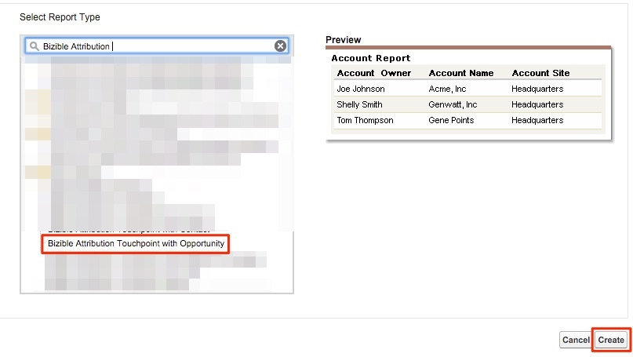

# Opportunità per canale di marketing {#opportunities-by-marketing-channel}

Questo rapporto evidenzia il numero di opportunità generate dai canali di marketing e include tutte le opportunità. Tuttavia, puoi filtrare questo rapporto per analizzare tipi specifici di opportunità.

1. Fare clic sulla scheda **[!UICONTROL Reports]** in Salesforce e selezionare **[!UICONTROL New Report]**.

1. Nel tipo di ricerca rapida in &quot;Attribuzione Bizible&quot;, selezionare il tipo di report **[!UICONTROL Bizible Attribution Touchpoint with Opportunity]** e selezionare **[!UICONTROL Create]**.

   

1. A partire dalla parte superiore del report, mostra **[!UICONTROL All Bizible Attribution Touchpoints]** e regola il campo data in base all&#39;intervallo di tempo su cui stai cercando di generare il report. Nel nostro esempio, guardiamo a All Time (Tutti i tempi). Inoltre, modificare il formato del report da [!UICONTROL Tabular] a **[!UICONTROL Summary]**.

   

1. Ora verranno aggiunti dei campi al rapporto. Nella ricerca rapida a sinistra, digita &quot;Canale di marketing&quot; e aggiungilo al raggruppamento di riepilogo nel rapporto.

   

1. Ora esegui il rapporto e analizza.

   Questo è un rapporto Opportunità riepilogato per canale di marketing. Questo rapporto è incentrato su tutte le Opp, ma puoi filtrare in base alla fase o al tipo di opportunità. Inoltre, puoi aggiungere qualsiasi campo su cui desideri creare un rapporto.

>[!MORELIKETHIS]
>
>[[!DNL Marketo Measure] Esercitazioni: Stock SFDC Reports](https://experienceleague.adobe.com/en/docs/marketo-measure-learn/tutorials/onboarding/marketo-measure-102/stock-salesforce-reports){target="_blank"}
