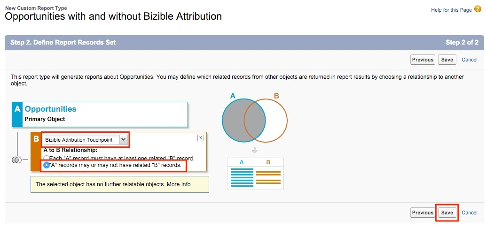

# Generazione di rapporti sulle opportunità con o senza punti di contatto di attribuzione buyer {#reporting-on-opportunities-with-or-without-buyer-attribution-touchpoints}

>[!NOTE]
>
>Potresti vedere le istruzioni che specificano &quot;[!DNL Marketo Measure]&quot; nella documentazione, ma vedi ancora &quot;Bizible&quot; nel tuo CRM. Stiamo lavorando per aggiornarlo e il rebranding verrà riportato nel tuo CRM a breve.

Crea un nuovo tipo di rapporto per includere tutte le opportunità con o senza punti di contatto di attribuzione buyer.

1. Vai a **[!UICONTROL Setup]** > **[!UICONTROL Create]** > **[!UICONTROL Report Types]**.

   

1. Seleziona **[!UICONTROL New Custom Report Type]**.

   

1. Imposta l’oggetto principale come &quot;[!UICONTROL Opportunities].&quot;

   * Assegna all&#39;etichetta del tipo di rapporto il nome seguente: &quot;Opportunità con o senza attribuzione buyer&quot;.
   * Utilizza la stessa denominazione per Nome tipo di rapporto. All’interno dell’input della descrizione, &quot;Opportunità con o senza punti di contatto di attribuzione acquirente&quot;.
   * Salva il report in &quot;[!UICONTROL Other]&quot; e imposta il rapporto su &quot;[!UICONTROL Deployed].&quot;

   

1. A questo punto, verrà collegato l&#39;oggetto opportunità all&#39;oggetto punti di contatto di attribuzione buyer. Assicurarsi di scegliere il pulsante &quot;I record &#39;A&#39; possono avere o meno record &#39;B&#39; correlati.&quot; Clic **[!UICONTROL Save]** al termine.

   

>[!MORELIKETHIS]
>
>[[!DNL Marketo Measure] Tutorials: rapporti SFDC aggiuntivi](https://experienceleague.adobe.com/en/docs/marketo-measure-learn/tutorials/onboarding/marketo-measure-102/addtional-salesforce-reports)
