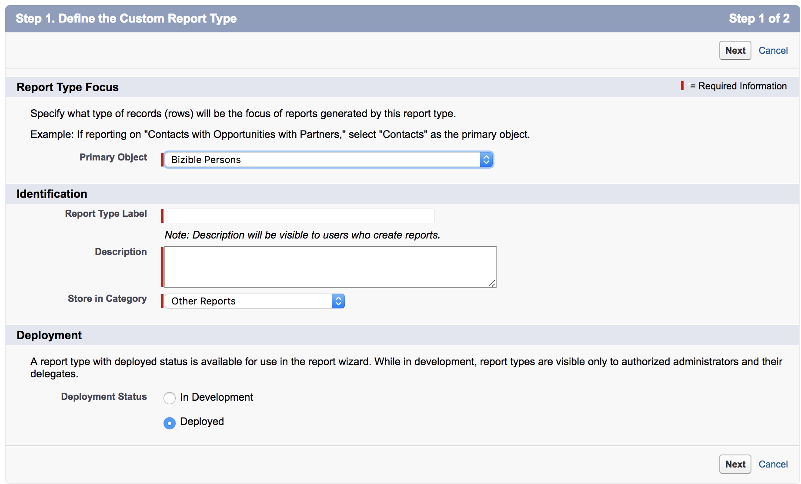

# Creazione di tipi di report [!DNL Marketo Measure] personalizzati {#creating-custom-marketo-measure-report-types}

>[!NOTE]
>
>Potresti vedere le istruzioni che specificano &quot;[!DNL Marketo Measure]&quot; nella documentazione, ma vedere comunque &quot;[!DNL Bizible]&quot; nel CRM. Stiamo lavorando per aggiornarlo e il rebranding verrà riportato nel tuo CRM a breve.

Scopri come creare tipi di report [!DNL Marketo Measure] [!DNL Salesforce] personalizzati. È consigliabile creare tre diversi tipi di rapporti: lead con punti di contatto buyer (personalizzati), [!DNL Marketo Measure] persona con punti di contatto buyer (personalizzati), opportunità con Buyer Attribution Touchpoint (personalizzati).

## Lead con punti di contatto dell&#39;acquirente (personalizzati) {#leads-with-buyer-touchpoints-custom}

1. Vai a **[!UICONTROL Setup]** > **[!UICONTROL Build]** > **[!UICONTROL Report Types]** > **[!UICONTROL New Custom Report Types]**.

   

1. Definisci il tipo di rapporto personalizzato.

   * [!UICONTROL Report Type Focus] > [!UICONTROL [!UICONTROL Primary Object]]: lead
   * Identificazione > [!UICONTROL Report Type Label]: lead con punti di contatto buyer (personalizzati)
   * [!UICONTROL Store in Category]: altri report
   * [!UICONTROL Deployment] > [!UICONTROL Deployment Status]: distribuito

   

1. Definire le relazioni tra oggetti.

   * Collegare l&#39;oggetto Lead (A) all&#39;oggetto persona [!DNL Marketo Measure] (B) e quindi all&#39;oggetto Buyer Touchpoint (C)
   * Assicurati che il record &quot;[!UICONTROL Each A/B record must have at least one B/C]&quot; sia selezionato
   * [!UICONTROL Save]

   

## [!DNL Marketo Measure] persona con punti di contatto dell&#39;acquirente (personalizzato) {#marketo-measure-person-with-buyer-touchpoints-custom}

1. Vai a **[!UICONTROL Setup]** > **[!UICONTROL Build]** > **[!UICONTROL Report Types]** > **[!UICONTROL New Custom Report Types]**.

   

1. Definisci il tipo di rapporto personalizzato.

   * [!UICONTROL Report Type Focus] > [!UICONTROL Primary Object]: [!DNL Marketo Measure] persone
   * [!UICONTROL Identification] > [!UICONTROL Report Type Label]: [!DNL Marketo Measure] Persona con punti di contatto dell&#39;acquirente (personalizzato)
   * [!UICONTROL Store in Category]: altri report
   * [!UICONTROL Deployment] > [!UICONTROL Deployment Status]: distribuito

   

1. Definire le relazioni tra oggetti.

   * Collegare l&#39;oggetto persona [!DNL Marketo Measure] (A) all&#39;oggetto Buyer Touchpoint (B)
   * Assicurati che il record &quot;[!UICONTROL Each A record must have at least one B]&quot; sia selezionato
   * [!UICONTROL Save]

   

## Opportunità con Buyer Attribution Touchpoint (personalizzato) {#opportunities-with-buyer-attribution-touchpoint-custom}

1. Vai a **[!UICONTROL Setup]** > **[!UICONTROL Build]** > **[!UICONTROL Report Types]** > **[!UICONTROL New Custom Report Types]**.

   

1. Definisci il tipo di rapporto personalizzato.

   * [!UICONTROL Report Type Focus] > [!UICONTROL Primary Object]: opportunità
   * [!UICONTROL Identification] > [!UICONTROL Report Type Label]: opportunità con Buyer Attribution Touchpoint (personalizzato)
   * [!UICONTROL Store in Category]: altri report
   * [!UICONTROL Deployment] > [!UICONTROL Deployment Status]: distribuito

   

1. Definire le relazioni tra oggetti.

   * Associare l&#39;oggetto Opportunities (A) all&#39;oggetto Buyer Attribution Touchpoint (B)
   * Assicurati che il record &quot;[!UICONTROL Each A record must have at least one B]&quot; sia selezionato
   * [!UICONTROL Save]

   

## Aggiunta di campi personalizzati a tipi di rapporti personalizzati {#adding-custom-fields-to-custom-report-types}

1. Una volta creati i rapporti, verrai reindirizzato a una panoramica del tipo di rapporto. Fare clic su **[!UICONTROL Edit Layout]**.

   

1. Assicurati che i campi personalizzati che desideri aggiungere al rapporto siano visualizzati nella sezione Proprietà layout campo. Se sono presenti altri campi da aggiungere, utilizzare l&#39;opzione &quot;[!UICONTROL Add fields related via lookup]&quot;.

   
