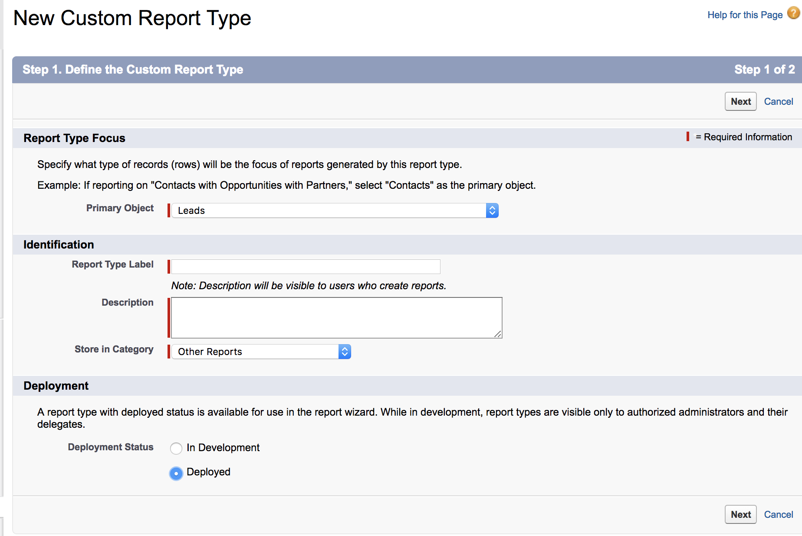

# Tipo di rapporto per contatti senza opportunità {#report-type-for-contacts-without-opportunities}

>[!NOTE]
>
>Potresti vedere le istruzioni che specificano &quot;[!DNL Marketo Measure]&quot; nella documentazione, ma vedere comunque &quot;[!DNL Bizible]&quot; nel CRM. Stiamo lavorando per aggiornarlo e il rebranding verrà riportato nel tuo CRM a breve.

Per creare rapporti sui contatti con i punti di contatto dell&#39;acquirente non associati a un&#39;opportunità, è necessario creare un tipo di rapporto personalizzato.

1. Vai a **[!UICONTROL Setup]** > **[!UICONTROL Create]** > **[!UICONTROL Report Types]**.

   

1. Seleziona **[!UICONTROL New Custom Report Type]**.

   

1. Imposta [!UICONTROL Primary Object] come &quot;[!UICONTROL Contacts]&quot;. Assegna all&#39;etichetta del tipo di rapporto il nome &quot;Contatti con i punti di contatto dell&#39;acquirente&quot;. Utilizza la stessa denominazione per Nome tipo di rapporto. All&#39;interno dell&#39;input della descrizione, &quot;Contatti con i punti di contatto dell&#39;acquirente&quot;. Salvare il report in &quot;[!UICONTROL Other]&quot; e impostare il report su &quot;[!UICONTROL Deployed]&quot;.

   

1. A questo punto, verrà collegato l&#39;oggetto Contatti all&#39;oggetto Punti di contatto buyer. Assicurarsi di scegliere il pulsante &quot;Ogni record &quot;A&quot; deve avere almeno un record &quot;B&quot; correlato.&quot;

   

1. Fai clic su **[!UICONTROL Save]** e l&#39;operazione è terminata.
