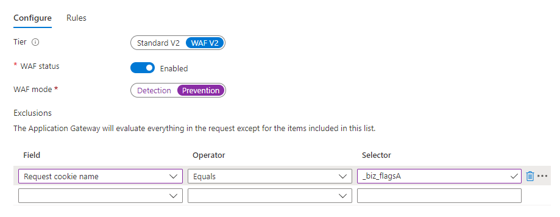

# Cookie di Marketo Measure {#marketo-measure-cookies}

Scopri i vari cookie [!DNL Marketo Measure] caricati sul tuo sito quando applichi il JavaScript [!DNL Marketo Measure] alle pagine di destinazione. Queste informazioni possono essere utili al team di sviluppo web durante l’implementazione.

>[!IMPORTANT]
>
>A causa di problemi di privacy, i cookie di terze parti sono in uscita. L’annuncio della rimozione dei cookie di terze parti, annunciata nel terzo trimestre 2024 da Google Chrome, segna di fatto la fine di questa forma di tracciamento. Di conseguenza, Adobe rende obsolete le funzioni di Marketo Measure che si basano su cookie di terze parti; in particolare, il tracciamento tra domini diversi e l’attribuzione view-through, che utilizzano il cookie di impression Google/DoubleClick. Nessun’altra funzione di Marketo Measure sarà interessata. Anche l’utilizzo di cookie di prime parti non è interessato. Alla luce della pianificazione di Google, la data prevista di deprecazione per le due funzioni di cui sopra è il 6/1/2024. I dati correlati raccolti prima di questa data rimangono disponibili per i clienti Adobe.

| Nome cookie | Tipo di cookie | Finalità | Scadenza | Il flag Secure è impostato? | Il flag Solo HTTP è impostato? | Impostazione cookie |
| --- | --- | --- | --- | --- | --- | --- |
| `_biz_uid` | Prima parte | Identifica in modo univoco un utente nel dominio corrente. | 1 anno | No | No | `bizible.js` |
| `_biz_nA` | Prima parte | Un numero di sequenza che Marketo Measure include per tutte le richieste a scopo di diagnostica interna. | 1 anno | No | No | `bizible.js` |
| `_biz_flagsA` | Prima parte | Un cookie che memorizza varie informazioni utente, come l’invio di moduli, la migrazione tra domini diversi, il pixel view-through, lo stato di rinuncia al tracciamento e così via. | 1 anno | No | No | `bizible.js` |
| `_biz_pendingA` | Prima parte | Memorizza temporaneamente i dati di analisi fino a quando non vengono inviati correttamente al server Marketo Measure. | 1 anno | No | No | `bizible.js` |
| `_biz_ABTestA` | Prima parte | Elenco di checksum dai dati ABT di Optimize e Visual Web Optimizer già segnalati, che impediscono a `bizible.js` di inviare nuovamente i dati raccolti. | 1 anno | No | No | `bizible.js` |
| `_biz_EventA` | Prima parte | Elenco dei checksum segnalati dagli eventi Bizible per impedire a `bizible.js` di inviare nuovamente i dati raccolti. | 1 anno | No | No | `bizible.js` |
| `_biz_su` | Prima parte | ID utente universale per identificare un utente tra più domini, applicabile solo ai tenant con integrazione che aggira le limitazioni ITP. | 1 anno | Sì | No | Edgecast |
| `_BUID` | Terze parti, dominio=.bizible.com | ID utente universale per identificare un utente tra più domini. | 1 anno | Sì | No | Edgecast |
| `_BUID` | Terze parti, dominio=.bizibly.com | Mappatura tra l’ID cookie di Marketo Measure sul dominio del tenant e il relativo ID cookie di impression a doppio clic. | 1 anno | Sì | No | Edgecast |

Se durante la configurazione di JavaScript viene attivato un avviso di WAF (Web Application Firewall), gli utenti possono disabilitare la regola di WAF o inserire nell&#39;elenco Consentiti i cookie, come nell’esempio seguente:

