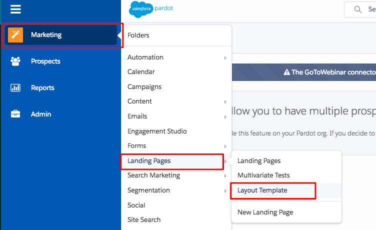

# Aggiunta [!DNL Marketo Measure] JavaScript per [!DNL Pardot] {#adding-marketo-measure-javascript-to-pardot}

[!DNL Pardot] i moduli richiedono una gestione aggiuntiva all&#39;interno del modello di modulo, oltre all&#39;inserimento di script nel sito per [!DNL Marketo Measure] per riconoscere gli invii di moduli. Il processo è semplice e richiede solo l&#39;inserimento [!DNL Marketo Measure] script di tracciamento in [!DNL Pardot] modello di modulo.

## Istruzioni dettagliate {#step-by-step-instructions}

Dopo aver effettuato l’accesso a [!DNL Pardot] account, segui i passaggi seguenti.

1. Accedi a **[!UICONTROL Marketing]**.

1. Fai clic su **[!UICONTROL Landing Pages]**.

1. Seleziona **[!UICONTROL Layout Template]**.

   

1. Determinare il modello di layout appropriato e fare clic su **[!UICONTROL Edit]** a destra.

   

1. Copiare e incollare [!DNL Marketo Measure] Codice JavaScript immediatamente prima del tag di intestazione close nella pagina HTML.

   `<script type="text/javascript" src="https://cdn.bizible.com/scripts/bizible.js" async=""></script>`

1. Segui questi passaggi per tutti i modelli di layout della pagina di destinazione applicabili.

1. Assicurati che le [!DNL Marketo Measure] JavaScript si trova anche nella pagina generale del sito.

   All&#39;interno del [!DNL Pardot] Modello di layout, il codice sarà simile al seguente:

```text
<script type="text/javascript" src="https://cdn.bizible.com/scripts/bizible.js" async=""></script>
   </head>
   <body>
```

## Note aggiuntive {#additional-notes}

Se il [!DNL Pardot] IFrame ha il seguente tag HTML:

`<base href="http://go.pardot.com">`

_E_ IFrame si trova effettivamente su una pagina protetta (HTTPS) invece di una pagina non protetta (HTTP), quando si tenta di caricare lo script sul [!DNL Pardot] IFrame, il browser tenterà di caricare una versione HTTP del nostro script su una pagina HTTPS che avrà esito negativo e ci impedirà di tracciare. La soluzione consiste nell&#39;aggiornare lo script [!DNL Pardot] IFrame per caricare la versione protetta del nostro script:

`<script type="text/javascript" src="https://cdn.bizible.com/scripts/bizible.js" async=""></script>`

In quest’area potrebbero essere già presenti altri snippet di codice di tracciamento, ad esempio [!DNL Google Analytics] codice. Assicurarsi di separarli con un punto e virgola `;` e un singolo spazio, come mostrato in questo esempio:

`<script type="text/javascript" src="https://cdn.bizible.com/scripts/bizible.js" async=""></script>; <script async="true" type="othercode_example" src="otherfile_example.js" ></script>`
