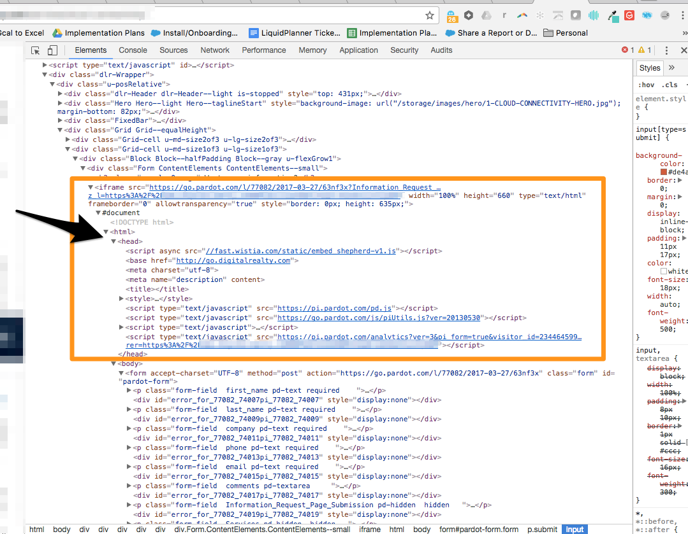

# IFrame Forms e [!DNL Marketo Measure] {#iframe-forms-and-marketo-measure}

Con [!DNL Marketo Measure] una delle funzionalità principali consiste nel monitorare le attività di marketing digitale attraverso sessioni sul sito e l&#39;invio di moduli. In genere, quando Marketo JavaScript viene inserito nel sito, vengono automaticamente allegati a tutti i moduli del sito. Tuttavia, questa funzionalità è limitata se il modulo è contenuto in un IFrame.

Considera un IFrame come una pagina all’interno di una pagina, quindi proprio come richiediamo che lo script venga aggiunto a tutte le pagine del sito, avremmo bisogno dello script posizionato all’interno di IFrame per garantire il tracciamento.

Vediamo in molti casi che IFrame è gestito tramite un provider di automazione marketing, quindi sarà necessario configurarlo all’interno di tale piattaforma o tramite il provider di moduli.

Si consiglia di posizionare il JavaScript all&#39;interno della parte superiore dell&#39;IFrame e da lì verranno automaticamente collegati ai moduli all&#39;interno di tale cornice.

Per qualsiasi domanda sull&#39;aggiunta del nostro JavaScript ai moduli IFrame, rivolgiti al team dell&#39;account Adobe (il tuo Account Manager) o al [supporto Marketo](https://nation.marketo.com/t5/support/ct-p/Support){target="_blank"}.
