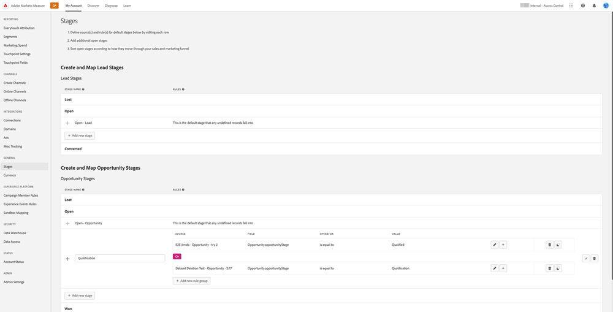

# [!DNL Marketo Measure] Panoramica di Ultimate {#marketo-measure-ultimate-overview}

[!DNL Marketo Measure] (precedentemente Bizible) offre agli esperti di marketing informazioni sulle attività di marketing più efficaci per incrementare le entrate e massimizzare il ritorno sull’investimento. [!DNL Marketo Measure] è una soluzione di attribuzione marketing che tiene traccia automaticamente delle prestazioni dei canali e genera rapporti su di esse, fornendo visibilità sui canali che generano il coinvolgimento maggiore dei clienti e consentendo di ottimizzare di conseguenza le spese di marketing.

[!DNL Marketo Measure Ultimate] contiene le funzionalità aggiuntive:

* Acquisisci da quasi tutte le origini dati e da più origini dati dello stesso tipo per inserire tutti i dati per l’attribuzione.
   * Utilizza con quasi tutte le CRM, non solo Salesforce e Dynamics.
   * Connettere più istanze di CRM e/o istanze MAP a una [!DNL Marketo Measure] dell&#39;istanza.
   * Importa dati di registrazione e partecipazione a webinar di terze parti.

* Trasforma i dati con grande flessibilità attraverso le funzionalità di mappatura dei campi e trasformazione per garantire la forma corretta dei dati.

* Rendi gli insight di attribuzione disponibili alle applicazioni esterne tramite il data warehouse incluso, per integrarli nel flusso di lavoro. Dati di risultati più granulari e reporting basato su BI, inclusa la Data Warehouse del Snowflake, che consente di accedere a dati di risultati granulari e di utilizzare qualsiasi strumento BI per l&#39;analisi e il reporting.

* Integrazione con RTCDP (versione B2B o B2P), fornendo una soluzione di attribuzione B2B integrata per i clienti RTCDP come RTCDP e [!DNL Marketo Measure] entrambi funzionano da dati Adobe Experience Platform centralizzati (AEP).

**[!DNL Marketo Measure]Livelli 1-3**

**[!DNL Marketo Measure Ultimate]**

## Novità in [!DNL Marketo Measure Ultimate] {#whats-new-in-marketo-measure-ultimate}

**Importare dati B2B tramite AEP**

Gli addetti al marketing devono inserire i propri dati B2B (ad esempio account, opportunità, contatto, lead, campagna, membro della campagna, attività) tramite AEP. Le connessioni dirette CRM e di Marketo Engage non sono più disponibili per Ultimate. Gli addetti al marketing continueranno a portare i dati di Ad Platform tramite connessioni dirette e il tracciamento delle attività web tramite [!DNL Marketo Measure] javascript.

**Impostazione valuta predefinita**

[!DNL Marketo Measure Ultimate] imposta la valuta predefinita su USD finché l’utente non la modifica. Se si imposta una nuova valuta predefinita, i dati verranno aggiornati senza essere rielaborati. Se la valuta selezionata è presente come codice ISO di destinazione, non è necessario inviare i tassi di conversione.

**[!DNL Marketo Measure Ultimate]Sandbox**

[!DNL Marketo Measure Ultimate] l&#39;istanza deve essere mappata a una sandbox di AEP prima di creare [!DNL Marketo Measure] i flussi di dati di destinazione in AEP.

>[!NOTE]
>
>A [!DNL Marketo Measure Ultimate] l&#39;istanza di produzione deve essere mappata su una sandbox di produzione AEP, una [!DNL Marketo Measure Ultimate] l&#39;istanza per sviluppatori deve essere mappata a una sandbox per sviluppatori di AEP.

Una volta salvata la selezione della mappatura sandbox, non è più possibile modificarla nell’applicazione in questo momento. Per modificarlo, contatta [Supporto Marketo](https://nation.marketo.com/t5/support/ct-p/Support){target="_blank"}.

I dati per una determinata entità (ad esempio, Account) da una determinata origine dati possono essere inseriti in un solo set di dati. Ogni set di dati può essere incluso in un solo flusso di dati. Le violazioni arresteranno il flusso di dati in fase di esecuzione.

**Mappatura stadio**

Tutti [!DNL Marketo Measure Ultimate] le regole sono specifiche per il set di dati. È necessario creare regole di mappatura stadio per tutti i set di dati e tutte le fasi selezionate.

Sono disponibili sei fasi integrate:

* Lead perso
* Apertura lead
* Lead convertito
* Opportunità persa
* Opportunità aperta
* Opportunità acquisita

Le sezioni Lost, Won e Convertito non consentono fasi personalizzate. I dati di origine possono, tuttavia, essere mappati sugli stadi persi/vinti/convertiti incorporati aggiornando la regola di mappatura.

Gli stadi personalizzati possono essere definiti solo per le sezioni aperte.
Non includiamo più automaticamente le fasi di gestione delle relazioni con i clienti nella mappatura delle fasi.

È necessario mappare quattro stadi incorporati con regole (le regole di mappatura per gli altri due, Lead perso e Lead convertito, sono facoltative):

* Apertura lead
* Opportunità persa
* Opportunità aperta
* Opportunità acquisita

Le condizioni delle regole sono specifiche per il set di dati. È necessario creare regole di mappatura stadio per tutti i set di dati e tutte le fasi ad eccezione di Lead perso e Lead convertito.

Nessuna selezione per funnel vs boomerang vs modello personalizzato. Tutti gli stadi sono selezionati per funnel, boomerang e modello personalizzato. È previsto un limite per il numero di fasi supportate: 15 fasi personalizzate più 6 fasi integrate.

Le regole dei punti di contatto per i membri della campagna e le regole dei punti di contatto per le attività sono specifiche per set di dati.

I punti di contatto di attribuzione non vengono scritti in CRM perché Ultimate non dispone di una connessione CRM diretta.

[!DNL Marketo Measure] I servizi ML di ABM (corrispondenza lead-account e punteggio di coinvolgimento predittivo) non sono disponibili per [!DNL Marketo Measure Ultimate]. Tali servizi sono inclusi gratuitamente nell’edizione B2B di RT-CDP.

## Limitazioni {#limitations}

* Al momento sono disponibili campi limitati per le regole di trasformazione dei dati.
* Nessun percorso di migrazione per gli utenti esistenti di livello 1/2/3. Richiede una nuova implementazione, ma aiuteremo a migrare i dati delle attività web tracciate dall’istanza esistente.

>[!MORELIKETHIS]
>
>[Destinazione Marketo Measure Ultimate](https://experienceleague.adobe.com/docs/experience-platform/destinations/catalog/adobe/marketo-measure-ultimate.html?lang=en){target="_blank"}
