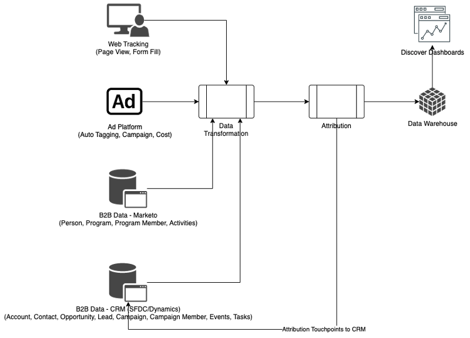

# Panoramica di [!DNL Marketo Measure] Ultimate {#marketo-measure-ultimate-overview}

[!DNL Marketo Measure] (precedentemente Bizible) offre ai marketer approfondimenti sulle iniziative di marketing più efficaci per aumentare i ricavi e ottimizzare il ritorno sull’investimento per l’azienda. [!DNL Marketo Measure] è una soluzione di attribuzione marketing che tiene traccia e genera report automatici sulle prestazioni dei canali, fornendo visibilità su quali canali generano il maggior coinvolgimento dei clienti e consentendo di ottimizzare le spese di marketing di conseguenza.

[!DNL Marketo Measure Ultimate] contiene le funzionalità aggiuntive:

* Acquisisci da quasi tutte le origini dati e da più origini dati dello stesso tipo per inserire tutti i dati per l’attribuzione.
   * Da utilizzare con quasi tutte le CRM, non solo con Salesforce e Dynamics.
   * Connettere più istanze di CRM e/o istanze MAP a un&#39;istanza [!DNL Marketo Measure].
   * Importa dati di registrazione e partecipazione a webinar di terze parti.

* Trasforma i dati con grande flessibilità attraverso le funzionalità di mappatura dei campi e trasformazione per garantire la forma corretta dei dati.

* Rendi gli insight di attribuzione disponibili alle applicazioni esterne tramite il data warehouse incluso, per integrarli nel flusso di lavoro. Dati di risultati più granulari e reporting basato su BI, incluso Snowflake Data Warehouse, che consente di accedere a dati di risultati granulari e di utilizzare qualsiasi strumento BI per l&#39;analisi e il reporting.

* Integrazione con RTCDP (versione B2B o B2P), che fornisce una soluzione di attribuzione B2B integrata per i clienti RTCDP, in quanto RTCDP e [!DNL Marketo Measure] entrambi funzionano da dati Adobe Experience Platform (AEP) centralizzati.

**[!DNL Marketo Measure]livelli 1-3**

**[!DNL Marketo Measure Ultimate]**

## Novità di [!DNL Marketo Measure Ultimate] {#whats-new-in-marketo-measure-ultimate}

**Importa dati B2B tramite AEP**

Gli addetti al marketing devono inserire i propri dati B2B (ad esempio account, opportunità, contatto, lead, campagna, membro della campagna, attività) tramite AEP. Le connessioni dirette CRM e Marketo Engage non sono più disponibili per Ultimate. Gli addetti al marketing continuano a portare dati di Ad Platform tramite connessioni dirette e a tenere traccia delle attività web tramite JavaScript [!DNL Marketo Measure].

**Impostazione valuta predefinita**

[!DNL Marketo Measure Ultimate] imposta la valuta predefinita su USD finché l&#39;utente non la modifica. L’impostazione di una nuova valuta predefinita aggiorna i dati senza rielaborarli. Se la valuta selezionata è presente come codice ISO di destinazione, non è necessario inviare i tassi di conversione.

Sandbox **[!DNL Marketo Measure Ultimate]**

L&#39;istanza [!DNL Marketo Measure Ultimate] deve essere mappata a una sandbox di AEP prima di creare i flussi di dati di destinazione [!DNL Marketo Measure] in AEP.

>[!NOTE]
>Un&#39;istanza di produzione [!DNL Marketo Measure Ultimate] deve essere mappata a una sandbox di produzione AEP, un&#39;istanza di sviluppo [!DNL Marketo Measure Ultimate] deve essere mappata a una sandbox di sviluppo AEP.

Una volta salvata la selezione di mappatura sandbox, non è possibile modificarla nell’applicazione. Per modificarlo, contattare il [Supporto Marketo](https://nation.marketo.com/t5/support/ct-p/Support){target="_blank"}.

I dati di una determinata entità (ad esempio, Conto) da una determinata origine dati possono essere inseriti in un solo set di dati. Ogni set di dati può essere incluso in un solo flusso di dati. Le violazioni arrestano il flusso di dati in fase di esecuzione.

**Mappatura fase**

Tutte le regole [!DNL Marketo Measure Ultimate] sono specifiche per il set di dati. È necessario creare regole di mappatura stadio per tutti i set di dati e tutte le fasi selezionate.

Sono disponibili sei fasi integrate:

* Lead perso
* Apertura lead
* Lead convertito
* Opportunità persa
* Opportunità aperta
* Opportunità vinta

Le sezioni Lost, Won e Convertito non consentono fasi personalizzate. I dati di Source possono, tuttavia, essere mappati sulle fasi perse/vinte/convertite incorporate aggiornando la regola di mappatura.

Gli stadi personalizzati possono essere definiti solo per le sezioni aperte.
Non includiamo più automaticamente le fasi di gestione delle relazioni con i clienti nella mappatura delle fasi.

È necessario mappare quattro stadi incorporati con regole (le regole di mappatura per gli altri due, Lead perso e Lead convertito, sono facoltative):

* Apertura lead
* Opportunità persa
* Opportunità aperta
* Opportunità vinta

Le condizioni delle regole sono specifiche per il set di dati. È necessario creare regole di mappatura stadio per tutti i set di dati e tutte le fasi ad eccezione di Lead perso e Lead convertito.

Nessuna selezione per funnel vs boomerang vs modello personalizzato. Tutte le fasi sono selezionate per il modello funnel, boomerang e personalizzato. È previsto un limite per il numero di fasi supportate: 15 fasi personalizzate più 6 fasi integrate.

Le regole dei punti di contatto per i membri della campagna e le regole dei punti di contatto per le attività sono specifiche per set di dati.

I punti di contatto di attribuzione non vengono scritti in CRM perché Ultimate non dispone di una connessione CRM diretta.

[!DNL Marketo Measure] servizi ABM ML (corrispondenza lead-account e punteggio di coinvolgimento predittivo) non disponibili per [!DNL Marketo Measure Ultimate]. Tali servizi sono inclusi gratuitamente nel B2B edition RT-CDP.

## Limitazioni {#limitations}

* Sono disponibili campi limitati per le regole di trasformazione dei dati.
* Nessun percorso di migrazione per gli utenti esistenti di livello 1/2/3. Richiede una nuova implementazione, ma aiutiamo a migrare i dati delle attività web tracciate dall’istanza esistente.

>[!MORELIKETHIS]
> [Destinazione Marketo Measure Ultimate](https://experienceleague.adobe.com/docs/experience-platform/destinations/catalog/adobe/marketo-measure-ultimate.html?lang=it){target="_blank"}
> [VIDEO: Panoramica di Marketo Measure Ultimate](https://experienceleague.adobe.com/it/docs/marketo-measure-learn/tutorials/marketo-measure-ultimate/overview){target="_blank"}
