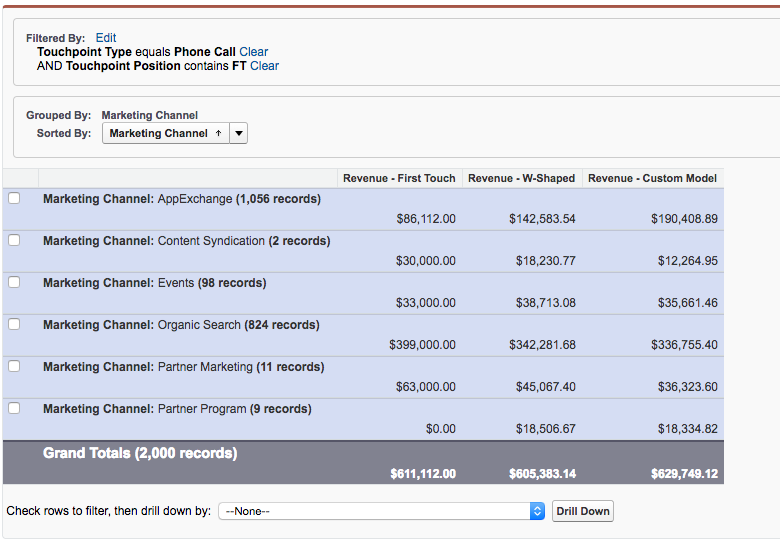

# Integrazione del tracciamento delle chiamate {#call-tracking-integration}

La nostra integrazione con [!DNL CallTrackingMetrics] è destinato a unire una sessione web con una chiamata telefonica. Una chiamata telefonica viene trattata come invio di un modulo a [!DNL Marketo Measure]. Attribuisce credito a una sessione web che altrimenti sarebbe stata considerata solo una visita web perché non vi era un effettivo invio del modulo.

## Spiegazione del tracciamento delle chiamate {#call-tracking-explained}

&quot;Call Tracking&quot; in senso generale è un prodotto di aziende come [!DNL CallTrackingMetrics], [!DNL DiaglogTech], [!DNL Invoca]oppure [!DNL CallRail], per citarne alcuni. Gli utenti ricevono numeri di telefono univoci in base ai diversi canali di marketing o alle diverse campagne da cui provengono. Questo consente agli addetti al marketing di vedere le prestazioni di tali canali o campagne.

## Prima e dopo {#before-and-after}

Guarda il diagramma di flusso sottostante per vedere come [!DNL Marketo Measure] utilizzato per gestire le chiamate telefoniche senza un&#39;integrazione con CallTrackingMetrics. La telefonata che si è svolta è stata cancellata, quindi è stata vista come una sessione web e non è stato creato alcun punto di contatto per esso. Solo nella visita successiva in cui l’utente ha compilato un modulo è stato finalmente compilato un punto di contatto.

Con l&#39;integrazione, puoi vedere che la sessione web era in realtà legata a una chiamata telefonica. Il modulo successivo viene compilato come un tocco PostLC ed è ancora tracciato come parte del percorso.

## Come funziona {#how-it-works}

CallTrackingMetrics deve svolgere un po&#39; di lavoro di sviluppo sulla loro fine per far funzionare questo. Con il javascript che inseriscono sul tuo sito, CallTrackingMetrics può afferrare il _biz_uid dal [!DNL Marketo Measure] cookie. Questo &quot;[!DNL BizibleId]&quot; viene quindi memorizzato da CallTrackingMetrics.

Quando un visitatore accede al tuo sito e effettua una chiamata telefonica, è compito di CallTrackingMetrics inviare tali dati in [!DNL Salesforce]  In genere un [!DNL Salesforce Task] viene creato per la compilazione di dati quali numero di telefono, oggetto, tipo e ora, il [!DNL BizibleId]

La [!DNL BizibleId] è un campo installato con versione 6.7+ del [!DNL Marketo Measure] Pacchetto di attribuzione marketing.

Di seguito è riportato un esempio di record Task con [!DNL BizibleId] popolato.

Quando [!DNL Marketo Measure] trova un record Task con un [!DNL BizibleId] valore inserito, [!DNL Marketo Measure] può mappare l&#39;utente a una sessione web con la stessa [!DNL BizibleId] e attribuisce la sessione a una chiamata telefonica invece di una visita web.

## Il punto di contatto {#the-touchpoint}

Quando [!DNL Marketo Measure] può importare/scaricare l&#39;attività, elaboriamo quel dettaglio insieme alla sessione web. Nella maggior parte dei casi, può essere unita a un referrer o ad. Nell’esempio seguente, un visitatore ha trovato l’azienda tramite un annuncio Google a pagamento e ha effettuato una chiamata telefonica.

La [!UICONTROL Touchpoint] Il tipo &quot;Call&quot; viene estratto dall&#39;attività, dalla schermata precedente, che viene popolata anche da CallTrackingMetrics quando l&#39;attività viene creata.

## Reporting {#reporting}

Valori del tipo di punto di contatto che [!DNL Marketo Measure] in genere i messaggi push sono Visita web, Modulo web o Chat web, ma nel caso dei punti di contatto CallTrackingMetrics, il tipo di punto di contatto sarà Chiamata telefonica. In questo modo, gli esperti di marketing possono vedere quali canali ricevono il maggior numero di chiamate e generare entrate per la loro organizzazione.

## Domande frequenti {#faq}

**Perché la mia visita web di tipo touchpoint?**

Il campo Tipo punto di contatto viene compilato dal campo Task.Type . Se il campo Task.Type è vuoto, allora [!DNL Marketo Measure] imposta automaticamente il tipo di punto di contatto come Visita web. Una volta compilato il campo Task.Type [!DNL Marketo Measure] leggerà tale valore e compilerà di conseguenza il tipo di punto di contatto.

**Quali altri campi vengono compilati dalla chiamata telefonica?**

Sia il tipo di punto di contatto che il valore medio conterranno i dati estratti da Task.Type. Tutti gli altri punti dati vengono estratti dai dati di tracciamento web e javascript.

**Perché questa chiamata non è legata a una sessione web?**

Per prima cosa, controlla l’attività per verificare che sia presente un [!DNL BizibleId] popolato. Se non c’è alcun valore, non creeremo e non potremo creare un punto di contatto per esso. Questo deve essere inoltrato con CallTrackingMetrics .

Se c&#39;è un valore, tieni presente che tutte le sessioni web sono considerate solo 30 minuti. Se un annuncio Google è stato cliccato alle 12:17 (inizio della sessione sul sito web), ma la chiamata telefonica si è verificata solo alle 13:05 pm, la sessione web e la chiamata telefonica non verranno unite. Piuttosto, [!DNL Marketo Measure] creerà un separato [!DNL Salesforce Task] punto di contatto per tenere traccia della chiamata telefonica, ma non avrà dati di sessione web.

## Partnership {#partnerships}

[!DNL Marketo Measure] attualmente dispone di un partner ufficiale per il monitoraggio delle chiamate che ha superato il processo di integrazione &quot;ufficiale&quot; con noi, che ha incluso la co-marketing e la formazione sui prodotti. Questo partner è CallTrackingMetrics.
