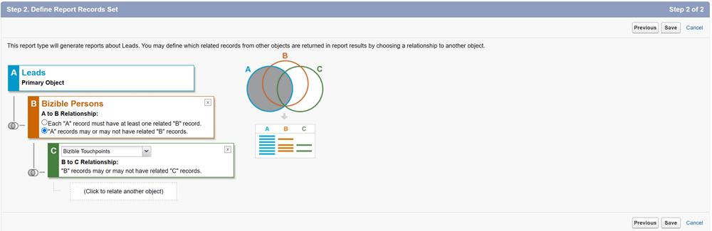
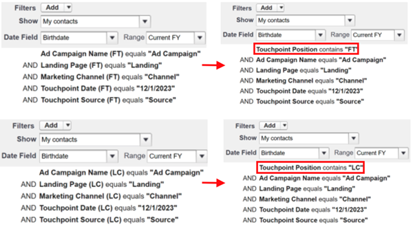
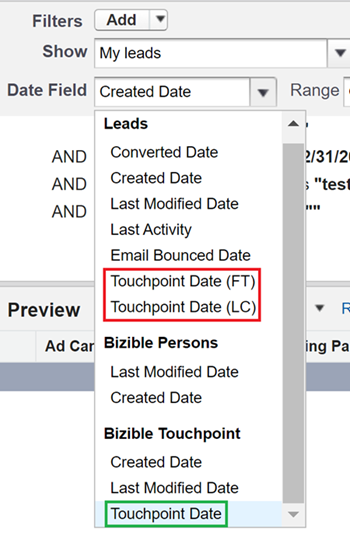

# Note sulla versione: 2023 {#release-notes-2023}

Di seguito trovi tutte le funzioni nuove e aggiornate per le versioni del 2023.

## Versione Q4 {#q4-release}

 

**Dashboard traffico Web**

Il [dashboard del traffico Web](/help/marketo-measure-discover-ui/dashboards/web-traffic-dashboard.md){target="_blank"} riprogettato è ora accessibile a tutti i clienti. Questa dashboard offre una panoramica completa delle interazioni dei visitatori del sito web. Puoi analizzare metriche quali conteggi di visitatori univoci per URL, visite complessive, visualizzazioni di pagina e invii di moduli da URL di moduli o pagine di destinazione specifici. Puoi anche tenere traccia delle tendenze del traffico mensile e identificare i media a pagamento con prestazioni elevate, che ti aiuteranno a perfezionare le strategie per una generazione ottimale dei ricavi.

Il nuovo set di dashboard predefiniti dovrebbe essere introdotto gradualmente, per concludersi prima della fine dell’anno.

>[!NOTE]
>
>Anche se le dashboard correnti diventeranno obsolete entro marzo 2024, fino a quel momento puoi utilizzare entrambe le versioni, garantendo una transizione senza intoppi.

**Rimozione dati indirizzo IP**

I dati degli indirizzi IP vengono rimossi dallo storage a lungo termine per garantire la conformità alla privacy dei dati. Attualmente, le seguenti tabelle e viste di Snowflake contengono indirizzi IP e prevediamo di rimuovere questi dati e aggiungere nuove informazioni di geolocalizzazione:

<table style="width:400px">
<thead>
  <tr>
    <th style="width:50%">Tabelle</th>
    <th>Viste</th>
  </tr>
</thead>
<tbody>
  <tr>
    <td>CUSTOMER_AB_TESTS</td>
    <td>BIZ_CUSTOMER_AB_TESTS</td>
  </tr>
  <tr>
    <td>CUSTOMER_EVENTS</td>
    <td>BIZ_CUSTOMER_EVENTS</td>
  </tr>
  <tr>
    <td>FORM_SUBMITS</td>
    <td>BIZ_FORM_SUBMITS</td>
  </tr>
  <tr>
    <td>IMPRESSION</td>
    <td>BIZ_IMPRESSION</td>
  </tr>
  <tr>
    <td>PAGE_VIEWS</td>
    <td>BIZ_PAGE_VIEWS</td>
  </tr>
  <tr>
    <td>SESSIONI</td>
    <td>BIZ_SESSIONI</td>
  </tr>
  <tr>
    <td>MAPPATURE_HOST_WEB</td>
    <td>BIZ_WEB_HOST_MAPPINGS</td>
  </tr>
</tbody>
</table>

* Da ora in poi, scaricheremo Codice paese, Nome città e Codice regione invece di Nome paese, Nome città e Nome regione.
* Durante l’elaborazione di tutte le attività web storiche, possono verificarsi incongruenze nelle informazioni sulla posizione tra i record. Queste incoerenze possono includere la presenza di indirizzi IP senza dettagli di geolocalizzazione, informazioni di geolocalizzazione aggiornate senza indirizzi IP o una combinazione di nomi e codici di paesi o aree geografiche.
* _**Questo periodo di dati misti è previsto dal 01/04/2023 al 02/29/2023.**_

**Dati titolo pagina nella tabella URL**

La tabella URL nel [data warehouse](/help/marketo-measure-data-warehouse/data-warehouse-schema.md){target="_blank"} includerà ora un campo titolo pagina, oltre alle tabelle dati Web.

Tieni presente che il titolo della pagina nella tabella URL potrebbe non corrispondere sempre al titolo della pagina in altre tabelle web. La tabella URL avrà il titolo della pagina più recente. Se il titolo dell’URL è stato modificato dopo lo svolgimento dell’attività web, non corrisponderà a quanto riportato nella tabella URL.

**Rileva riprogettazione dashboard**

Tutti gli utenti di Marketo Measure sperimenteranno le nostre dashboard in-app riprogettate che combinano usabilità avanzata con valore aggiunto. Stiamo inoltre introducendo nuove metriche, come il &quot;ROI realizzato&quot;, che tiene conto del tipico ritardo tra gli investimenti di marketing e gli acquisti nei go-to-market B2B.

Il nuovo set di dashboard predefiniti dovrebbe essere introdotto gradualmente, a partire dalla prima settimana di ottobre fino alla fine dell’anno. Queste nuove dashboard verranno visualizzate automaticamente nelle istanze, insieme alle informazioni interne al prodotto e ai collegamenti alla documentazione.

* [Nuova guida per l&#39;individuazione del dashboard](/help/marketo-measure-discover-ui/dashboards/new-discover-dashboard-guide.md){target="_blank"}
* [Nozioni di base sulla dashboard](/help/marketo-measure-discover-ui/dashboards/discover-dashboard-basics.md){target="_blank"}
* [Dashboard panoramica ricavi](/help/marketo-measure-discover-ui/dashboards/revenue-overview-dashboard.md){target="_blank"}
* [Dashboard ricavi attribuiti](/help/marketo-measure-discover-ui/dashboards/attributed-revenue-dashboard.md){target="_blank"}
* [Dashboard ROI](/help/marketo-measure-discover-ui/dashboards/roi-dashboard.md){target="_blank"}
* [Dashboard Passport](/help/marketo-measure-discover-ui/dashboards/passport-dashboard.md){target="_blank"}

>[!NOTE]
>
>Anche se le dashboard correnti diventeranno obsolete entro marzo 2024, fino a quel momento puoi utilizzare entrambe le versioni, garantendo una transizione senza intoppi.

### Funzionalità deprecate {#deprecations}

 

#### Deprecazioni campo Salesforce

Elimineremo gradualmente i nostri processi di esportazione agli oggetti Lead/Contact per semplificare la nostra integrazione ed eliminare la necessità di esportare in oggetti standard Salesforce. Anche i campi denormalizzati elencati di seguito diventeranno obsoleti, in quanto i clienti possono ottenere gli stessi dati dai loro oggetti punto di contatto. _**La timeline delle attività obsolete è giugno 2024.**_

<table style="width:350px">
<tbody>
  <tr>
    <td>bizible2__Ad_Campaign_Name_FT__c</td>
  </tr>
  <tr>
    <td>bizible2__Ad_Campaign_Name_LC__c</td>
  </tr>
  <tr>
    <td>bizible2__Landing_Page_FT__c</td>
  </tr>
  <tr>
    <td>bizible2__Landing_Page_LC__c</td>
  </tr>
  <tr>
    <td>bizible2__Touchpoint_Date_FT__c</td>
  </tr>
  <tr>
    <td>bizible2__Touchpoint_Date_LC__c</td>
  </tr>
  <tr>
    <td>bizible2__Punto di contatto_Source_FT__c</td>
  </tr>
  <tr>
    <td>bizible2__Punto di contatto_Source_LC__c</td>
  </tr>
  <tr>
    <td>bizible2__Marketing_Channel_FT__c</td>
  </tr>
  <tr>
    <td>bizible2__Marketing_Channel_LC__c</td>
  </tr>
</tbody>
</table>

I campi che contengono le stesse informazioni sugli oggetti punto di contatto e punto di contatto di attribuzione sono:

* bizible2__Ad_Campaign_Name__c
* bizible2__Landing_Page__c
* bizible2__Marketing_Channel__c
* bizible2__Touchpoint_Date__c
* bizible2__Punto di contatto_Source__c

**Azioni richieste**

* Crea nuovi tipi di rapporto per lead e contatti con o senza punti di contatto.

* Crea rapporti che acquisiscono le funzionalità di qualsiasi rapporto esistente che utilizza i campi rimossi. Come parte di questo processo, è necessario modificare i campi nel rapporto come specificato di seguito:

* Rimuovi campi Lead/Contatto FT/LC:

* Aggiungi campi punto di contatto:

* Il filtro Posizione punto di contatto e tutti i filtri che utilizzano i campi FT/LC, incluso il campo Data, devono essere aggiornati come segue:

* Eliminare i report preesistenti che utilizzavano i campi rimossi dall&#39;oggetto Lead/Contact per non fare più riferimento a tali campi.

 

#### Relativo al pacchetto Dynamics

* Per rimanere connesso a Dynamics, installa la versione più recente del pacchetto, v6.12. Le versioni precedenti `(<v6.12)` non saranno più supportate. Questo aggiornamento ottimizza la creazione di record storici per ridurre l’utilizzo dello storage.

* Il metodo obsoleto di OAuth con RefreshToken diventerà obsoleto. Consulta [questa guida](/help/marketo-measure-and-dynamics/getting-started-with-marketo-measure-and-dynamics/oauth-with-azure-active-directory-for-dynamics-crm.md){target="_blank"} per aggiornare le credenziali in modo da rispettare le best practice di Microsoft relative all&#39;utilizzo di ClientSecret.

#### Campo &quot;custom_properties&quot;

Nel data warehouse, il campo &quot;custom_properties&quot; funge da archivio per punti dati aggiuntivi non coperti dallo schema fisso. Memorizzato in formato JSON, l’utilizzo di questo campo è limitato e la sua integrazione con le query SQL può essere complicata, influendo sulle prestazioni. Dati questi fattori, abbiamo deciso di rendere obsoleto questo campo. Questa modifica interesserà principalmente il livello di elaborazione dei dati nell’archiviazione delle tabelle di Azure e i dati esportati nel data warehouse.

### Cosa sta succedendo? {#q4-whats-coming}

 

**Generazione rapporti personalizzati in-app**

I clienti di Marketo Measure, per la prima volta, potranno creare e salvare i propri rapporti direttamente nell’app. Questo farà seguito al rilascio delle dashboard predefinite all’inizio del 2024.

 

## Versione secondo trimestre {#q2-release}

 

* **Consolidamento pacchetto Salesforce**

Stiamo unendo tutti i pacchetti Salesforce in un unico pacchetto completo per migliorare l’esperienza utente e semplificarne l’utilizzo. I pacchetti V1, V2_EXT e Reporting verranno ritirati il prossimo trimestre. Il nuovo pacchetto combina tutte le funzioni precedenti, consentendo un tracciamento più efficiente e informazioni più approfondite sui clienti.

I clienti che hanno già installato il pacchetto V2 devono aggiornarlo alla nuova versione consolidata.

Sono stati aggiunti due nuovi campi per migliorare le funzionalità di reporting:

* nome_modulo: ora disponibile negli oggetti BT/BAT, questo campo consente agli utenti di creare report basati sui nomi dei moduli.
* user_touchpoint_id: questo campo consente agli utenti di creare rapporti con conteggi univoci dei punti di contatto degli utenti.

[Questo articolo](/help/configuration-and-setup/marketo-measure-and-salesforce/salesforce-package-consolidation.md){target="_blank"} include le guide sulla ricreazione di report e dashboard dai pacchetti di reporting legacy.

* **Aggiornamenti versione API Salesforce**

Tutte le versioni API Salesforce delle classi Apex, inclusa la classe UserActivityContext, vengono aggiornate alle versioni supportate. (da 31,0 a 57,0)

* **Nuova installazione pacchetto**

Il nuovo collegamento di installazione del pacchetto consolidato [ è disponibile qui](https://login.salesforce.com/packaging/installPackage.apexp?p0=04t1P000000VY6Z){target="_blank"}

### Cosa sta succedendo? {#q2-whats-coming}

 

**Modifiche nell&#39;archiviazione indirizzi IP**

Non memorizzeremo più gli indirizzi IP nel nostro sistema in base a considerazioni sulla privacy. Continueremo a identificare e archiviare la geolocalizzazione dell’indirizzo IP, ma il formato cambierà (ad esempio, &quot;Stati Uniti&quot; in &quot;Stati Uniti&quot;).
