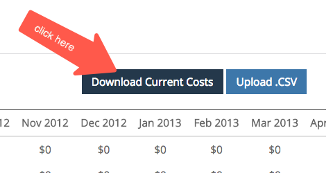

# Metodi di gestione della spesa {#spend-management-methods}

I dati di spesa sono fondamentali per il corretto reporting del ROI con [!DNL Marketo Measure]. Per ottenere rapporti sul ROI precisi e completi su tutti i canali e i sottocanali, è necessario assicurarsi di disporre dei dati di spesa appropriati da inserire in [!DNL Marketo Measure].

Esistono tre modi per immettere i dati di spesa in [!DNL Marketo Measure]. Ogni metodo è progettato per estrarre i dati di spesa da input di dati specifici.

**1 account API connessi**

Qualsiasi account annuncio connesso a [!DNL Marketo Measure] tramite un&#39;API ha la spesa automaticamente inserita in [!DNL Marketo Measure] per il reporting sul ROI. Per verificare quali account si sono connessi e quindi ritirare la spesa, accedere all&#39;app [!DNL Marketo Measure] e selezionare la scheda [!UICONTROL Connections] nella sezione [!UICONTROL Integrations]. Per ulteriori dettagli sulla configurazione delle connessioni API, consulta [Piattaforme pubblicitarie integrate](/help/api-connections/integrated-ad-platforms.md).

Sincronizzazione costi campagna CRM **2**

Ogni account [!DNL Marketo Measure] ha accesso a una funzionalità denominata [Sincronizza costi campagna CRM](/help/crm-campaign-costs.md). Per impostazione predefinita, questo bit di funzione è impostato su &quot;No&quot; ma può essere attivato in qualsiasi momento.

Quando è abilitata, questa funzione richiama automaticamente le spese da qualsiasi campagna/programma di gestione delle relazioni con i clienti che soddisfa i seguenti criteri:

i. [!DNL Marketo Measure] verifica innanzitutto se la campagna o il programma sta creando punti di contatto da una [regola di sincronizzazione campagna](/help/channel-tracking-and-setup/custom-campaign-sync.md) creata o da una [regola di sincronizzazione programma](/help/marketo-engage-programs-integration.md) creata oppure il valore [Abilita punti di contatto buyer](/help/channel-tracking-and-setup/syncing-offline-campaigns.md) è &quot;Includi tutti i membri della campagna&quot; o &quot;Includi i membri della campagna &quot;Risponsi&quot;.&quot;

ii. È necessario inserire una data di inizio nella campagna/nel programma

iii. È necessario inserire una data di fine nella campagna/nel programma

iv. È necessario specificare il costo effettivo (per le campagne in SFDC) o il costo del periodo (per i programmi in Marketo).

**3 Caricamento costo manuale**

Questo metodo ti consente di [caricare manualmente i dati di spesa](/help/marketing-channel-costs.md) per i canali e i sottocanali che non sono coperti dagli account API connessi o dalla sincronizzazione dei costi delle campagne CRM. Passando alla sezione Spese di marketing nelle impostazioni di [!DNL Marketo Measure], puoi caricare i dati di spesa tramite un file CSV per qualsiasi canale.

I clienti possono utilizzare una combinazione di tutti e tre questi metodi per gestire la spesa, a seconda della configurazione specifica di [!DNL Marketo Measure]. Poiché esistono tre metodi per importare le spese in [!DNL Marketo Measure], si consiglia vivamente di utilizzare la bacheca delle spese di marketing in Discover per ottenere una visualizzazione completa di tutti i dati relativi alle spese. Questa bacheca è l’unico posto in cui potrai vedere tutti i tuoi canali e la relativa spesa associata. Il comitato per le spese di marketing può aiutarti a identificare rapidamente dove potrebbero essere presenti delle lacune nei dati di spesa e come migliorare il reporting sul ROI.
